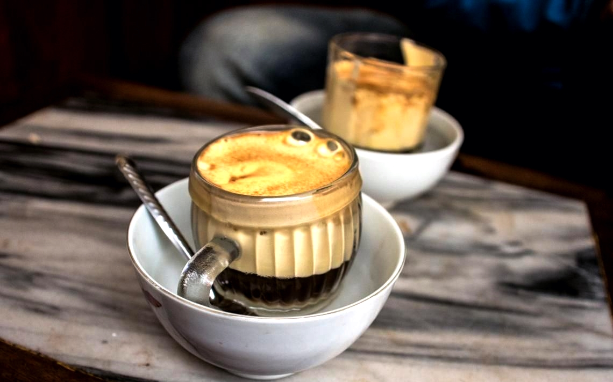

# Cà Phê Trứng (Vietnamese Egg Coffee)

*Hanoi's signature coffee: an egg yolk whipped with sweetened condensed milk into a thick, fluffy meringue-like cream, floated on top of a small cup of strong Vietnamese drip coffee. Served in a bowl of hot water to keep it warm. Tastes like liquid tiramisu.*

**Serves:** 2 cups

**Prep Time:** 3 minutes

**Cook Time:** 6 minutes

## Overview
Cà phê trứng is a Hanoi invention, traditionally credited to the Giang Café in the Old Quarter where it was created in 1946 to substitute for fresh milk during the French colonial milk shortage. The drink is now a Vietnamese institution and a tourist pilgrimage destination: a tiny glass of strong, dark Vietnamese drip coffee (cà phê) with a thick, fluffy, sweet cap of whipped egg yolk and sweetened condensed milk floating on top, served in a small bowl of hot water that keeps the coffee warm. The egg foam tastes like a custard cream — sweet, eggy, vanilla-rich, with the bitter dark coffee underneath cutting through it perfectly. The texture is the whole experience: stir slowly with a small spoon as you drink, alternating between sipping the strong coffee and spooning the cream. Some people drink the coffee first then eat the cream like dessert. There's no wrong way. It tastes like Vietnamese tiramisu in a glass; it's served at every Hanoi café from breakfast through midnight.

## Ingredients

- 2 tablespoons strong Vietnamese ground coffee (Trung Nguyên brand; dark Robusta-blend; espresso grind)
- 200 ml just-off-the-boil water
- 2 egg yolks (from very fresh free-range eggs — the egg is whipped raw, so quality matters)
- 4 tablespoons sweetened condensed milk
- 1/2 teaspoon vanilla extract

### Equipment
- A small Vietnamese phin filter (the metal drip filter) OR a small French press OR a moka pot — produces the strong coffee base
- Electric hand whisk or stand mixer for the egg cream

### To serve
- 2 small thick-walled coffee glasses (about 150 ml capacity)
- 2 small bowls or shallow dishes of hot water (to hold the coffee glasses and keep warm)
- Optional: a small dusting of cocoa powder or cinnamon

## Method

### Stage 1 - Brew the coffee
1. Set up your brewing method. For a phin: put 2 tablespoons of coffee into the metal filter, screw down the press plate gently (not too tight), set on top of a small glass.
1. Pour 200 ml of just-off-the-boil water into the filter, cover with the lid, and let it drip slowly (3-5 minutes). The brewed coffee will be very dark, almost black.
1. For a French press / moka: brew normally with the strongest setting; you want a very concentrated dark coffee.

### Stage 2 - Whip the egg cream (do during brewing)
1. Put the egg yolks, sweetened condensed milk and vanilla extract into a small bowl.
1. Whip with an electric hand whisk on high speed for 3-4 minutes until the mixture is thick, pale, fluffy and roughly tripled in volume. It should hold soft peaks and have the consistency of whipped cream / a stiff custard.
1. The colour will lighten from deep yellow to a pale creamy yellow.

### Stage 3 - Assemble
1. Pour the hot brewed coffee into 2 small thick-walled glasses, filling them about a third full (about 50-60 ml each).
1. Spoon the egg cream generously on top — it should float as a thick fluffy layer covering the coffee completely. The cream should fill the remaining two-thirds of the glass.

### Stage 4 - Serve
1. Set each glass into a small bowl of hot water (the hot-water bath keeps the coffee warm while the cream stays cool on top — the classic Hanoi serve).
1. Optional: dust the cream with a tiny pinch of cocoa powder or cinnamon.
1. Serve immediately with a small spoon.

## Notes
- **Egg yolk freshness.** The egg yolk is whipped raw and served raw. Use the freshest free-range eggs you can find. If raw eggs are a concern (very young children, pregnant women, elderly), use pasteurised liquid yolks instead — most major supermarkets stock them.
- **Strong coffee is essential.** Cà phê trứng depends on the contrast between bitter dark coffee and sweet eggy cream. Weak coffee gives a sweet, one-note drink.
- **Whip the cream thick.** Under-whipped cream sinks into the coffee instead of floating. Properly whipped cream floats as a distinct thick layer.
- **The hot water bath.** Setting the coffee glass in a bowl of hot water is the proper Hanoi serve. It keeps the drink warm without further heating (which would cook the egg yolk in the cream).

## Variations
- **Cà phê trứng đá.** The cold version: strong coffee over ice, egg cream floated on top. Hanoi summer variant.
- **Chocolate cà phê trứng.** Add 1 tablespoon of cocoa powder to the egg-cream mixture before whipping. Hanoi modern café trend.
- **Without dairy.** Replace sweetened condensed milk with sweetened condensed coconut milk. Lighter, slightly different.
- **Matcha trứng.** Replace coffee with strong-brewed matcha. Not traditional but increasingly common in modern Hanoi cafés.

## Storage
- Doesn't store. Build to order. The cream loses its fluff within 10 minutes; the coffee goes cold and unappetising shortly after.
