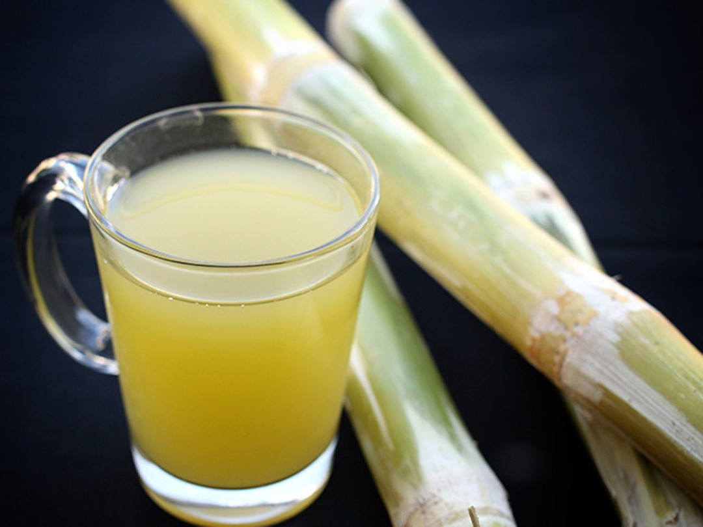

# Nước Mía (Vietnamese Sugarcane Juice)

*Vietnam's everyday street juice: fresh sugarcane crushed through a press, finished with a squeeze of calamansi and poured over crushed ice: the after-pho drink at every street corner in Saigon and Hanoi.*

**Serves:** 4 tall glasses

**Prep Time:** 5 minutes (assumes pre-pressed juice)

**Cook Time:** 0 minutes

## Overview
Nước mía (literally "sugarcane water") is the everyday Vietnamese street drink: fresh sugarcane juice pressed minutes before you drink it, served cold over crushed ice with a squeeze of calamansi (the small green Vietnamese citrus, kumquat-like) for brightness. Across Saigon, Hanoi and every town in between, streetside vendors run rolling-cart sugarcane presses; long peeled cane stalks feed between rollers that crush out the juice into a tall metal jug. A fresh squeeze of calamansi cuts the sweetness; the drink pours into a tall plastic bag, tied at the top with a straw poking through, and handed over for the equivalent of about thirty pence. Sweet, refreshing, cooling, and the perfect chaser to a steaming bowl of phở or a hot afternoon. At home outside Vietnam, buy fresh-pressed sugarcane juice frozen at Southeast Asian groceries, or extract it from peeled stalks with a juicer (the home extraction is inferior but works in a pinch).

## Ingredients

- 1 litre fresh sugarcane juice (from a streetside press if you can; from frozen at a Southeast Asian grocery as a backup; or extract from 1 kg of peeled sugarcane stalks via a juicer for the home version)
- Juice of 4 calamansi (the small Vietnamese green citrus; substitute with juice of 2 limes or 1 lemon if calamansi unavailable)
- Plenty of crushed ice

### To serve
- 4 tall glasses, chilled
- Optional: a small wedge of calamansi (or lime) per glass
- Optional: a sprig of mint per glass

## Method

### Stage 1 - Combine juice and citrus
1. Pour the fresh sugarcane juice into a chilled jug.
1. Squeeze the calamansi juice through a sieve into the jug to catch the seeds.
1. Stir gently.
1. Taste: it should be very sweet with a clear bright citrus lift. Add another half-squeeze of citrus if it tastes flat or one-note.

### Stage 2 - Chill (if needed)
1. If the juice is freshly pressed and at room temperature, refrigerate it for 30 minutes before serving. Sugarcane juice oxidises and loses brightness within 2 hours at room temp, so the colder and fresher, the better.

### Stage 3 - Serve
1. Fill chilled tall glasses three-quarters full with crushed ice.
1. Pour the sugarcane juice over the ice.
1. Garnish each glass with a small wedge of calamansi or lime and (optionally) a mint sprig.
1. Serve immediately with a thick straw.

## Notes
- **Freshness is everything.** Sugarcane juice tastes brightest within 1-2 hours of pressing. After 4-6 hours it loses its grassy-sweet snap and tastes flat. Buy from a busy vendor; refrigerate immediately if not drinking straight away.
- **Calamansi, not lime.** If you can find calamansi (small green Filipino-Vietnamese citrus, sold at Asian groceries), use it, the flavour is distinct, somewhere between lime and tangerine. Lime is the closest substitute but tastes different.
- **No added sugar.** Sugarcane juice is naturally about 15-20% sugar; it doesn't need any added. The brightness comes from the citrus, not extra sweetness.
- **Don't strain finely.** A bit of natural pulp/fibre in the juice is correct and adds to the texture. Over-straining gives a thin, less satisfying drink.

## Variations
- **Nước mía dừa.** With a tablespoon of coconut milk stirred in. Tropical, slightly creamier; popular in southern Vietnam.
- **With pandan.** Brew a knotted pandan leaf in 50 ml of warm water for 10 minutes, cool, strain, stir into the juice. Adds a faintly grassy-floral character.
- **Nước mía gừng (ginger sugarcane).** Add 1 teaspoon of fresh ginger juice (grate ginger, squeeze through cloth). Warm, slightly spicy; the cold-weather Vietnamese version.
- **Lemongrass sugarcane.** Bruise 1 lemongrass stalk and steep it in 50 ml warm water, strain, stir into the juice. Citrus-grass aroma, brighter.

## Storage
- Best fresh. Fresh-pressed juice keeps 24 hours sealed in the fridge but the flavour fades noticeably after 12 hours.
- Freeze in ice cube trays for longer storage; use frozen cubes in iced drinks. The flavour holds up well frozen up to 1 month.
