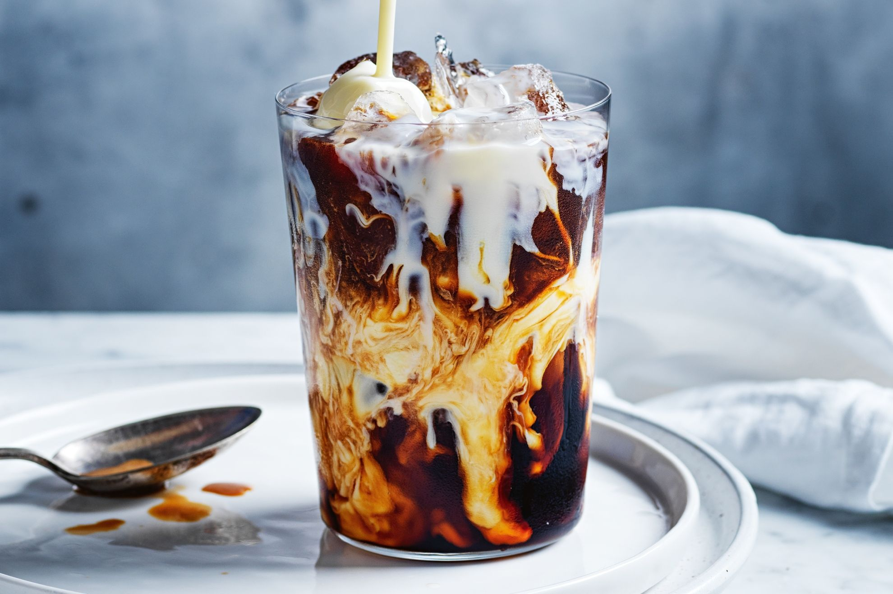

# Vietnamese Iced Coffee

*Cà phê sữa đá: strong dark coffee dripped slowly through a phin filter onto a layer of sweetened condensed milk, stirred together, poured over ice.*

**Serves:** 1

**Prep Time:** 2 minutes

**Cook Time:** 5 minutes

## Overview
Vietnamese iced coffee, cà phê sữa đá, is one of the great hot-country drinks: a way of making coffee bearable in 35°C humidity by sweetening it heavily with condensed milk and dropping the whole thing onto a tall glass of ice. The traditional brewing method is a phin, the small metal drip filter that sits on top of the glass and lets ground coffee drip slowly through hot water over four or five minutes; the resulting brew is concentrated, intensely roasted (Vietnamese coffee is typically dark robusta, much stronger than the arabica in Italian espresso) and dark as treacle. Two tablespoons of sweetened condensed milk go into the bottom of the glass first; the hot coffee drips onto it; you stir to combine; the whole thing pours over ice in a tall glass and is drunk through a straw on a hot afternoon while the rest of Saigon sweats. A phin filter is the right tool but a strong espresso or a cafetière brew works.

## Ingredients

### Per glass
- 2 tablespoons sweetened condensed milk (the proper stuff in a tin; not evaporated milk)
- 2 tablespoons coarsely ground Vietnamese coffee (or any dark French roast; robusta is traditional, arabica works)
- 100 ml just-off-the-boil water (around 95°C)
- Plenty of ice cubes (fill the glass)

### Equipment
- A phin filter (Vietnamese drip filter; sold for a few pounds online or at any Asian grocer)
- A tall glass

### To serve
- A straw (the wide kind)

## Method

### Stage 1 - Set up
1. Spoon the sweetened condensed milk into a heatproof glass that will sit under the phin.
1. Tip the ground coffee into the phin's chamber.
1. Place the phin on top of the glass.

### Stage 2 - First wet
1. Pour 20 ml of the hot water onto the coffee grounds, just enough to wet them.
1. Let it sit for 30 seconds; the grounds will swell. This "bloom" step releases the trapped gases and lets the proper extraction happen.

### Stage 3 - Drip slowly
1. Slowly pour the remaining hot water into the phin filter.
1. Place the screw-down filter disc on top (most phin filters have one) and tighten it lightly; this controls the drip speed.
1. The coffee should drip through in 4 to 5 minutes; if it drips faster than 3 minutes, tighten the filter; slower than 6 minutes, loosen it.
1. The coffee drips onto the condensed milk; do not stir yet.

### Stage 4 - Stir and pour
1. When the dripping stops, lift off the phin and set aside (be careful, it's hot).
1. Use a long spoon to stir the coffee and condensed milk together until completely combined; the mixture turns a deep caramel colour.
1. Fill a second tall glass with ice cubes; pour the coffee mixture over the ice (it will dilute slightly as the ice melts, which is the goal).

### Stage 5 - Serve
1. Add a wide straw; serve immediately.
1. The drink should be intensely sweet, deeply coffee-forward, and properly cold; stir again with the straw before drinking.

## Notes
- **A phin is the right tool but not the only one.** Without one, use a strong espresso (2 shots, 60 ml) or a cafetière brew (3 tablespoons coffee + 150 ml water steeped 4 minutes). The drip slowness of the phin gives a different mouthfeel but the principle holds.
- **Sweetened condensed milk, not evaporated.** Condensed milk has been heavily reduced with sugar; evaporated milk is just reduced, no sugar. Vietnamese iced coffee depends on the sweetness.
- **Dark roast is the canon.** Vietnamese coffee is typically robusta, harvested for caffeine punch rather than nuance. French roast or Italian espresso roast arabicas work; a light third-wave roast is the wrong choice here.
- **Ice in a second glass.** The ice goes in last, in a fresh glass, after the coffee has been mixed. Putting it under the dripping coffee dilutes everything too fast.

## Variations
- **Cà phê đen đá.** "Black iced coffee": no condensed milk. Drip the coffee onto an empty glass, sweeten with a teaspoon of caster sugar if wanted, pour over ice.
- **Egg coffee (cà phê trứng).** A Hanoi specialty: whip an egg yolk with condensed milk to a thick mousse, spoon onto hot coffee. Tastes like coffee tiramisu in a cup.
- **Coconut coffee.** Pour the coffee over a tall glass of crushed ice topped with coconut cream; the Saigon street version.

## Storage
- Drink immediately; the coffee dilutes fast as the ice melts.
- The unmixed phin can be brewed ahead and cooled for an iced coffee at any time within 4 hours.
- A sealed jar of cold-brewed strong coffee keeps 5 days in the fridge as a base for iced coffee on demand.
