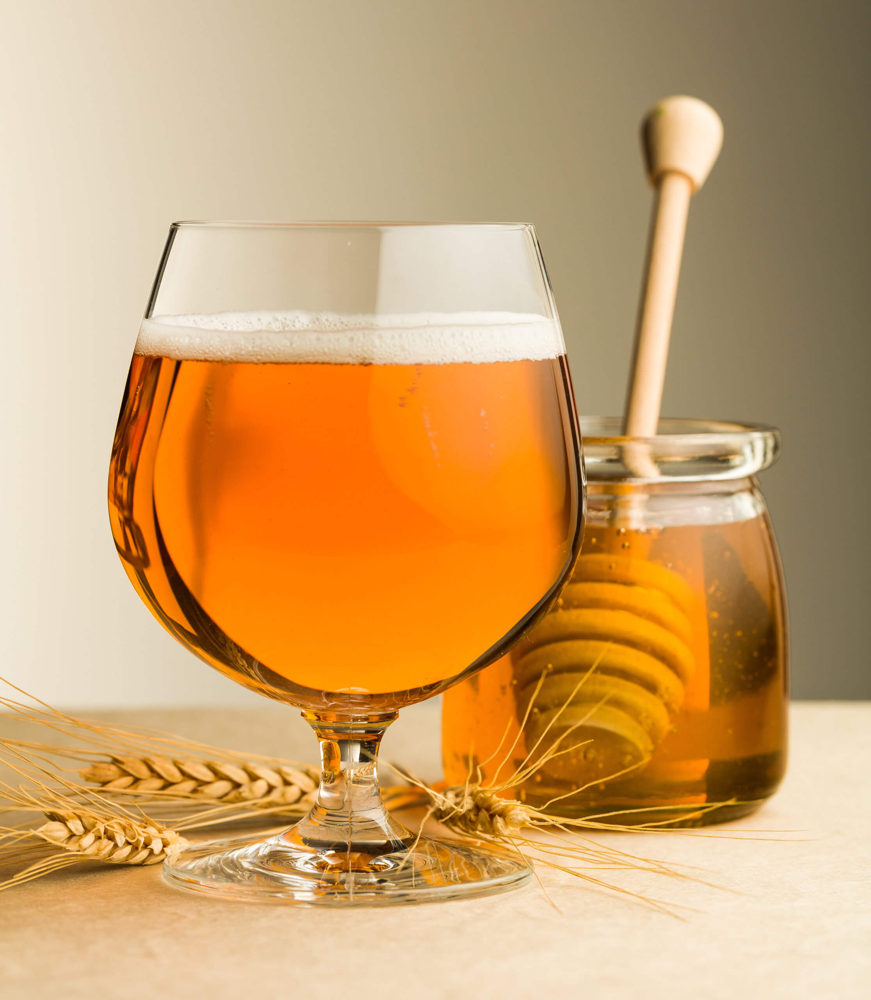

# Bragawd (Welsh Honey-Spiced Ale)

*The ancient Welsh medd-and-cwrw hybrid: a honey-spiced ale brewed with malted barley, mead and a Welsh spice mix of clove, cinnamon and ginger; deep amber, warm-spiced, mentioned in the laws of Hywel Dda over a thousand years ago.*

**Serves:** 1 demijohn (about 4.5 litres, 18 small bottles)

**Prep Time:** 1 hour 30 minutes

**Cook Time:** 1 hour 30 minutes (plus 6 weeks fermentation and 3 months maturing)

## Overview
Bragawd (anglicised as "bragget") is the original Welsh celebratory drink, predating English beer in Welsh tradition and listed in the 10th-century Laws of Hywel Dda as the second most valuable liquid in Wales (after pure mead). The construction is a hybrid: an ale brewed from malted barley is combined with mead (the honey-water ferment) and spiced with the Welsh-medieval spice quartet of clove, cinnamon, ginger and grains of paradise. The result is darker, fuller and more spiced than mead; warmer and sweeter than ale. It was the drink poured into the king's cup at a Welsh court feast and into the wedding cup at a Welsh handfasting. The 19th-century cwrw industry pushed bragawd to the edges; the modern Welsh revival (Heavenly Sweets, Coastal Mead) has brought it back. Brewed slowly, matured patiently, drunk on cold winter Welsh evenings beside a peat fire.

## Ingredients

### Beer base
- 2.5 litres water
- 500 g crushed pale ale malt (or 500 g malt extract)
- 30 g traditional bittering hops (Fuggles or Goldings)

### Mead component
- 1 kg Welsh honey (wildflower or heather)
- 1.5 litres just-cooled boiled water

### Welsh spice mix
- 4 whole cloves
- 1 cinnamon stick (10 cm)
- 30 g fresh ginger (peeled, sliced)
- 6 grains of paradise (or black peppercorns, lightly cracked)
- 1 strip orange zest (no pith)

### Fermentation
- 1 sachet (5 g) ale yeast (S-04 or Nottingham)
- 1 teaspoon yeast nutrient

### Equipment
- 1 large stockpot (6+ litres)
- 1 muslin grain bag (or fine sieve + cheesecloth)
- 1 demijohn (5 litre glass fermenter)
- 1 airlock + bung
- 1 racking siphon
- Sterilised 500 ml swing-top bottles

## Method

### Stage 1 - Mash the malt (40 minutes)
1. Heat the 2.5 litres of water to 68°C in the stockpot.
2. Put the crushed malt into the muslin grain bag.
3. Lower the grain bag into the water; close the lid.
4. Hold at 65-68°C for 40 minutes (the malt enzymes convert starch into fermentable sugars).
5. Lift the grain bag out; let it drain back into the pot for 5 minutes; squeeze gently.

### Stage 2 - Boil with hops and spices (60 minutes)
1. Bring the wort (the strained malt-water) to a boil.
2. Add the bittering hops.
3. Boil 45 minutes uncovered.
4. Add the cloves, cinnamon stick, ginger slices, grains of paradise, and orange zest.
5. Boil another 15 minutes.
6. Take off the heat; let stand 10 minutes for the hops and spices to settle.

### Stage 3 - Mead component
1. While the wort cools, warm 500 ml of the just-boiled water to dissolve the honey.
2. Stir till the honey is fully dissolved (do not boil; preserves the aromatics).
3. Top up with the remaining 1 litre of cool water.

### Stage 4 - Combine in the demijohn
1. Sterilise the demijohn, airlock and bung.
2. Strain the cooled wort (now at 25°C or below) into the demijohn through a fine sieve, discarding the hops and spices.
3. Add the honey-water mead component.
4. Top up to about 4.5 litres total volume; the demijohn should be 90% full.
5. Add the yeast nutrient.
6. Sprinkle the ale yeast over the surface.

### Stage 5 - Primary fermentation (10-14 days)
1. Fit the airlock with sanitiser.
2. Store at 18-20°C in a cool dark place.
3. Within 24 hours the airlock starts bubbling.
4. Active fermentation lasts 10-14 days.

### Stage 6 - Secondary fermentation (4 more weeks)
1. Siphon the bragawd off the lees into a sterilised second demijohn.
2. Refit the airlock.
3. Mature 4 weeks at 14-16°C; the bragawd clears as the yeast settles.

### Stage 7 - Bottle (with priming sugar)
1. Boil 80 ml water with 25 g caster sugar; cool.
2. Mix the priming syrup into the demijohn gently (don't aerate).
3. Siphon into sterilised swing-top bottles, leaving 3 cm headspace.
4. Cap.

### Stage 8 - Carbonate and mature
1. Store the bottles upright at 18-20°C for 2 weeks (the residual yeast carbonates the bottle).
2. Then move to a cool cellar 8-12°C for at least 3 months (longer is better).
3. The bragawd matures and rounds out over 6-12 months.

### Stage 9 - Serve
1. Chill the bottle 2 hours before serving.
2. Decant carefully (the yeast sediment is on the bottom).
3. Pour into small thick-walled cwpan brag (the traditional Welsh bragawd cup) or into wine glasses.

## Notes
- **Welsh honey is the dish:** the floral character of Welsh wildflower or heather honey defines bragawd.
- **Grains of paradise:** a black-peppery aromatic spice; the traditional medieval Welsh ingredient. Use cracked black pepper if you can't find it.
- **Don't boil the honey:** keeps the floral aromatics intact.
- **Three months minimum, six months better:** a freshly bottled bragawd is harsh; the time rounds it into amber-sweet-spiced harmony.
- **Watch the bottle pressure:** if a bottle feels rock-hard or starts venting on the cap, chill the entire batch immediately (over-carbonation is a real risk).

## Variations
**Mulled bragawd:** warm 200 ml in a saucepan with an extra clove and orange slice; the Welsh winter version.
**Dry bragawd:** ferment longer (8 weeks) to drive the residual sugar lower; serve as an ale.
**Sweet bragawd:** back-sweeten with 50 g extra honey after fermentation; add potassium sorbate to prevent re-fermentation.
**Bragawd with bog myrtle:** add 5 g dried bog myrtle (Welsh "myrtle ale" tradition) instead of hops.
**Spiced wedding bragawd:** add 1 teaspoon rose-water and 1 teaspoon orange-flower water to the secondary fermenter.

## Serving
At a Welsh wedding (the traditional honeymoon drink) · at Christmas dinner with the goose · at a Welsh bardic supper · alongside a slice of bara brith with butter · with cawl on a winter night · at a Welsh Eisteddfod after the prize-giving.

## Storage
- Bottled bragawd keeps 3 years in a cool dark cellar.
- The flavour develops for 12 months, then plateaus.
- Once opened, refrigerate; drink within 5 days.
- Don't freeze (the bottle bursts; the residual yeast keeps fermenting slowly at freezer-edge temperatures).
