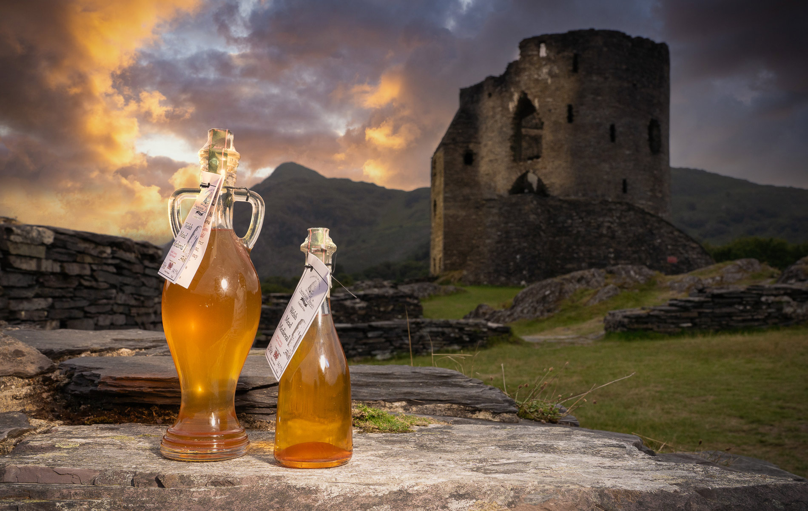

# Medd (Welsh Mead)

*The drink of the Welsh bards: honey, water and a strip of citrus fermented six months into a dry-to-off-dry amber wine; the original Welsh celebratory drink, with the Welsh epic Y Gododdin quoting the mead-hall over a thousand years ago.*

**Serves:** 1 bottle (about 750 ml)

**Prep Time:** 30 minutes

**Cook Time:** 20 minutes (plus 6 months fermenting and maturing)

## Overview
Medd is the Welsh honey wine, made for over fifteen hundred years in Welsh mead-halls and mentioned in the 6th-century poem Y Gododdin ("the men of Catraeth drank mead in the noble hall"). The traditional Welsh medd is built on three things: Welsh honey (heather honey from upland hives, or wildflower honey from lower-down), spring water, and a single strip of lemon or orange zest for brightness. Yeast and a little nutrient drive a slow fermentation that takes six weeks; the mead is then racked off the lees and matured another four months minimum to round out. The finished medd is amber-gold, dry to off-dry, with the honey flavour transformed (the sweetness is mostly gone, the floral character of the honey remains). The Welsh tradition is to serve medd at weddings (the source of the word "honeymoon", a month of mead-drinking by the bride and groom), at Christmas, and at any chapel-tea celebration.

## Ingredients

### For 1 demijohn (5 litres)
- 1.5 kg Welsh honey (heather honey, or any unfiltered raw wildflower honey)
- 4 litres spring or filtered water
- 1 lemon (zest only, in long strips; no pith)
- 1 sachet (5 g) mead yeast or champagne yeast (or Lalvin 71B / EC-1118)
- 1 teaspoon yeast nutrient (DAP)
- 1/4 teaspoon yeast energizer
- 5 g pectic enzyme (optional, for clarity)

### Equipment
- 1 large saucepan (5+ litres)
- 1 demijohn (5 litre glass fermenter)
- 1 airlock + bung
- 1 hydrometer (optional, for measuring strength)
- 1 racking siphon
- 1 sterilised wine bottle + cork or screw-cap (for the finished product)

## Method

### Stage 1 - Sterilise everything
1. Sterilise the demijohn, airlock, bung, and the saucepan with food-grade sanitiser (e.g. Star San or Milton solution).
2. Rinse with clean water.

### Stage 2 - Must (the honey-water base)
1. Combine 1.5 kg honey with 1.5 litres of the water in the saucepan.
2. Warm gently over low heat, stirring constantly till the honey dissolves (do not boil; boiling drives off the honey aromatics).
3. Add the lemon zest strips.
4. Off the heat, top up with the remaining 2.5 litres of cool water to bring the volume to 4 litres and the temperature to 20°C.

### Stage 3 - Pitch the yeast
1. Pour the must into the sterilised demijohn.
2. Add the yeast nutrient and energizer.
3. Sprinkle the yeast over the surface; let it sit 10 minutes.
4. Stir gently to incorporate.
5. Fit the airlock half-filled with sanitiser.

### Stage 4 - Primary fermentation (3 weeks)
1. Store the demijohn in a cool dark place at 18-20°C.
2. Within 24-48 hours the airlock should start bubbling.
3. Leave undisturbed 3 weeks; the bubbling slows from constant (week 1) to occasional (week 3).

### Stage 5 - Rack off the lees (week 3)
1. Siphon the mead off the sediment ("lees") into a second sterilised demijohn.
2. Top up with a little boiled-and-cooled water if needed (the mead must reach the demijohn shoulder; air-gap above causes oxidation).
3. Refit the airlock.

### Stage 6 - Secondary fermentation (3 more weeks)
1. Leave undisturbed for 3 more weeks at 16-18°C.
2. The mead clears noticeably as more sediment drops.

### Stage 7 - Mature
1. Rack a second time off the new sediment into a clean demijohn.
2. Leave to mature for at least 4 months (longer is better; the Welsh tradition is to start medd at midsummer for Christmas drinking).

### Stage 8 - Bottle
1. Siphon the cleared medd into sterilised wine bottles.
2. Cork or cap; lay flat in a cool dark cupboard.
3. Mature at least 1 month before opening.

### Stage 9 - Serve
1. Chill the bottle 2 hours before serving.
2. Pour into small wine glasses or thistle-shaped traditional Welsh mead glasses.
3. Serve at 8-10°C.

## Notes
- **Welsh honey, not commercial honey:** the floral character is the dish. Welsh heather honey is the gold standard; any raw unfiltered honey works. Skip the supermarket squeeze-bottle.
- **Don't boil:** boiling honey kills the aromatics and produces a flat mead.
- **6 months is the minimum:** a freshly bottled medd is sharp and harsh. The Welsh saying: "leave it for the bride." (Honeymoon = month of mead.)
- **Citrus zest only, no juice or pith:** the zest gives the lift; juice acidifies too much, pith adds bitterness.
- **Airlock bubbles slowing means the yeast is finishing:** taste a sample at week 6; it should be dry. If still sweet, leave another 2 weeks.

## Variations
**Bragawd (spiced mead):** add 1 teaspoon each of clove, allspice, cinnamon to the must (the medieval Welsh "bragget").
**Melomel (fruit mead):** add 1 kg fresh raspberries or blackberries to the secondary fermenter (Welsh fruit mead).
**Sweet medd:** stop the fermentation early by chilling and adding potassium sorbate at week 4; back-sweeten with 100 g honey before bottling.
**Hot medd (mulled):** warm a glass of medd with a clove-stuck orange slice and a cinnamon stick; serve hot in winter.
**Wedding medd:** add 1 tablespoon rose-water and 1 strip orange zest to the must (the Welsh wedding tradition).

## Serving
At a Welsh wedding (the honeymoon tradition) · at a Christmas Welsh chapel-tea · on Saint David's Day (March 1) · at a Welsh bardic gathering (the Eisteddfod) · as a digestif after Welsh lamb · with bara brith and butter at teatime.

## Storage
- Bottled medd matures another 5 years in a cool dark cupboard.
- Once opened, refrigerate; drink within 1 week.
- Don't freeze (the alcohol prevents freezing solid but the texture suffers).
- Older medd develops sherry-like depth; the colour deepens from gold to amber.
