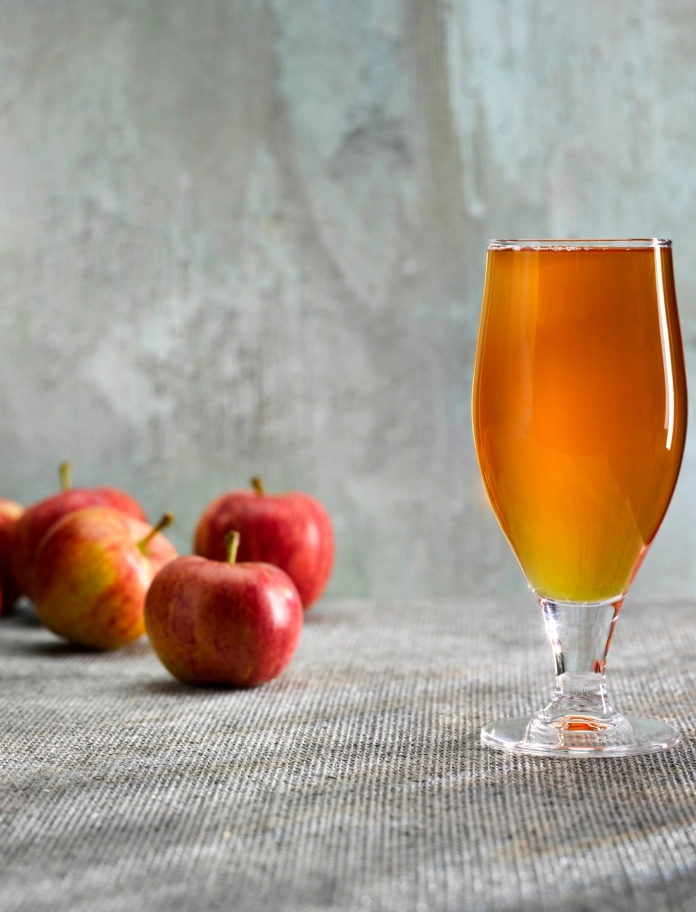

# Welsh Cider (Seidr)

*Monmouthshire orchard cider: hand-pressed from sharp bittersweet Welsh apples, wild-fermented in oak six months till dry and faintly tannic, drunk straight from the barrel at a Welsh harvest supper.*

**Serves:** 1 demijohn (about 5 litres, 25 small glasses)

**Prep Time:** 1 hour

**Cook Time:** None (plus 6-8 months fermentation and maturing)

## Overview
Welsh cider (seidr in Welsh) is a Monmouthshire and Herefordshire-borders tradition, made from bittersweet and sharp cider apples grown in small orchards along the lower Wye Valley. The Welsh cider-making revival of the 1990s rescued varieties like Frederick, Foxwhelp, Browns and Breakwell's Seedling that had nearly vanished; the small Welsh cider houses (Hallets, Gwynt y Ddraig, Springherne) now sell barrel cider through the Campaign for Real Welsh Cider. The construction is straightforward but slow: apples are pressed in autumn, the juice goes into a vessel (traditionally an oak cask, modernly a glass demijohn), wild yeasts on the apple skins drive a six-month wild fermentation, and the cider is racked once or twice before serving at Easter the following year. The Welsh style is dry, faintly tannic, slightly funky, distinctly orchardy; very different from the over-sweetened mass-market cider that calls itself by the name.

## Ingredients

### For 5 litres (1 demijohn)
- 7 kg mixed cider apples (60% bittersweet + 30% sharp + 10% sweet, OR 50% Bramley + 50% sweet eating apples as a substitute)
- 1 Campden tablet (optional, for sulphite stabilisation)
- 1 sachet (5 g) cider yeast (or champagne yeast, or wild ferment with no addition)
- 1 teaspoon yeast nutrient (optional)

### Equipment
- 1 fruit press (a small basket press, or a heavy bag and weight)
- 1 large food-grade bucket
- 1 demijohn (5 litre glass fermenter)
- 1 airlock + bung
- 1 racking siphon
- Sterilised 750 ml glass bottles + crown caps OR swing-top caps

## Method

### Stage 1 - Pick and sort the apples
1. Use a mix of cider apples (bittersweet for tannin, sharp for acid, sweet for sugar).
2. Reject any apples that are bruised, mouldy or rotten (one bad apple sours the whole barrel).
3. Wash the apples in cold water.
4. Sit them in a single layer for 1-2 weeks ("sweating") to develop sugar.

### Stage 2 - Mill and press
1. Chop the apples into rough quarters (skin and pips left in, the core goes too).
2. Crush in a fruit mill, or pulse-blitz in batches in a food processor (don't puree, you want chunks).
3. Tip the pulp into the press; press out the juice.
4. (No press? Wrap the pulp in a clean cotton bag and weight heavily on a colander overnight.)
5. Strain the juice through muslin into a sterilised bucket.

### Stage 3 - (Optional) Sulphite
1. Crush a Campden tablet; stir into the juice.
2. Leave 24 hours; this kills off wild bacteria but spares the cider yeasts you'll pitch.
3. Skip this step entirely if you want a true wild ferment.

### Stage 4 - Pitch the yeast
1. Pour the juice into a sterilised demijohn (leave 5 cm headspace).
2. Sprinkle the yeast over the surface.
3. Fit the airlock half-filled with sanitiser.

### Stage 5 - Primary fermentation (3-4 weeks)
1. Store the demijohn in a cool dark place at 15-18°C.
2. Within 24-48 hours the airlock starts bubbling.
3. Active fermentation continues 2-3 weeks, then slows.

### Stage 6 - Rack and mature (5 months)
1. Siphon the cider off the lees into a clean demijohn.
2. Top up with a little boiled-cooled water if needed.
3. Refit the airlock.
4. Mature 5 months in a cool dark place; the cider clears and rounds out.

### Stage 7 - Bottle
1. Siphon into sterilised bottles.
2. For still cider: cap and store.
3. For lightly sparkling: add 1/4 teaspoon caster sugar per bottle (priming sugar) before capping; the residual yeast will produce a gentle natural fizz over 2-3 weeks.

### Stage 8 - Serve
1. Mature at least 2 months before drinking; Welsh tradition serves the new cider at Easter.
2. Chill to 8-10°C.
3. Pour into small thick-walled glasses (the Welsh cider glass is small to keep the cider cold over a long evening).

## Notes
- **Cider apples, not eating apples:** the bittersweet tannin is the dish. If you can't get cider apples, mix 50% Bramley (sharp) with 50% Cox or sweet apples, and accept a less complex result.
- **Wild ferment vs. yeast pitch:** wild is more characterful but riskier; pitched yeast is more reliable.
- **Don't skim the brown foam:** the foam ("Welsh hat") is normal during primary fermentation and falls back in.
- **Slow and cold:** Welsh cider is a slow ferment at low temperature; a warm shed cuts the maturation but produces a coarser cider.
- **The Campaign for Real Welsh Cider (CAMRA Cymru)** lists the small Welsh cider houses worth supporting if you want commercial Welsh cider rather than home-pressed.

## Variations
**Sparkling Welsh cider:** prime each bottle with 1/4 teaspoon sugar; cap; rest 3 weeks at room temperature.
**Dry Welsh cider:** ferment to completion; no priming sugar; serve still.
**Welsh cider hot toddy:** warm 200 ml cider with a slice of orange, a clove and a stick of cinnamon; the winter version.
**Welsh wassail cup:** mull a litre of cider with apple slices, ginger, cinnamon and a slug of brandy for a Twelfth Night wassail (the orchard-blessing tradition).
**Cider vinegar:** if a batch goes off, let it continue and you'll have raw cider vinegar in 4 months.

## Serving
At a Welsh harvest supper (the traditional setting) · with Welsh leek and bacon pie · alongside a Glamorgan sausage ploughman's · at a Twelfth Night wassail in the orchard · with crumbly Caerphilly cheese and bara brith · on a Black Mountains walk after a long day.

## Storage
- Bottled Welsh cider keeps 12 months unopened in a cool dark cellar.
- Once opened, refrigerate; drink within 5 days.
- The flavour deepens with age for 6-12 months, then starts to oxidise; drink within the first year.
- Don't freeze (the bottle pressure breaks the glass).
