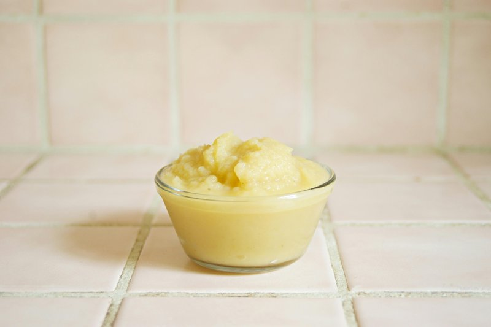

# Apple Sauce

*Britain's apple sauce: bramley apples slow-cooked with butter, sugar and a strip of lemon zest into a soft pale sauce.*

**Serves:** 6

**Prep Time:** 10 minutes

**Cook Time:** 25 minutes

## Overview
Apple sauce is the building block for the classic British accompaniment to roast pork, duck, goose and game: peeled diced apples cooked down with a splash of water, sugar, lemon juice and a cinnamon stick into a soft pale compote, whisked at the end with butter and a pinch of salt for richness and gloss. The choice of apple is what gives the sauce its character. Cox's give the classic balance of sweetness and acidity (the version most cooks default to); Bramleys collapse to a tarter sharper sauce that cuts through fatty roast pork beautifully and is the more traditional British choice. Peel, core and finely dice the apples, then drop into a heavy-based saucepan with 150 ml of water, the caster sugar, lemon juice and half a cinnamon stick. Bring to a simmer over medium heat, then cover and cook gently for around 15 minutes till the apples have collapsed but haven't dried out; check halfway and add a splash more water if the pan is going dry. Fish out the cinnamon stick (forget this and you'll find fragments in the sauce later). Off the heat, whisk in the butter a small piece at a time with a pinch of salt to bring the sauce together into a glossy compote; the butter is what turns it from stewed apple into proper apple sauce, so don't skip it. The final consistency depends on how juicy your apples were, so loosen with a tablespoon or two of water if it feels too thick. Serve warm or at room temperature next to roast pork, duck, goose, game, or alongside a pork pie. Keeps three to four days refrigerated or freezes three months.

## Ingredients

### Base
- 500 grams dessert apples (preferably Cox's)
- 20 grams caster sugar
- ½ lemon (juice)
- ½ stick cinnamon
- 30 grams butter
- pinch of salt

## Method

### Stage 1 - Cook apples
1. Peel, core and finely dice the apples. 
1. Place them in a heavy-based saucepan with 150 ml water, along with the sugar, lemon juice and cinnamon.
1. Bring to a simmer over a medium heat, then cover and cook for about 15 minutes until the apples are tender but not dried out. 

### Stage 2 - Finish sauce
1. Discard the cinnamon stick.
1. Take the pan off the heat and, using a small whisk, incorporate the butter and a pinch of salt to make a smooth compote. 
1. The consistency will vary according to how ripe or green the apples are. 
1. If the sauce seems too thick, add a couple of tablespoons of water to thin it slightly. 

## Notes
- **Cinnamon selection:** Use a fresh stick for best flavour; discard before serving to prevent fragments in the sauce.
- **Texture variation:** The final consistency depends on the moisture content of your apples; adjust water or cooking time accordingly.
- **Apples to use:** Cox's apples provide excellent balance of sweetness and acidity; Bramleys can be substituted for a more tart sauce.

## Serving
- Serve warm or at room temperature alongside roasted duck, pork, or game dishes. Also excellent with charcuterie and pâté.

## Storage
- Keeps refrigerated for 3-4 days in an airtight container.
- Freezes well for up to 3 months; thaw to room temperature before serving.
- Best eaten warm; reheat gently over low heat before serving.
