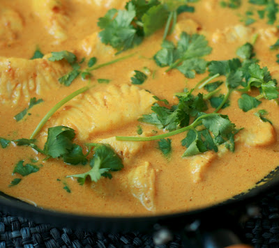

<!-- TODO: hero image undersized, refresh from Pexels or hand-curate -->
# Fruity Curry Sauce

*Serve this creamy, slightly fruity sauce with veal escalopes or chicken, accompanied by a pilaf or curried rice.*

**Serves:** 8

**Prep Time:** 15 minutes

**Cook Time:** 30 minutes

## Overview
Fruity curry sauce is the building block for the gently-spiced creamy curry-style sauce that drapes over poached chicken breast, veal escalopes or seared white fish: a velvety pale-gold sauce of softened onion, sweated tropical fruit (pineapple, banana, dessert apple), curry powder, ground almonds, veal stock and coconut milk, blitzed smooth and passed through a sieve. This isn't a fiery Indian curry; it's the soft European interpretation that uses the curry powder as a warm aromatic backdrop while the fruit does the dominant work, and it sits comfortably on a Sunday lunch table alongside pilaf rice. Three ingredient details matter. Use ripe but still-firm fruit so it holds shape during the initial sauté; soft overripe fruit breaks down too fast and the sauce loses texture. Use ground almonds rather than cream as the thickener; they give a subtle nutty body without making the sauce heavy, and they're what hold the coconut milk and stock together without splitting. And use a quality curry powder; the brand matters more here than in a curry with twenty other ingredients, because there's nowhere for stale curry powder to hide. Melt butter in a saucepan, sweat the chopped onion for a minute, then add the diced pineapple, sliced banana and chopped Cox's apple and cook five minutes till softened. Stir in the ground almonds and curry powder so they coat the fruit, then pour in the veal stock and coconut milk. Bring to the boil, drop to a gentle simmer for 20 minutes till everything melds, then pass through a fine-meshed conical sieve into a clean pan. Season with salt, reheat very gently to avoid splitting the coconut milk, and serve over chicken, veal or fish with rice.

## Ingredients

### Base
- 40 grams butter
- 60 grams onions (chopped)

### Fruit & aromatics
- 300 grams pineapple (cut into small pieces)
- 1 banana (medium, cut into rounds)
- 1 desert apple (Preferably Cox's, peeled, de-seeded and chopped)

### Spice & liquid
- 2 tablespoons ground almonds
- 40 grams [Curry Powder](../../cuisine/indian/Spice-Mixes/curry-powder.md)
- 300 ml Veal stock
- 200 ml coconut milk

## Method

### Stage 1 - Sweat aromatics
1. Melt the butter in a saucepan, add the onions and sweat them over a low heat for 1 minute to soften slightly. 

### Stage 2 - Add fruit & spices
1. Add the pineapple, banana and apple and cook gently for 5 minutes, stirring with a wooden spoon.
1. Stir in the curry powder and ground almond, then pour in the veal stock and coconut milk. 

### Stage 3 - Finish
1. Bring to the boil, reduce and let bubble gently for 20 minutes.
1. Pass the sauce through a fine-meshed conical sieve, season with salt to taste and serve immediately.

## Notes
- **Texture:** The ground almonds thicken the sauce naturally; they also add subtle nuttiness that complements the fruit.
- **Spice level:** Use quality curry powder; adjust quantity to taste as brands vary significantly in heat.
- **Fruit selection:** Use ripe but firm fruit; softer fruit will break down too quickly during cooking.

## Serving
Serve immediately with veal escalopes, chicken breast or lightly cooked fish. Accompany with pilaf rice, jasmine rice, or simple boiled basmati.

## Storage
- Keeps refrigerated for 2-3 days in an airtight container.
- Freezes well for up to 2 months.
- Best eaten fresh; reheat gently and stirring frequently to prevent splitting of the coconut milk.
