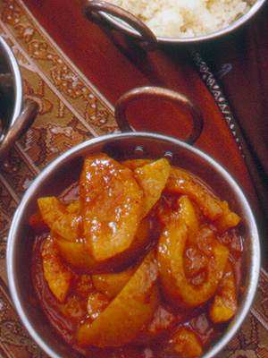

<!-- TODO: hero image undersized, refresh from Pexels or hand-curate -->
# Peach Chutney

*Make this chutney during the summer, when peaches are at their best. Serve it with terrines, pâté and cold meats, especially cold roast chicken.*

**Serves:** 9 (makes 700 grams preserve)

**Prep Time:** 30 minutes

**Cook Time:** 75 minutes

## Overview
Peach chutney is the building block for the summer cheese-board preserve, the jewelled jar you make when peaches are at their peak in August: a base of grated cooking apple, chopped ripe tomato, onion, ginger, garlic and lime cooked down into a thick spiced syrup, then finished with ripe peeled diced peach flesh and a handful of flaked almonds for textural contrast. The two-stage cook is what makes the chutney work. Cook the base mixture (everything except the peaches) for 30 minutes first till it turns jam-thick and a finger drawn down the back of the spoon leaves a clear trace, then add the peaches and cook gently for another 40 minutes so the peach pieces soften but don't disintegrate into the syrup. Cooking the peaches the whole way through would turn them to mush; adding them late gives you visible glossy chunks of peach suspended in the spiced base. Two ingredient points matter. Use peaches that are ripe but still firm; an overripe peach collapses in seconds, while an underripe one stays fibrous and tasteless. And use fresh lime zest, finely pared; dried lime zest lacks the bright citrus oils that lift the spice and balance the sweetness. Peel the peaches by scoring around the equator, dropping into boiling water briefly till the skins lift, refreshing in iced water and pulling the skins off; halve, stone and dice the flesh. Cook the base mixture down till jammy, add the peaches, simmer gently another 40 minutes stirring every 10, then ladle hot into sterilised jars and seal. The flavour develops over 2 to 3 days, so make it ahead. Keeps three weeks refrigerated.

## Ingredients

### Base & aromatics
- 60 grams cooking apples (cored, peeled and grated)
- ½ teaspoon salt
- 125 grams very ripe tomatoes (peeled, de-seeded and chopped)
- 60 grams onion (finely chopped)
- 1 clove garlic (crushed)
- 10 grams ginger (finely chopped)

### Spices & citrus
- 1 lime (finely pared and chopped, zest)
- 1 lime (juice)
- ½ teaspoon ground cinnamon
- ½ teaspoon ground nutmeg
- ½ teaspoon white pepper

### Sugar & liquid
- 150 grams caster sugar
- 150 ml white wine vinegar
- 70 grams flaked almonds
- 500 grams ripe, but firm peaches

## Method

### Stage 1 - Make base
1. Combine all the ingredients except the peaches in a heavy-based saucepan and bring to the boil over a very low heat, stirring from time to time with a wooden spoon. 
1. Continue to cook for about 30 minutes, giving a stir every 10 minutes, until the mixture is jam-like and syrupy. 
1. Test by running your finger down the back of the spoon; it should leave a clear trace.

### Stage 2 - Prepare & add peaches
1. In the meantime, peel the peaches: run the tip of a knife around the circumference, then immerse in a pan of boiling water.
1. As soon as the skin starts to lift along the incision, take the peaches out and refresh in iced water.
1. Lift out and pull off the skin. Halve and stone the peaches, then either cut the flesh into cubes or strips.
1. Add the peaches to the chutney mixture and cook very gently for another 40 minutes, stirring very gently every 10 minutes.

### Stage 3 - Jar
1. Transfer to a warm, sterilised preserving jar, leave to cool, then seal the jar. 
1. This will keep in the fridge for up to several weeks.

## Notes
- **Peaches:** Select ripe but firm peaches; overripe fruit becomes mushy and loses its integrity during the long cooking time.
- **Lime zest:** Fresh lime is essential; dried zest will not provide the same brightness and aromatic qualities.
- **Almonds:** Flaked almonds add textural contrast and subtle flavour; they soften but remain distinct during cooking.

## Serving
Serve with terrines, pâté, cold roasted poultry, and game. Also excellent alongside mature cheeses on a charcuterie board.

## Storage
- Keeps refrigerated for up to 3 weeks in sealed jars.
- Does not freeze well; texture and flavour are best preserved through refrigeration.
- Flavours develop over 2-3 days; best eaten after this initial maturation period.
