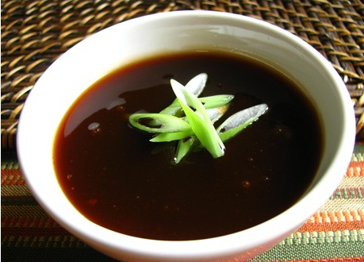

# Sweet and Sour Sauce

*This perfect dipping sauce for scampi and squid tempura, this sauce is also very good with sashimi, ham and other cold meat dishes.*

**Serves:** 6

**Prep Time:** 15 minutes

**Cook Time:** 20 minutes

## Overview
Sweet and sour sauce is the building block for the bright red-and-green dipping sauce that turns up next to scampi and squid tempura, spring rolls, dim sum and raw fish: charred peeled diced red and green peppers caramelised with onion and demerara sugar, then deglazed with red wine vinegar and finished with stock into a thick spoonable glossy sauce. This is the proper European version of sweet and sour, deeper and more savoury than the bright neon Chinese-takeaway version, with caramelised peppers as the dominant flavour rather than just sugar and vinegar. The two technique points that lift this above a simple syrup are charring the peppers and caramelising the sugar on the vegetables. Brush the whole peppers very lightly with oil, then char under a hot grill or in a hot oven till the skins blister and blacken; plunge into iced water to halt the cook, peel off the blackened skins, halve, deseed and finely dice. That char gives the peppers a smoky sweetness that you can't get from raw peppers cooked in the pan. Heat groundnut oil in a heavy saucepan, sweat the chopped onion for five minutes, add the diced peppers and sweat another five, then add the demerara sugar and keep stirring till the vegetables are lightly caramelised and the kitchen smells of sweet onion-pepper jam. Pour in the red wine vinegar to deglaze, scraping the bottom of the pan, and bubble hard till the liquid reduces by two-thirds and the harsh vinegar edge cooks off. Add the stock and continue to reduce till the sauce thickens enough to lightly coat the back of a spoon. Season, cool, and serve cold from the fridge as a dipping sauce. Keeps a week refrigerated and freezes 2 months.

## Ingredients

### Vegetables
- 200 grams green peppers
- 200 grams red peppers

### Base
- 2 tablespoons groundnut oil
- 200 grams onions (finely chopped)

### Sweetener & liquid
- 100 grams demerara sugar
- 100 ml red wine vinegar
- 100 ml stock (veal, chicken or vegetable)

## Method

### Stage 1 - Char peppers
1. Oil the peppers very lightly and grill them (either under a hot grill or in the oven) until their skins are blistered and blackened. 
1. Plunge the peppers into a bowl of iced water to cool them quickly, then remove and peel off the skins. 
1. Halve the peppers, remove the core, pith and the seeds, then dice the flesh.

### Stage 2 - Cook base
1. Gently heat the groundnut oil in a heavy-based saucepan. 
1. Add the onions and sweat gently for 5 minutes, stirring with a wooden spoon. 
1. Add the peppers and sweat, stirring for another 5 minutes. 

### Stage 3 - Caramelize & reduce
1. Add the sugar and cook until the vegetables are lightly caramelised, stirring all the time.
1. Pour in the wine vinegar, stirring to deglaze the pan, and let bubble over a medium heat until the liquid has been reduced by two-thirds. 
1. Add the stock and cook until the sauce is reduced and lightly coats the back of a spoon. 
1. Season with salt and pepper to taste.

## Notes
- **Pepper charring:** This step develops the sweet flavour of the peppers; burnt skin adds subtle smoky notes.
- **Caramelizing:** Take time with this step to develop natural sweetness in the vegetables; rushing results in less flavourful sauce.
- **Texture:** The finished sauce should be thick enough to cling to food; adjust liquid if needed.

## Serving
Serve cold or at room temperature as a dipping sauce for fried scampi, squid tempura, spring rolls, and dim sum. Also excellent with sashimi, raw fish, ham, and cured meats.

## Storage
- Keeps refrigerated for 5-7 days in an airtight container.
- Freezes well for up to 2 months.
- Best eaten cold; serve directly from the refrigerator.
