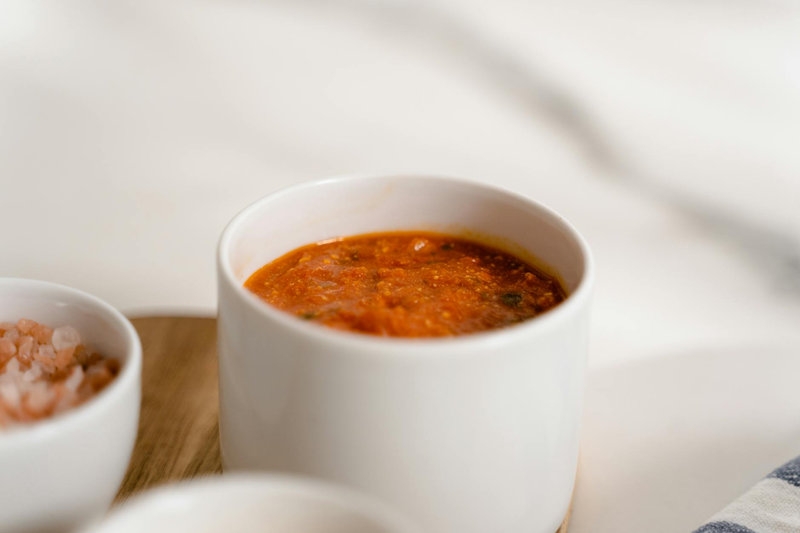

# Américaine Sauce

*This classic supreme sauce takes time to prepare, but is well worth the effort. Serve it with firm-fleshed fish, such as poached turbot, or a fish soufflé.*

**Serves:** 6

**Prep Time:** 20 minutes

**Cook Time:** 50 minutes

## Overview
Sauce américaine is the building block for the luxurious shellfish-stock sauce that drapes over poached turbot, fish soufflés and grand seafood plates: a glossy amber sauce built from sautéed lobster shells, finely diced carrot and shallot, Cognac, white wine, fish stock, ripe tomato and a bouquet garni, finished with the lobster coral mashed with butter and flour and a splash of cream. This is a serious time-investment sauce (45 minutes prep, 50 minutes cook) and it earns the time; the depth and elegance you get from cooking lobster shells into the base is unmatched by any other technique. Plunge a live 800 g lobster into boiling water for 45 seconds, separate the head from the body, cut the claw joints and tail into rings across the articulations, split the head and remove the grit sac near the feelers and the grey membranes. Scrape the green coral out into a bowl and reserve, season the lobster pieces with cayenne, salt and pepper. Sauté in hot groundnut oil till the shells turn bright red and the flesh is lightly coloured, lift out with a slotted spoon. Tip out most of the oil, sweat finely diced carrot and shallot with smashed garlic in the same pan, return the lobster to the pan, pour in Cognac and ignite (let the flames die down rather than blowing them out). Add white wine, fish stock, peeled diced tomato, bouquet garni and a pinch of salt, simmer 15 minutes. Lift out the claws and tail rings (these stay for the diner; reserve the meat). Reduce the sauce 30 more minutes, skimming. Mash the reserved coral with butter and flour, whisk into the sauce a little at a time to thicken, cook 5 minutes more, add cream, strain through a fine sieve pressing hard with a ladle to extract every drop of flavour. Season and serve hot.

## Ingredients

### Main
- 1 live lobster (about 800g, rinsed)

### Base
- 100 ml groundnut oil
- 4 tablespoons carrots (very finely diced)
- 2 tablespoons shallots (very finely diced)
- 2 cloves garlic (unpeeled, smashed)

### Liquid
- 50 ml Cognac
- 300 ml dry white wine
- 300 ml Fish stock

### Vegetable & finishing
- 200 grams tomatoes (very ripe, peeled, de-seeded and chopped)
- 1 [Bouquet Garni](../../base-ingredients/herbs/bouquet-garni.md) (with extra tarragon sprig)
- 75 ml double cream (optional)
- 60 grams butter
- 10 grams plain flour
- 1 pinch cayenne pepper
- salt
- pepper

## Method

### Stage 1 - Prepare lobster
1. Plunge the lobster into a large pan of boiling water for 45 seconds. Lift out and place on a board. Separate the head and body and cut the claw joints and tail into rings across the articulations. Split the head length-ways and remove the gritty sac close to the feelers, and the greyish membranes. Scrape out the greenish coral from the head and reserve in a bowl. Season the lobster with cayenne, salt and pepper.

### Stage 2 - Sauté lobster
1. Heat the groundnut oil in a deep sauté pan over a high heat. When it is sizzling, add the lobster pieces and sauté until the shell turns bright red and the flesh is lightly coloured. Remove with a slotted spoon on to a plate. Discard most of the oil in the pan.

### Stage 3 - Build sauce base
1. Sweat the carrots and shallots in a pan until soft but not coloured. Add the garlic and return the lobster to the pan. Pour in the Cognac and ignite. Once the flames have died down, pour in the wine and stock. Add the tomatoes, bouquet garni and a little salt. As it comes to the boil, lower the heat and cook gently for 15 minutes.

### Stage 4 - Reduce & finish
1. Remove and reserve the claws and rings of lobster tail containing the meat. Cook the sauce at a gentle bubble for a further 30 minutes, skimming it once or twice.
1. With a fork, mash the lobster coral with the butter and flour, then add to the sauce, a little at a time. Cook for 5 minutes, then add the cream, if using and pass through a fine-meshed conical strainer, pressing with the back of a ladle. Season to taste.

## Notes
- **Lobster coral:** The greenish roe adds delicate flavour and colour; reserve and mash with butter to thicken the sauce naturally.
- **Cognac flaming:** This step caramelizes flavours; let flames die naturally, never snuff them out.
- **Puréeing:** For lighter texture, purée the sauce in a blender for 1 minute; always press through sieve after puréeing to remove shell fragments.

## Serving
Serve hot with poached turbot, sole, or other firm white fish. Also excellent with fish soufflés and shellfish dishes.

## Storage
- Best eaten immediately after preparation.
- Keeps refrigerated for 1-2 days; reheat gently, stirring constantly (do not boil to prevent emulsion breaking).
- Freezes poorly due to cream content and shellfish texture breakdown.
