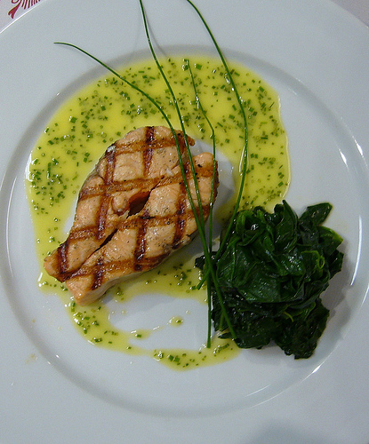

# Bercy Sauce

*This simple, classic sauce goes well with and red or white fleshed fish, like skate or dogfish.*

**Serves:** 6

**Prep Time:** 10 minutes

**Cook Time:** 30 minutes

## Overview
Sauce Bercy is the building block for the classical French white-wine sauce that drapes over skate, dogfish, sole and other mild white fish: a velouté base built up with shallot, white wine and fish stock reduction, finished with cold butter mounted into the sauce off the heat, lemon juice and a scatter of chopped parsley. It's a velouté with a personality, deeper than plain velouté thanks to the shallot reduction underneath, fresher than a beurre blanc thanks to the lemon and parsley finish at the end. The technique builds in layers. First, sweat finely chopped shallot in 20 g of butter for a minute over low heat without colour. Pour in dry white wine and fish stock and reduce by half over medium heat; this concentrates the wine flavour and burns off most of the alcohol so what's left tastes like wine without the raw bite. Stir in the fish velouté and simmer gently for 20 minutes till the sauce thickens enough to lightly coat the back of a spoon (if it's still too thin after 20 minutes, cook 5 to 10 more). Now off the heat, whisk in the remaining 40 g of cold butter a small piece at a time; this mounting step gives the sauce its silky gloss and is what separates Bercy from a plain reduction. The cold butter has to go in off the live heat (residual warmth carries the emulsion, but a hot stove splits it), so move the pan to a cool spot before you start. Finish with lemon juice and a generous handful of chopped parsley, season and serve immediately over poached white fish. The sauce won't hold; the emulsion breaks within an hour, so time it to be ready as the fish comes out of the pan.

## Ingredients

### Aromatics & liquid
- 60 grams butter (chilled and cut into cubes)
- 60 grams shallots (finely chopped)
- 200 ml dry white wine
- 150 ml Fish stock

### Base & finishing
- 400 ml [Velouté sauce](./veloute-sauce.md)
- ½ lemon (juice)
- 2 tablespoons parsley (chopped)
- salt
- pepper

## Method

### Stage 1 - Sweat shallots
1. Melt 20 grams of butter in a saucepan, add the chopped shallots and sweat them gently for 1 minute, without colouring.

### Stage 2 - Reduce wine
1. Pour in the white wine and fish stock and cook over a medium heat until the liquid has reduced by half.

### Stage 3 - Build sauce
1. Add the fish velouté and simmer gently for 20 minutes.
1. The sauce should be thick enough to coat the back of a spoon lightly. If it is not, cook it for a further 5-10 minutes.

### Stage 4 - Finish
1. Turn off the heat and whisk in the remaining butter, a small piece at a time, followed by the lemon juice. 
1. Season the sauce with salt and pepper to taste, stir in the chopped parsley and serve immediately.

## Notes
- **Velouté base:** Quality velouté is essential; prepare fresh or use homemade stock for best results.
- **Butter mounting:** Whisk in cold butter pieces to create emulsion; add slowly to prevent the sauce from breaking.
- **Lemon juice:** Use fresh, freshly squeezed lemon; bottled juice lacks the same brightness and complexity.

## Serving
Serve immediately with white fish fillets including skate, sole, dogfish, or turbot. Also pairs well with steamed fish and light shellfish dishes.

## Storage
- Best eaten immediately after preparation.
- Keeps refrigerated for 1 day; reheat gently, whisking constantly to prevent emulsion breaking.
- Does not freeze well due to butter-based emulsion.
