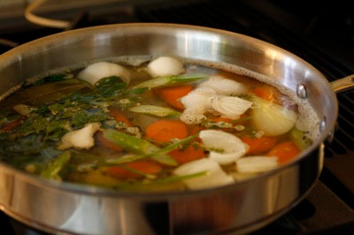

# Court Bouillon

*Traditionally, the poaching liquid for fish consists of water and white wine plus flavourings, known as a court-bouillon. Poaching a fish such as salmon helps maintain its natural colour and helps keep the flavours locked in, and the flesh moist.*

**Serves:** 6 (makes 1.2 litres)

**Prep Time:** 10 minutes

**Cook Time:** 20 minutes

## Overview
Court-bouillon is the building block for French fish poaching, the gentle aromatic liquid you submerge whole salmon, trout, halibut or any firm-fleshed fish in to cook through without losing colour, moisture or flavour: a short broth of water, dry white wine, white wine vinegar, lemon, chopped leek whites, carrot, onion, bouquet garni and peppercorns, simmered briefly to infuse, strained, then held at exactly 50 C around the fish till the flesh reaches 45 C in the thickest part. The technique works because of the temperature; at 50 C the proteins set gently without seizing or releasing albumin into the liquid, which is what gives properly poached salmon its silky tender flesh and clean rose colour. Boil a fish and you toughen it and turn it grey; poach it gently in court-bouillon and it stays bright pink and yielding. The acid component (lemon juice, white wine vinegar) is structural rather than just flavour; the acid sets the surface proteins quickly to seal in moisture, while the wine adds aromatic complexity. Place the chopped vegetables, bouquet garni and peppercorns in a large pan, cover with cold water and bring to the boil. Drop to a simmer, add the white wine and vinegar, squeeze in the lemon juice and drop the halves in too. Pull off the heat and let everything infuse for 10 minutes. Strain into a clean wide-bottomed pan, warm to 50 C, slide the fish in (a thermometer is the only reliable way to check), and hold the liquid at 50 C for 10 minutes till the fish's internal temperature reaches 45 C. Lift out carefully with a fish slice, drain well. The court-bouillon itself keeps refrigerated 2 to 3 days and freezes a month; use it as the base for a velouté or beurre blanc afterwards.

## Ingredients

### Vegetables & aromatics
- 2 leeks (white part only, chopped into large rounds)
- 2 carrots (peeled and sliced into large rounds)
- 2 onions (roughly chopped)
- 1 [Bouquet Garni](../../base-ingredients/herbs/bouquet-garni.md)
- 10 black peppercorns

### Liquid acid
- 2 lemons (halved)
- 400 ml dry white wine
- 100 ml white wine vinegar
- 1 litre water

## Method

### Stage 1 - Build broth
1. Place the vegetables, bouquet garni and peppercorns in a large saucepan and cover with the water.
1. Place the pan over a medium heat and bring to the boil.

### Stage 2 - Add acid
1. Reduce to a simmer and add the white wine and vinegar.
1. Squeeze in the juice from the lemons and add the halves.
1. Remove from the heat and allow to sit for 10 minutes.

### Stage 3 - Use for poaching
1. Strain and reserve for poaching the fish.
1. Warm the court-bouillon in a wide-bottomed saucepan over a medium-low heat until the temperature of the liquid reaches 75-80°C (just below a simmer; small bubbles around the edge but no rolling boil).
1. Place the fish in the liquid; hold the liquid at 75-80°C until the internal temperature of the thickest part of the fish reaches 55-60°C (allow 8-12 minutes for a 2 cm thick fillet). Do not let the bouillon boil - it toughens the flesh.
1. Carefully remove the fish with a spatula and drain well.

## Notes
- **Temperature control:** Holding the bouillon at 75-80°C gently poaches the fish to a safe 55-60°C internal without toughening; use a probe thermometer for accuracy.
- **Fresh vegetables:** Quality vegetables create clean, delicate broth; avoid wilted or old produce.
- **Lemon juice:** Fresh lemon is essential; it brightens flavours and prevents discoloration of light-fleshed vegetables.

## Serving
- Use as a poaching liquid for whole salmon, trout, halibut, and other firm-fleshed white fish. The liquid helps maintain the fish's colour and moisture during cooking.

## Storage
- Keeps refrigerated for 2-3 days in an airtight container.
- Freezes well for up to 1 month.
- Best used fresh; make ahead and chill before use.
