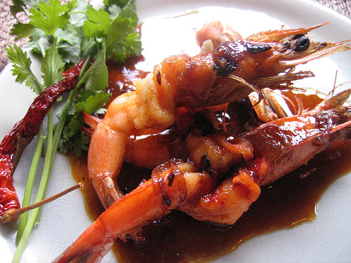

# Tamarind Sauce

*Tamarind sauce is superb with steamed firm-fleshed fish, such as halibut or monkfish or shellfish like prawn.*

**Serves:** 4

**Prep Time:** 5 minutes

**Cook Time:** 10 minutes

## Overview
Tamarind sauce is the building block for the bright Thai-influenced accompaniment to steamed halibut, monkfish, sea bass and prawns: a quick saucy mix of tamarind paste, fish sauce, palm sugar, light soy, ginger, garlic, julienned spring onion and crushed black peppercorns, briefly sautéed in groundnut oil. The flavour balance is the four corners of Thai cooking pulled into a single sauce: sour from the tamarind, salty from fish sauce and soy, sweet from palm sugar, and aromatic from the ginger, garlic and spring onion. None of the four dominates, and that balance is what makes the sauce work alongside delicate fish where a louder sauce would overwhelm. Heat groundnut oil in a frying pan, add the julienned spring onions and sauté over medium heat till softened, then drop the heat to low and add the chopped garlic and grated ginger for 2 minutes till fragrant without browning. Add the remaining ingredients (light soy, palm sugar, tamarind paste, fish sauce and crushed peppercorns) and simmer gently for another 2 minutes, stirring occasionally, till the palm sugar dissolves and the sauce comes together as a glossy fragrant liquid. Tip into a bowl, cover with pierced cling film, and let stand for around 20 minutes before serving; this short rest lets the flavours meld and the sharp edges of the soy and fish sauce mellow into the tamarind. Use proper tamarind paste from an Asian grocer (not bottled concentrate, which tastes flat and stale), and palm sugar rather than caster sugar for that distinctive caramel-floral note that defines Thai sweetness. Serve at room temperature spooned over steamed fish or prawns, or alongside Thai curries. Keeps three to four days refrigerated.

## Ingredients

### Base oil
- 2 tablespoons groundnut oil

### Aromatics
- 4 spring onions (3 cm julienne)
- 3 cloves garlic
- 2 tablespoons ginger (grated)

### Flavourings
- 2 tablespoons light soy sauce
- 1 tablespoon palm sugar
- 2 tablespoons tamarind paste
- 1 tablespoon fish sauce
- 10 black peppercorns (crushed)

## Method

### Stage 1 - Cook aromatics
1. Heat the groundnut oil in a frying pan, add the spring onions and sauté over a medium heat until softened.
1. Add the garlic and ginger, reduce the heat to low and cook for 2 minutes.

### Stage 2 - Add flavourings
1. Add the remaining ingredients to the pan and simmer gently, stirring occasionally, for a further 2 minutes.
1. Transfer the sauce to a bowl and cover with cling film, piercing it in a few places. 
1. Leave to stand for about 20 minutes before serving.

## Notes
- **Tamarind paste:** Essential for tart, complex flavour; use fresh paste from Asian suppliers, not bottled concentrate.
- **Fish sauce:** This pungent ingredient adds depth; use sparingly as it is very strong.
- **Palm sugar:** Use this rather than regular sugar for authentic Thai flavour; available in Asian markets.

## Serving
Serve at room temperature with steamed firm-fleshed fish (halibut, monkfish, sea bass), prawns, or other shellfish. Also excellent with Thai curries.

## Storage
- Keeps refrigerated for 3-4 days in an airtight container.
- Freezes well for up to 1 month.
- Best eaten at room temperature; flavours develop as it sits.
