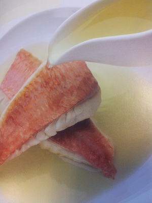

# Tomato and Basil Fish Fumet

*Steamed fillets of fish with delicate flesh, like red mullet, John Dory or sea bream are delicious served in a deep plate, bathed with a ladle of this fumet.*

**Serves:** 4

**Prep Time:** 10 minutes

**Cook Time:** 25 minutes

## Overview
Tomato and basil fish fumet is the building block for the elegant clarified-broth presentation of red mullet, John Dory or sea bream: a crystal-clear jewel-red fish broth made by clarifying fish stock through a raft of ripe chopped tomatoes, red pepper, basil leaves and egg whites, then ladling the bright clear liquid over a poached fish fillet in a wide shallow bowl. The technique is classical consommé clarification adapted for fish, and the science is beautiful in its simplicity. The egg whites, vegetables and basil bind with the cloudy proteins and impurities in the fish stock as it heats, and the whole mixture floats to the surface as a "raft" that filters the broth crystal clear as you ladle through it. The clarification raft also infuses the broth with tomato, pepper and basil aromatics, so it works as both filter and flavouring at once. Mix the chopped tomatoes, finely chopped red pepper, basil, egg whites and crushed peppercorns thoroughly in a bowl till uniform. Pour the cold fish stock into a saucepan and tip in the clarification mixture. Bring to the boil over medium heat while stirring with a wooden spoon (this is the only time you stir the raft; once the proteins start to coagulate, leave it alone or the broth will cloud back up). The moment it comes to the boil, drop to the gentlest simmer and let it bubble very gently for 20 minutes; the raft solidifies on the surface and the liquid clarifies underneath. Carefully ladle the fumet through a fine-meshed conical sieve into a clean pan, avoiding disturbing the raft. Season with salt and pepper. Serve hot in heated shallow bowls with poached or steamed delicate white fish fillets sitting in the broth.

## Ingredients

### Base
- 600 ml Fish stock

### Clarification
- 500 grams very ripe tomatoes (chopped)
- 1 red pepper (cored, de-seeded and finely chopped)
- 50 grams basil leaves (coarsely chopped)
- 4 egg whites
- 8 peppercorns (crushed)
- salt
- pepper

## Method

### Stage 1 - Prepare clarification mixture
1. Mix the clarification ingredients together thoroughly in a bowl.

### Stage 2 - Clarify fumet
1. Pour the fish stock into a saucepan and add the clarification mixture. 
1. Bring to the boil over a medium heat, stirring with a wooden spoon. 
1. As soon as the liquid boils, reduce the heat and simmer very gently for 20 minutes.

### Stage 3 - Strain & serve
1. Pass the clarified fumet through a fine meshed conical sieve, season with salt and pepper to taste and serve.

## Notes
- **Clarification:** This technique removes impurities, creating crystal-clear consommé with pure flavour; don't skip steps.
- **Gentle simmering:** Boiling vigorously will cloud the fumet; maintain a bare simmer throughout.
- **Egg white raft:** The white and vegetable mixture forms a natural filter; ladle gently to avoid disturbing.

## Serving
- Serve in heated shallow bowls with delicate-fleshed white fish fillets (red mullet, John Dory, sea bream) poached or steamed in the fumet itself.

## Storage
- Keeps refrigerated for 2-3 days in an airtight container.
- Freezes well for up to 1 month.
- Best served hot, immediately after straining.
