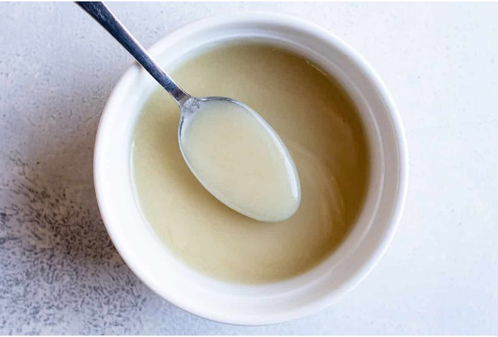

# Velouté Sauce

*France's velouté: fish stock thickened with a blond butter-and-flour roux into a silky pale sauce.*

**Serves:** 4 (makes 1 litre)

**Prep Time:** 5 minutes

**Cook Time:** 35 minutes

## Overview
Velouté is one of the five French mother sauces and the building block for an entire family of derived sauces, including Bercy, Normande, suprême, Albuféra and dozens more. The structure is simple but exacting: a blond roux of equal parts butter and flour, cooked to a soft pale gold, whisked with cold stock (fish for fish sauces, chicken for chicken velouté, vegetable for vegetarian) and simmered for 30 minutes till the raw flour taste cooks out and the sauce thickens to a silky pale-ivory pour. There are two technique points where home cooks go wrong. First, the roux. Melt the butter, pull off the heat, then add the sifted flour and whisk smooth before returning to medium heat. Cook for 3 minutes stirring constantly, watching the colour closely; this is a blond roux, not a brown one, so you want it to lose its raw flour smell and turn faintly pale gold without going past that. Second, cold stock onto hot roux, never the other way round. Pour the cold stock into the hot roux gradually while whisking; the temperature gap dissolves the roux smoothly without lumps. Pouring hot stock in clumps the roux instantly and no amount of whisking saves it. Simmer over low heat for around 30 minutes, whisking every few minutes; the slow cook is what fully gelatinises the starch and removes any remaining raw flour edge. The finished sauce should coat the back of a spoon. Season at the end. Velouté on its own is elegant enough to spoon over poached fish or chicken, but its real value is as the base for the dozen derived sauces. Keeps three to four days refrigerated or freezes two months.

## Ingredients
- 30g butter
- 30g plain flour (sifted)
- 1 litre cold stock (fish, chicken, or vegetable)
- salt
- pepper

## Method

### Stage 1 - Make roux
1. Melt the butter in a heavy-based saucepan.
1. Remove the pan from the heat and add the flour, stirring with a whisk.
1. Return the pan to a medium heat and cook for about 3 minutes, stirring constantly.

### Stage 2 - Create sauce
1. Pour the cold stock on to the roux, stirring constantly.
1. Cook the sauce over a low heat for about 30 minutes, occasionally stirring with a whisk.
1. Season with salt and pepper.

## Notes
- **Roux cooking:** Essential to remove raw flour taste; take time with this step for proper flavour development.
- **Cold stock:** Always use cold stock to prevent lumps forming when combined with hot roux.
- **Consistency:** Adjust consistency by cooking longer for thicker sauce or adding more stock for thinner.

## Serving
Use as a base for derived sauces (Bercy, Normandy, Chérubins, etc.) or serve with poached fish and chicken dishes.

## Storage
- Keeps refrigerated for 3-4 days in an airtight container.
- Freezes well for up to 2 months.
- Best used as a fresh base for other sauces rather than served alone.
