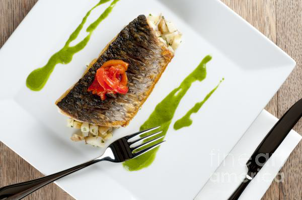

# Watercress Sauce

*A fresh-tasting sauce to serve with grilled scallops, lightly poached oysters or pan-fried fillets of sea bass or bream. It is extremely light, almost like a bouillon.*

**Serves:** 8

**Prep Time:** 10 minutes

**Cook Time:** 25 minutes

## Overview
Watercress sauce is the building block for the light bright-green herbaceous sauce that pools under grilled scallops, poached oysters or pan-fried sea bass and bream: peppery watercress sweated in butter, simmered in vegetable stock with soft green peppercorns, blitzed smooth and strained, then mounted with cold butter into a glossy almost-bouillon-light pour. It's far lighter than a cream-based fish sauce; the body comes from the watercress and the butter mounted at the end rather than from flour or cream, which means the bright peppery character of the watercress carries clean through to the plate without being weighed down. Two technique points matter. First, only use the slender stem tips and leaves of the watercress; the thicker stalks lower down are bitter, fibrous and woody, and ruining the sauce by including them is the most common reason this comes out grassy or sharp. Second, use soft green peppercorns from acid-packed jars, not the freeze-dried kind; the softness lets them break down into the sauce during blending and adds a gentle warmth without the harsh peppery bite that dried green peppercorns leave. Melt 30 g of butter in a saucepan, sweat the trimmed watercress over low heat for 3 minutes till wilted, stirring constantly. Add the vegetable stock and green peppercorns, raise the heat to medium and cook 10 minutes. Off the heat, leave to infuse 10 minutes (this is where the watercress aromatics develop), then blitz in a blender for two full minutes. Strain through a fine-meshed conical sieve into a clean pan, pressing hard with a ladle to extract every drop. Reheat gently till just bubbling, then off the heat whisk in 70 g of cold butter a piece at a time to mount the sauce. Season and serve immediately.

## Ingredients

### Base
- 400 grams watercress
- 100 grams butter

### Liquid & aromatics
- 500 ml Vegetable stock
- 15 grams soft green peppercorns
- salt
- pepper

## Method

### Stage 1 - Prepare watercress
1. Cut off and discard the thicker watercress stalks, retaining only the most slender stems. 

### Stage 2 - Sweat watercress
1. Melt 30 grams of the butter in a saucepan.
1. Add the watercress and sweat over a low heat for 3 minutes, stirring continuously with a spatula.

### Stage 3 - Cook & infuse
1. Add the vegetable stock and green peppercorns, increase the heat to medium and cook for 10 minutes.
1. Turn off the heat and leave the sauce to infuse for 10 minutes, then purée using a blender for 2 minutes.

### Stage 4 - Finish
1. Pass the sauce through a fine-meshed conical sieve into a clean saucepan, rubbing it through with the back of a ladle.
1. Reheat until gently bubbling, then take the pan off the heat and whisk in the remaining butter, a knob at a time. 
1. Season with salt and pepper to taste. Serve hot.

## Notes
- **Watercress stems:** Use only tender stem tips; thick, woody stalks are bitter and fibrous.
- **Green peppercorns:** These soft, pickled peppercorns add gentle spice; use genuine ones from acid-packed jars, not freeze-dried.
- **Infusion time:** Allow the sauce to infuse with heat off for best flavour extraction.

## Serving
- Serve immediately with grilled scallops, lightly poached oysters, pan-fried sea bass, bream, or other white fish. Also excellent with shellfish dishes.

## Storage
- Best eaten immediately after preparation.
- Keeps refrigerated for 1 day; reheat gently, stirring constantly.
- Does not freeze well due to butter content and watercress texture breakdown.
