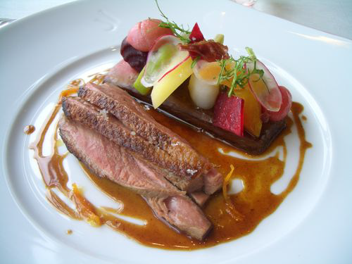

# Bigarade Sauce

*This is the classic sauce for duck à l'Orange.*

**Serves:** 6

**Prep Time:** 15 minutes

**Cook Time:** 45 minutes

## Overview
Sauce bigarade is the building block of duck à l'Orange, the deep glossy mahogany sauce traditionally made from bitter Seville (bigarade) oranges: a base of caramelised sugar and red wine vinegar cooked dark, deglazed with veal stock and fresh orange and lemon juice, simmered with browned duck wings for depth, then finished with finely julienned blanched citrus zest. The technique builds layers. Start by paring fine zest strips from one lemon and two of the three oranges, reserving for the finish, then squeeze the juice from all four citrus fruits. Make a deep caramel by dissolving caster sugar in red wine vinegar over low heat then cooking till deep gold (the colour matters; too pale and the caramel is sticky-sweet without depth, too dark and it turns bitter). While the caramel is forming, brown duck wings in oil in a separate pan till deeply coloured on all sides; these are doing the work of building flavour rather than appearing on the plate. The moment the caramel hits deep gold, pour in the veal stock and citrus juices (the caramel hisses violently and tightens; this is correct) and add the browned duck wings. Bring to the boil, drop to a gentle simmer for 45 minutes, skimming foam as it rises, till the sauce thickens enough to lightly coat the back of a spoon. Meanwhile, cut the reserved zests into fine julienne and blanch in boiling water for a minute to strip the bitter pith oils, drain thoroughly. Strain the sauce through a fine-meshed conical sieve into a clean pan, removing the duck wings and any solids, season with salt and pepper, then stir in the blanched zest just before serving so the colour stays bright and the strands don't darken in the sauce. Serve immediately over roast duck breast.

## Ingredients

### Fruit
- 1 lemon
- 3 oranges

### Aromatics & base
- 45 grams caster sugar
- 3 tablespoons red wine vinegar
- 300 grams duck wings

### Liquid & finishing
- 2 tablespoons olive oil
- 700 ml Veal stock
- salt
- pepper

## Method

### Stage 1 - Prepare citrus
1. Finely pare the zest from the lemon and two of the oranges and reserve. 
1. Squeeze the juice from all of the citrus fruit and set aside.

### Stage 2 - Make caramel
1. Put the sugar and wine vinegar into a deep frying pan and dissolve over a very low heat. 
1. Continue to cook until you have a deep golden caramel.

### Stage 3 - Build sauce
1. Meanwhile, heat the oil in another pan, and very quickly brown the duck wings, turning to colour all over.
1. As soon as the vinegar syrup has formed a caramel, pour in the veal stock and citrus juices, then add the duck wings.
1. Bring to the boil, lower the heat and cook gently for 45 minutes, skimming the surface if necessary. 
1. The sauce should be thick enough to lightly coat the back of a spoon. If it is not, cook for a little longer.

### Stage 4 - Add citrus zest & finish
1. In the meantime, cut the citrus zests into a fine julienne. 
1. Add to a pan of boiling water and blanch for 1 minute. Drain thoroughly.
1. Pass the sauce through a fine-meshed conical sieve into a clean pan and season with salt and pepper to taste, then add the citrus zests. 
1. The sauce is now ready to serve.
1. If you are not using the sauce immediately, keep it warm in a bain-marie but only add the zests when you are ready to serve.

## Notes
- **Caramel colour:** Achieve a deep golden colour for best flavour; too light results in bitter sauce, too dark is burnt.
- **Citrus zest blanching:** This step removes bitterness from the pith; essential for bright, pleasant flavour.
- **Zest timing:** Add zests just before serving to maintain vibrant colour and prevent them from darkening.

## Serving
- Serve immediately with roasted duck, duck confit, or other duck preparations. The bright citrus complements rich duck beautifully.

## Storage
- Keep refrigerated for 2-3 days in an airtight container (store zests separately).
- Freezes well for up to 1 month (freeze without zests; add fresh when reheated).
- Best eaten warm; reheat gently, stirring occasionally.
