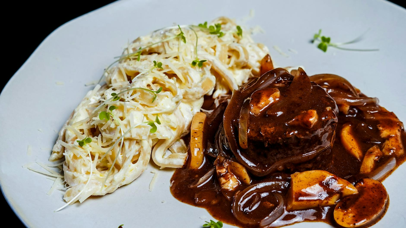

# Bordelaise Sauce

*This wonderful sauce looks as good as it tastes. It is delicious with any cut of beef, especially entrecôte, rib and sirloin. Remember to soak the beef marrow in advance.*

**Serves:** 4

**Prep Time:** 10 minutes

**Cook Time:** 30 minutes

## Overview
Sauce Bordelaise is the building block for entrecôte, rib of beef and sirloin, the classical French red wine and beef marrow sauce that drapes over premium beef cuts at a brasserie or fine restaurant: a shallot and red wine reduction enriched with veal stock and bouquet garni, mounted with cold butter, and finished with small pieces of poached beef marrow that scatter through the glossy sauce. The marrow is the defining ingredient (the sauce comes from Bordeaux, and the wine and marrow combination is what gives it the name), and it needs proper preparation. Soak it in ice water for a full four hours before you cook to draw out the blood; skip this step and the finished sauce comes out grey-tinged and slightly muddy where it should be deep glossy red. Use a claret-style red wine (proper Bordeaux ideally; a thin light wine fades to nothing during the long reduction). In a saucepan, combine finely chopped shallots, crushed white peppercorns and the red wine, then reduce hard over high heat till the volume drops by a third and the wine takes on a syrupy gloss. Add the veal stock and a bouquet garni, drop the heat and bubble gently for around 20 minutes till the sauce thickens enough to lightly coat the back of a spoon. Strain through a conical sieve into a clean pan. While the sauce reduces, drain the soaked marrow, cut into small pieces, drop into lightly salted cold water in a small pan, bring to the boil and immediately kill the heat; let stand 30 seconds, then drain carefully (the brief hot bath sets the marrow without toughening it). Season the strained sauce, whisk in cold cubed butter off the heat to mount into a glossy emulsion, then fold the well-drained marrow pieces in at the very end. Serve immediately over the beef.
## Ingredients

### Wine & aromatics
- 40 grams shallots (finely chopped)
- 8 white peppercorns (crushed)
- 200 ml red wine (preferably claret)

### Stock & marrow
- 300 ml Veal stock
- 1 [Bouquet Garni](../../base-ingredients/herbs/bouquet-garni.md)
- 200 grams beef marrow (soaked in ice water for 4 hours)

### Finishing
- 30 grams butter (chilled and diced)
- salt
- pepper

## Method

### Stage 1 - Reduce wine
1. Put the shallots, crushed peppercorns and red wine in a saucepan and set over a high heat.
1. Let bubble until the wine has reduced by one-third.

### Stage 2 - Build sauce
1. Add the veal stock and bouquet garni and bubble gently for about 20 minutes, or until the sauce has reduced and thickened enough to lightly coat the back of a spoon. 
1. Pass it through a conical sieve into a clean saucepan.

### Stage 3 - Prepare marrow
1. Drain the beef marrow and cut it into small pieces. 
1. Place in a small saucepan, cover with a little cold water and salt lightly. 
1. Bring to the boil over a medium heat. Immediately turn off the heat, leave the marrow for 30 seconds, then drain it carefully.

### Stage 4 - Finish
1. Season the sauce with salt and pepper to taste. 
1. Whisk in the butter, a piece at a time, then add the well-drained beef marrow. 
1. Taste and adjust the seasoning. 
1. Serve immediately.

## Notes
- **Beef marrow preparation:** Soak in ice water for 4 hours to remove blood; this prevents discoloration.
- **Wine reduction:** Essential for concentrated flavour; don't skip or rush this step.
- **Marrow poaching:** The brief hot bath sets the marrow without making it tough; timing is critical.

## Serving
Serve immediately with entrecote, sirloin, rib, or other premium beef cuts. Can also accompany beef tournedos and steaks.

## Storage
- Best eaten immediately after preparation.
- Keeps refrigerated for 1 day; reheat gently without boiling to prevent emulsion breaking.
- Does not freeze well due to beef marrow and butter emulsion content.
