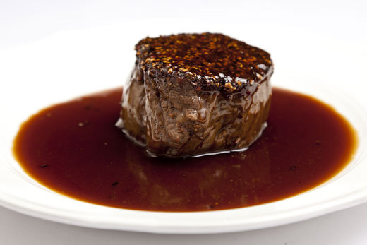

# Buccaneer's Sauce

*A pirate-named sauce: butter, garlic, lemon and a generous splash of rum.*

**Serves:** 8

**Prep Time:** 10 minutes

**Cook Time:** 25 minutes

## Overview
Buccaneer's sauce is the building block for an unusual sweet-savoury sauce designed to pair with roasted game, duck, pork or pheasant: thinly sliced shallots and grated fresh ginger sweated in butter, joined by a sliced banana that almost disintegrates into the pan, deglazed with raspberry vinegar and finished with veal stock and cold butter mounted at the end. The banana is doing structural work rather than acting as a recognisable fruit; as it cooks down it breaks apart and dissolves into the sauce, contributing body, faint sweetness and a tropical undertone that anchors the sauce without ever announcing itself. The result is a glossy mahogany sauce with sweet-tart layers (raspberry vinegar acidity, banana sweetness, ginger heat, veal-stock depth) that handles rich gamey proteins beautifully. Melt the room-temperature butter in a saucepan, sweat the sliced shallots over medium heat for a minute, then add the grated ginger and cook another minute or two stirring till the shallots are lightly coloured. Add the sliced banana and cook over low heat for 2 minutes, stirring with a spatula till the banana softens and begins to break down into the pan rather than holding shape. The moment it starts to disintegrate, splash in the raspberry vinegar (use a proper raspberry vinegar from a deli, not a thin acidic one) and stir vigorously for another two minutes. Pour in the veal stock and simmer gently for 20 minutes till everything melds and the sauce thickens. Pass through a fine-meshed sieve into a clean pan to leave the spent banana and shallot pulp behind, then whisk in the remaining cold cubed butter a piece at a time off the heat to mount into a glossy emulsion. Season and serve immediately over roast game, pork or duck.

## Ingredients

### Base
- 50 grams butter (at room temperature)
- 50 grams butter (chilled and diced)

### Aromatics & vegetables
- 60 grams shallots (thinly sliced)
- 40 grams ginger (peeled and finely grated)
- 100 grams banana (peeled and sliced)

### Liquid
- 6 tablespoons raspberry vinegar
- 400 ml Veal stock
- salt
- pepper

## Method

### Stage 1 - Cook aromatics
1. Melt the non-chilled butter in a saucepan. Add the sliced shallots and sweat over a medium heat for 1 minute. 
1. Add the ginger and cook, stirring, until the shallots are very lightly coloured.

### Stage 2 - Add & cook banana
1. Add the banana and cook, stirring with a spatula, over a low heat for 2 minutes until it softens and begins to disintegrate. 

### Stage 3 - Deglaze & reduce
1. Immediately add the raspberry vinegar and continue to stir over a medium heat for another 2 minutes.
1. Add the veal stock and simmer gently for 20 minutes, then pass through a fine-meshed sieve into a clean pan.

### Stage 4 - Finish
1. Whisk in the remaining butter, a piece at a time, until the sauce is smooth and glossy. 
1. Season with salt and pepper. 
1. Serve at once.

## Notes
- **Banana disintegration:** The banana should almost completely break down into the sauce, creating body rather than remaining as identifiable pieces.
- **Ginger freshness:** Use fresh ginger, not dried powder; fresh provides better flavour and prevents grittiness.
- **Raspberry vinegar quality:** Use good vinegar; cheap vinegar will create thin, acidic sauce lacking complexity.

## Serving
Serve immediately with roasted game (venison, pheasant, duck), pork, or veal. The exotic flavours complement rich meats beautifully.

## Storage
- Best eaten immediately after preparation.
- Keeps refrigerated for 1 day; reheat gently, stirring constantly to prevent emulsion breaking.
- Does not freeze well due to butter emulsion and banana content.
