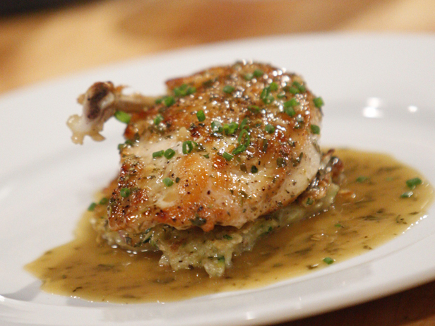

# Chicken Jus with Savory

*This flavourful jus is perfect for roast chicken, poussin or guinea fowl. If preferred, you can use fresh tarragon instead of savory.*

**Serves:** 6

**Prep Time:** 5 minutes

**Cook Time:** 40 minutes

## Overview
Chicken jus with savory is the building block for the simple roasted-chicken gravy that emerges from the roasting tin itself: deglazed pan juices from a roast bird, with caramelised vegetables, a sprig of savory (or tarragon) and chicken stock, lightly thickened by mashing a roasted potato through it. It's not a reduction sauce or a velouté; it's the Sunday-lunch jus, made directly from the bird's roasting tray with everything that browned onto the bottom, which means it tastes immediately of the bird it accompanies. Roast the bird at 200 C till lightly browned (around 20 minutes), then drop the oven to 190 C, scatter sliced carrots, diced onion, a quartered potato, a thyme sprig and two unpeeled garlic cloves around the bird, and continue roasting till the bird is cooked through, basting every 15 minutes and stirring the vegetables so they colour without burning. Lift the bird out and rest under foil. Break the carcass up with poultry shears, skim the fat from the tin (don't discard; save for roast potatoes another day), and return the carcass pieces and bones to the tin. Set over a medium burner, pour in dry white wine to deglaze (scrape every scrap of caramelised fond from the bottom of the tin into the wine), add the savory sprigs and cook 10 minutes. Mash the roasted potato into the jus with a fork; the starch thickens the sauce naturally without flour. Add chicken stock, cook another 10 minutes. Strain through a fine-meshed conical sieve into a saucepan, pressing hard on the bones and vegetables with the back of a ladle to extract every drop. Season, then pour any juices from the rested bird into the jus and serve in a warmed jug.

## Ingredients

### Vegetables & aromatics
- 200 grams carrots (cut into rounds)
- 150 grams onions (cut into dice)
- 1 potato (medium, peeled and cut into 8 pieces)
- 1 sprig thyme
- 2 cloves garlic (unpeeled)

### Liquid & herbs
- 150 ml dry white wine
- 50 grams savory sprigs (or tarragon)
- 150 ml Chicken Stock (or water)
- salt
- pepper

## Method

### Stage 1 - Roast bird & vegetables
1. Preheat the oven to 200°C. Put your bird(s) in a roasting tin and roast in the oven until lightly browned, about 20 minutes. 
1. Lower the oven setting to 190°C and take the roasting tin out. 
1. Distribute the carrots, onions, potato, thyme and garlic around the bird. 
1. Return to the oven and roast until cooked through, basting from time to time using a spoon, stirring the vegetables around so they take on some colour without burning.

### Stage 2 - Rest bird & prepare jus base
1. When the bird is cooked through, remove the legs and breasts, with the wing attached. 
1. Put them on a warm plate, partially cover with foil and leave to rest in a warm place. 
1. Break the carcass up, using poultry shears or a small cleaver. 
1. Using a spoon, skim the fat from the roasting tin and add the carcass pieces and bones to the tin.

### Stage 3 - Make jus
1. Pour in the white wine to deglaze, add the savory and cook over a medium heat for 10 minutes. 
1. Crush the potato pieces with a fork to bind the jus, add the chicken stock and cook for a further 10 minutes.

### Stage 4 - Strain & season
1. Strain through a fine-meshed conical sieve into a saucepan, pressing down on the bones and vegetables with the back of a small ladle to extract as much flavour and juice as possible. 
1. Season to taste with salt and pepper. Keep the jus warm until ready to serve with the rested poultry.

## Notes
- **Vegetable crushing:** The crushed potato acts as natural thickener; ensure you press thoroughly to release starches.
- **Herb choice:** Savory provides peppery warmth; tarragon offers anise notes. Choose based on preference or availability.
- **Deglazingprocess:** Ensure you scrape up all browned bits for maximum flavour extraction.

## Serving
Serve warm in a jug alongside rested roasted chicken, poussin, guinea fowl, or other roasted poultry.

## Storage
- Keeps refrigerated for 2-3 days in an airtight container.
- Freezes well for up to 2 months.
- Best served warm; reheat gently over low heat, stirring occasionally.
