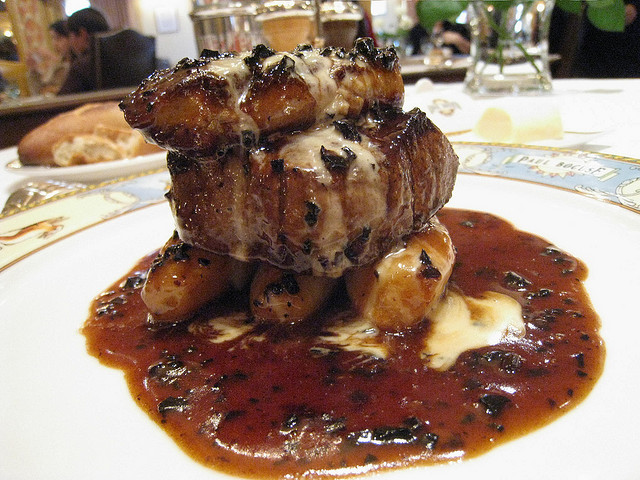

# Périgueux Sauce

*This sauce is excellent served with little hot pies or pâté en croûte, with beef tournedos or pan-fried saddle of lamb, and of course on pasta.*

**Serves:** 6

**Prep Time:** 5 minutes

**Cook Time:** 15 minutes

## Overview
Sauce Périgueux is the building block for the showpiece truffle sauce that elevates beef tournedos, pan-fried saddle of lamb, hot pâté en croûte or rich pasta into something special: a small-batch reduction of veal stock and precious truffle juice, finished with chopped black truffles and cold butter mounted at the end into a glossy emulsion. The name comes from Périgord in southwest France, the spiritual home of the black winter truffle, and the sauce is engineered to let the truffles speak rather than hide them in complexity. Three ingredients, four steps, ten minutes; this is one of the shortest classical sauces in the French repertoire and one of the most expensive per spoonful. The technique is simple. Bring veal stock to the boil in a small saucepan and reduce over medium heat till it tightens enough to lightly coat the back of a spoon; the reduction concentrates the gelatin in the stock so the sauce has body before any butter goes in. Pour in the truffle juice (the precious liquid from a tin of preserved truffles, or the juice you'd reserve from a fresh truffle), cook another five minutes for the truffle aromatics to infuse into the stock. Add the chopped or finely sliced black truffles, bubble briefly. Off the heat, swirl in cold cubed butter a piece at a time by rotating the pan; the residual heat carries the emulsion, but a live burner would split it. Use proper black truffles, ideally Périgord winter truffles (Tuber melanosporum) for authentic flavour; summer truffles (Tuber aestivum) work but the aroma is much milder. Serve immediately; the volatile truffle aromatics fade fast once exposed to air.

## Ingredients

### Base & truffle
- 400 ml Veal stock
- 50 ml truffle juice
- 20 grams truffles (finely chopped or sliced)

### Finishing
- 40 grams butter (chilled and diced)
- salt
- pepper

## Method

### Stage 1 - Reduce veal stock
1. Bring the veal stock to the boil in a small saucepan and let bubble over a medium heat to reduce until it is thick enough to lightly coat the back of a spoon.

### Stage 2 - Add truffle juice
1. Add the truffle juice and cook for another 5 minutes. 

### Stage 3 - Add truffles
1. Add the chopped truffles and let the sauce bubble briefly.

### Stage 4 - Finish with butter
1. Take the pan off the heat and add the butter, a piece at a time, swirling and rotating the pan to incorporate it. 
1. Season the sauce with salt and pepper to taste and serve immediately.

## Notes
- **Truffle quality:** Use genuine black truffles (Périgord) for authentic flavour; summer truffles have less potency.
- **Truffle juice:** Essential ingredient; use the precious liquid from canned or fresh truffles for maximum flavour.
- **Timing:** Prepare just before serving; hold briefly over gentle heat to maintain warmth without overcooking.

## Serving
Serve immediately with beef tournedos, pan-fried saddle of lamb, hot pâté en croûte, or pasta. A small spoonful is sufficient given the rich flavor.

## Storage
- Best eaten immediately after preparation (truffles lose nuance upon standing).
- Keeps refrigerated for 1 day; reheat gently without boiling.
- Does not freeze well; butter emulsion breaks and truffles become rubbery.
