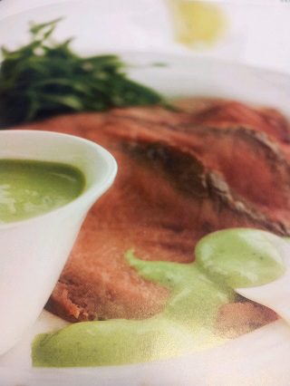

# Rocket Sauce with Horseradish

*This fresh tasting, healthy sauce goes beautifully with cold meat, or with cold poached salmon or smoked trout.*

**Serves:** 8

**Prep Time:** 10 minutes

**Cook Time:** 0 minutes

## Overview
Rocket and horseradish sauce is the building block for the bright peppery cold sauce that pairs with cold roast beef, cold poached salmon, smoked trout and a charcuterie plate: peppery rocket leaves and freshly grated horseradish blitzed smooth with Dijon mustard, olive oil, lemon juice and crushed garlic, then whisked with Greek yoghurt for body and tang. There's no cooking; the entire sauce comes together in 10 minutes in a blender and is served straight from the fridge. The combination is engineered for cold proteins where a hot mounted-butter sauce would seize, and the heat sits in two distinct layers (the peppery green bite of rocket plus the cleaner nose-clearing heat of fresh horseradish) which lift the cold flesh of fish or beef beautifully. Use tender young rocket leaves with the stalks removed; older mature rocket turns bitter and stringy in the blender. Use freshly grated horseradish from a fresh root if you can find one; the bottled stuff loses its volatile heat fast in storage and tastes flat. Tip the rocket, Dijon, fresh horseradish, olive oil, milk, lemon juice and finely chopped garlic into a blender and process for 2 to 3 minutes till the rocket is completely smooth and the sauce turns vibrant green. Pour into a bowl, whisk in the Greek yoghurt (this softens the sharpness and adds creamy body; ordinary yoghurt makes a thinner less luxurious sauce), season with salt and pepper, taste and adjust the horseradish if needed. Cover with cling film pressed to the surface and chill till ready to serve; a quick whisk before serving brings the texture back together if it has separated. Best eaten within 24 hours while the green colour and peppery character are at their brightest.

## Ingredients

### Base
- 60 grams rocket leaves (stalks removed)
- 150 grams Greek yoghurt

### Flavourings
- 1 tablespoon Dijon mustard
- 3 teaspoons fresh horseradish (finely grated)
- 2 tablespoons extra virgin olive oil
- 2 tablespoons milk
- 1 lemon (juice)
- 1 clove garlic (finely chopped)
- salt
- pepper

## Method

### Stage 1 - Blend rocket mixture
1. Put all the ingredients, except the yoghurt and seasoning into a blender and process for 2-3 minutes until smooth.

### Stage 2 - Add yoghurt
1. Transfer to a large bowl and whisk in the yoghurt until combined. 
1. Season the sauce with salt and pepper to taste.

### Stage 3 - Chill & serve
1. Cover with cling film and refrigerate until ready to use. 
1. This sauce keeps well for 2-3 days in the fridge, needing only a quick whisk before serving.

## Notes
- **Rocket: Use tender rocket leaves; mature leaves become bitter and fibrous.
- **Fresh horseradish:** Use freshly grated if possible; prepared horseradish in jars loses potency.
- **Yoghurt quality:** Greek yoghurt's richness is essential; regular yoghurt results in thinner sauce.

## Serving
Serve chilled alongside cold roasted meats, cold roasted poultry, cold poached salmon, or smoked trout. Also excellent as a condiment with charcuterie.

## Storage
- Keeps refrigerated for 2-3 days in an airtight container, covered.
- Do not freeze; yoghurt texture becomes grainy upon thawing.
- Best eaten fresh; flavour peaks within first 24 hours.
