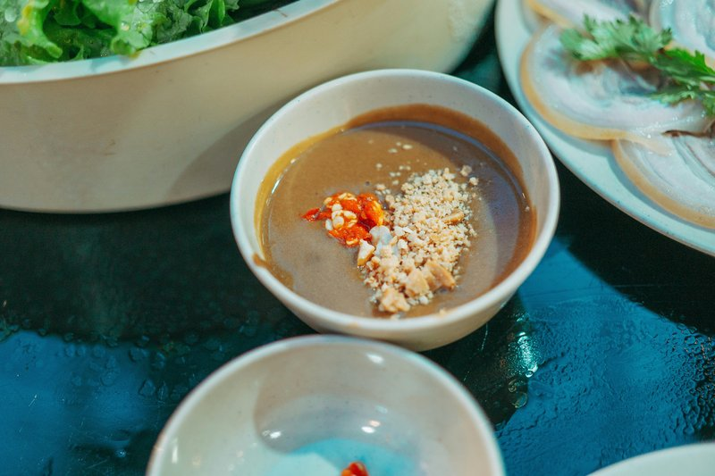

# Satay Sauce

*This goes very well with barbequed or grilled brochettes of pork, lamb or chicken.*

**Serves:** 8

**Prep Time:** 5 minutes

**Cook Time:** 5 minutes

## Overview
Satay sauce is the building block for the deep nutty dipping sauce that goes alongside Southeast Asian grilled and barbecued meat skewers: chicken satay, pork satay, lamb satay or beef satay. A base of crunchy peanut butter loosened with water, then seasoned with garlic, palm sugar, dark soy, lemon juice, tamarind liquid, chilli powder and just enough coconut milk to bring it to a dippable consistency. It's deceptively simple (one pan, five minutes), but the flavour balance carries the whole sauce, and each of the four classical Southeast Asian flavour anchors needs to land: salty from the soy, sweet from the palm sugar, sour from the lemon and tamarind, and warm from the chilli, all riding on the nutty body of the peanut butter. Use crunchy peanut butter rather than smooth; the small fragments of crushed peanut give the sauce texture and bite that smooth makes flat. Use palm sugar over caster sugar for the distinctive caramel-floral notes that make the sauce taste properly Southeast Asian. And use proper tamarind liquid from an Asian grocer for the tart fruity acidity that lemon alone can't replicate. Tip the peanut butter into a saucepan with 100 ml of water and heat gently, stirring with a wooden spoon till the mixture loosens and just starts to boil. Pull off the heat immediately (overcook the peanut butter and the oil starts to split out), then stir in the crushed garlic, palm sugar, dark soy, lemon juice, tamarind liquid, chilli powder and just enough coconut milk to bring the sauce to a thick coating consistency. Serve warm with the skewers; the sauce thickens as it sits and a splash of water loosens it back. Keeps four to five days refrigerated.

## Ingredients

### Base
- 8 tablespoons crunchy peanut butter

### Flavourings
- 1 clove garlic
- 1 tablespoon palm sugar
- 2 tablespoons dark soy sauce
- 1 tablespoon lemon juice
- 2 tablespoons tamarind liquid

### Heat & body
- a generous pinch of chilli powder
- a little coconut milk to bind the sauce

## Method

### Stage 1 - Heat peanut butter
1. Put the peanut butter into a saucepan with 100 ml of water and heat gently, stirring with a wooden spoon. 
1. As soon as it starts to boil, remove from the heat and add the remaining ingredients. 

### Stage 2 - Mix & serve
1. Stir until thoroughly mixed, then set aside until ready to use.
1. This sauce is best served hot or warm.

## Notes
- **Peanut butter:** Use crunchy peanut butter; smooth results in overly fine texture with no body.
- **Tamarind liquid:** Essential for authentic flavour; creates sour notes that balance sweetness.
- **Coconut milk consistency:** Add just enough to achieve desired consistency; more liquid creates thinner sauce.

## Serving
Serve hot or warm as a dipping sauce for grilled or barbecued pork, lamb, or chicken brochettes. Also excellent with satay skewers and spring rolls.

## Storage
- Keeps refrigerated for 4-5 days in an airtight container.
- Freezes well for up to 2 months.
- Best reheated gently over low heat, stirring frequently to prevent sticking. Add water if thickened upon standing.
