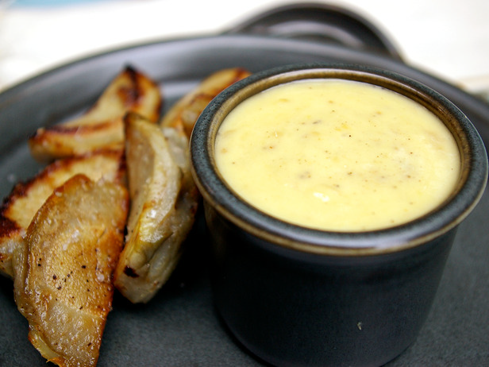

# Aïoli

*Aïoli is excellent with salt cod, bouillabaisse (better than the traditional rouille), fish soups and Mediterranean vegetables.*

**Serves:** 8

**Prep Time:** 15 minutes

**Cook Time:** 0 minutes

## Overview
Aïoli is the building block of Provençal cooking, the golden saffron-tinted garlic mayonnaise that anchors classical Mediterranean dishes: served alongside salt cod for grand aïoli, swirled into bouillabaisse and fish soups (better than the traditional rouille according to many cooks), or spooned over steamed Mediterranean vegetables. The structure is an emulsion of egg yolk and olive oil thickened with crushed raw garlic, with hard-boiled yolks adding extra body and saffron giving the sauce its signature golden colour. Two technique points keep the emulsion stable. First, room-temperature ingredients; cold egg yolks straight from the fridge will split as soon as the oil hits them, so let everything sit out for half an hour before you start. Second, slow oil addition, especially at the beginning. Rub the hard-boiled yolks through a fine sieve into a large mortar with the crushed garlic, raw egg yolks and a pinch of salt; pound with the pestle till smooth and well combined. Now start trickling in the olive oil in a thin steady stream, working the mixture continuously with the pestle; this is the moment the emulsion forms and rushing it gives you a greasy split sauce that can't be saved. Once you've worked in about half the oil and the mixture has visibly thickened, add the saffron infusion (steeped in 3 tablespoons of just-boiled water) along with the lemon juice and cold water. Then trickle in the remaining oil while pounding till the aïoli turns thick glossy and golden. Season with cayenne and salt to taste. Serve at room temperature spooned next to boiled salt cod, alongside steamed vegetables, or swirled into a fish soup.

## Ingredients

### Base
- 2 egg yolks (hard boiled)
- 1 egg yolk (raw)

### Aromatics & spice
- 4 cloves garlic (crushed)
- 1 pinch salt
- 1 pinch cayenne pepper
- 1 pinch saffron threads (infused in 3 tablespoons of boiling water)

### Liquid
- 200 ml olive oil
- 1 teaspoon lemon juice
- ½ teaspoon cold water

## Method

### Stage 1 - Create emulsion base
1. Rub the hard boiled egg yolks through a sieve and put into a mortar with the garlic, raw egg yolks and a pinch of salt.
1. Crush these ingredients together with a pestle until well amalgamated.

### Stage 2 - Add oil gradually
1. Now start to trickle in the olive oil in a thin, steady stream, working the mixture continuously with the pestle. 
1. When about half of the oil has been incorporated, add the saffron infusion, still mixing as you go. 
1. Add the lemon juice and cold water, still mixing as you go.

### Stage 3 - Finish
1. Trickle in the remaining oil, working it in with the pestle to make a smooth, homogeneous sauce. 
1. Season with a good pinch of cayenne and salt to taste.

## Notes
- **Temperature:** Keep all ingredients at room temperature to prevent emulsion breaking; cold ingredients result in separation.
- **Oil addition speed:** The slowness of oil incorporation is critical; rushing creates greasy, separated sauce.
- **Saffron infusion:** Steep saffron in just-boiled water to extract colour and flavour; do not boil saffron directly.

## Serving
- Serve with salt cod, bouillabaisse, fish soups, grilled fish, steamed vegetables, and Mediterranean vegetable platters. Traditional companion to aioli royale and fish soups.

## Storage
- Keeps refrigerated for 2-3 days in an airtight container.
- Does not freeze well; emulsion breaks upon thawing.
- Best eaten fresh; flavour and texture peak immediately after making.
