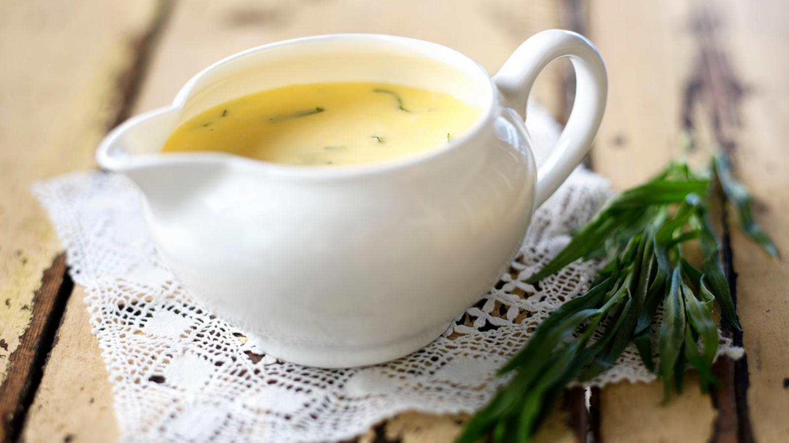

<!-- TODO: hero image undersized, refresh from Pexels or hand-curate -->
# Béarnaise Sauce

*This sauce is equally good with grilled steak and beef fondue.*

**Serves:** 6

**Prep Time:** 10 minutes

**Cook Time:** 15 minutes

## Overview
Sauce Béarnaise is the building block for steak frites, the silky herbaceous egg-yolk emulsion that drapes over grilled fillet, sirloin and rib of beef, served alongside beef fondue, and one of the great showpiece sauces of the classical French repertoire. It's a hollandaise variation; the technique is identical (egg yolks whisked with clarified butter into a stable emulsion over gentle heat) but the flavour profile is shifted by a sharp tarragon and shallot vinegar reduction that goes in at the start instead of plain lemon. Temperature control is everything; the sauce splits if it goes above 65 C and won't emulsify if it goes below, so a thermometer or a steady hand and intuition are non-negotiable. Combine white wine vinegar, two tablespoons of snipped fresh tarragon, finely chopped shallots and crushed peppercorns in a small heavy-based saucepan and reduce by half over low heat; cool fully before adding the eggs. Add four egg yolks and three tablespoons of cold water to the cold reduction. Set the pan over very low heat and whisk continuously, keeping the whisk in contact with the bottom of the pan; as you whisk, gradually increase the heat so the sauce emulsifies slowly and turns thick mousse-light over 8 to 10 minutes. The moment it ribbons, kill the heat (never let it go above 65 C). Whisk in the clarified butter a little at a time, off the heat or on the lowest setting; the residual warmth keeps the emulsion stable. Season, strain through a fine-meshed conical sieve into a clean pan to remove the shallot and peppercorn solids, then stir in the remaining fresh tarragon, chopped parsley and a squeeze of lemon. Serve immediately; the emulsion holds about 30 minutes warm in a bain-marie before it breaks.

## Ingredients

### Wine reduction
- 2 tablespoons white wine vinegar
- 3 tablespoons tarragon (snipped)
- 30 grams shallots (finely chopped)
- 10 peppercorns (crushed)

### Emulsion
- 4 egg yolks
- 250 grams [Clarified Butter (Beurre Clarifié)](../../base-ingredients/baking/clarified-butter.md) (cooled to tepid)

### Finishing
- 2 tablespoons parsley
- ½ lemon (juice)
- salt
- pepper

## Method

### Stage 1 - Make reduction
1. Combine the wine vinegar, 2 tablespoons of the tarragon, the shallots and peppercorns in a small, heavy-based saucepan and reduce by half over a low heat.
1. Set aside to cool. When the vinegar reduction is cold, add the egg yolks and 3 tablespoons of cold water. 

### Stage 2 - Create emulsion
1. Set the pan over a low heat, and whisk continuously, making sure that the whisk remains in contact with the bottom of the pan. 
1. As you whisk, gently increase the heat; the sauce should emulsify slowly and gradually, becoming smooth after 8-10 minutes. 
1. Do not let the sauce go above 65° C. Turn off the heat and whisk the clarified butter into the sauce, a little at a time. 

### Stage 3 - Finish
1. Season with salt and pepper to taste and pass through a fine meshed conical sieve into a clean pan. 
1. Stir in the rest of the tarragon, parsley and lemon juice. Check the seasoning, and serve.

## Notes
- **Temperature control:** Critical to prevent curdling; use thermometer and keep sauce below 65°C throughout.
- **Clarified butter:** Must be clarified to prevent white solids from creating grainy texture.
- **Tarragon freshness:** Use fresh tarragon only; dried loses delicate, complex flavour.

## Serving
Serve immediately with grilled or pan-fried steak,beef tournedos, and beef fondue. Also excellent with roasted veal and poultry.

## Storage
- Best eaten immediately after preparation.
- Keeps warm in a bain-marie for up to 30 minutes.
- Does not refrigerate or freeze well; emulsion breaks and texture becomes granular.
