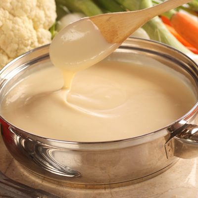

# Béchamel Sauce

*This sauce features in a variety of dishes, such as lasagne and croque monsieur. Béchamel goes well with vegetables, white meats and ham, and forms the basis of many other sauces.*

**Serves:** 4 (makes 500 ml)

**Prep Time:** 5 minutes

**Cook Time:** 15 minutes

## Overview
Béchamel is one of the five French mother sauces and the building block for cheese sauce (mornay), aurore, soubise, lasagne layers, croque monsieur, moussaka, vegetable gratins and an entire family of derived sauces. The structure is simple: a blond roux of butter and flour whisked with cold milk and simmered till thick, smooth, silky and free of any raw flour taste. A pinch of grated nutmeg at the end is traditional but optional. Two technique points keep béchamel from going wrong. First, the roux must be properly cooked but not coloured; a 2 to 3 minute white roux is what cooks the raw flour taste out, but any caramelisation pushes the sauce towards a brown sauce rather than a clean white one. Second, the milk must be cold when it hits the hot roux. Cold milk into hot roux dissolves smoothly with a whisk; hot milk into hot roux forms instant lumps that no amount of whisking saves. Melt the butter in a small heavy-based saucepan over low heat, then add the flour and whisk to combine. Cook gently for 2 to 3 minutes stirring constantly with the whisk till the roux turns smooth and lightly nutty in aroma without taking on colour. Pour in the cold milk steadily while whisking continuously, then raise the heat to medium and bring to the boil while whisking. The moment it boils, drop to a gentle simmer and cook for around 10 minutes, stirring frequently so it doesn't catch on the bottom. The sauce thickens to a smooth coating consistency. Season with salt and white pepper (not black, which would speckle the white sauce), grate in a pinch of nutmeg, then pass through a fine-meshed conical sieve to remove any small lumps. Use as a base for derived sauces or serve over poached vegetables and white meats.

## Ingredients

### Roux
- 30 grams butter
- 30 grams plain flour

### Liquid & seasoning
- 500 ml milk
- 1 pinch salt and pepper
- ½ teaspoon nutmeg (grated)

## Method

### Stage 1 - Make white roux
1. Melt the butter in a small, heavy based saucepan over a low heat, and then add the flour. 
1. Stir with a whisk, and cook gently for 2-3 minutes to make a white roux.

### Stage 2 - Add milk
1. Pour the cold milk on to the roux, whisking as you do so, and bring to the boil over a medium heat, whisking continuously.
1. When the sauce comes to the boil, lower the heat and simmer gently for about 10 minutes, stirring frequently. 

### Stage 3 - Season & finish
1. Season to taste with freshly ground salt and pepper. 
1. Add the nutmeg if you wish, and pass through a fine-meshed conical sieve.

## Notes
- **Roux cooking:** Essential to remove raw flour taste; white roux should not colour and remains pale throughout cooking.
- **Cold milk:** Always use cold milk; hot milk creates lumps immediately upon contact with hot roux.
- **Nutmeg:** A classic garnish adding warmth; optional but traditional especially for lasagne and creamy vegetables.

## Serving
Use as a base for derived sauces (Aurora, Mornay, etc.) or serve with vegetables, white meats, ham, and pasta dishes. Excellent in lasagne and creamy vegetable gratins.

## Storage
- Keeps refrigerated for 3-4 days in an airtight container.
- Freezes well for up to 2 months.
- Best used as fresh base for derived sauces rather than served alone; reheat gently, stirring frequently.
