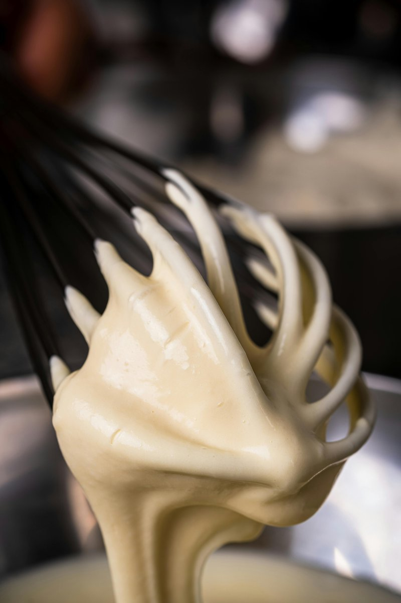

# Beurre Blanc with Cream

*Simple and delicate, this sauce is delicious with most poached fish.*

**Serves:** 6

**Prep Time:** 5 minutes

**Cook Time:** 10 minutes

## Overview
Beurre blanc is the building block for the classic French butter sauce that pairs with poached and steamed fish, especially sole, turbot, halibut and other delicate white fish: a sharp shallot, white wine and white wine vinegar reduction, mounted with cold butter into a silky emulsion. The Loire Valley version this recipe follows adds a touch of double cream to the reduction before the butter goes in, which makes the emulsion considerably more stable and gives a slightly thicker richer sauce than the pure butter beurre blanc nantaise (no cream). Temperature is the single biggest variable. Hold the sauce at exactly 90 C as you mount the butter; hotter than that and the emulsion splits to a greasy layer, cooler and the butter never properly emulsifies and just melts as oil into the reduction. A thermometer is the safest way to learn it. Combine the dry white wine, white wine vinegar and finely chopped shallots in a small heavy-based saucepan and reduce by two-thirds over low heat. Add the double cream and reduce again by a third; the cream gives the sauce body and the second reduction concentrates everything before the butter. Now over the lowest heat, whisk in cold cubed butter a little at a time (or beat in with a wooden spoon), keeping the sauce at a barely-simmering 90 C the whole way through; do not let it boil at any point. The sauce thickens and emulsifies into a silky pale-ivory pour. Season with salt and pepper to taste. Some chefs strain through a fine sieve to remove the shallot pieces; others leave them in for texture. Serve immediately under poached fish; the emulsion holds 20 minutes maximum in a bain-marie before it breaks.

## Ingredients

### Wine reduction
- 75 ml dry white wine
- 75 ml white wine vinegar
- 60 grams shallots (finely chopped)

### Finishing
- 50 ml double cream
- 200 grams butter (chilled and diced)
- salt
- pepper

## Method

### Stage 1 - Make reduction
1. Combine the white wine, wine vinegar and shallots in a small, heavy-based saucepan and reduce the liquid over a low heat by two-thirds. 
1. Add the cream and reduce again by one-third.

### Stage 2 - Mount butter
1. Over a low heat, whisk in the butter, a little at a time, or beat in using a wooden spoon. 
1. It is vital to keep the sauce barely simmering at 90°C as you incorporate the butter, making sure it does not boil. 
1. Season to taste with salt and pepper and serve immediately.

## Notes
- **Temperature control:** Maintain sauce at exactly 90°C; hotter causes separation, cooler prevents proper emulsion.
- **Butter temperature:** Cold butter pieces emulsify correctly; room temperature butter creates greasy, separated sauce.
- **Never boil:** Once butter is incorporated, do not allow sauce to boil or emulsion will break.

## Serving
- Serve immediately with poached fish, steamed fish, delicate white fish fillets, and shellfish. Classic pairing for sole, turbot, and halibut.

## Storage
- Best eaten immediately after preparation.
- Keep warm in bain-marie for up to 20 minutes maximum.
- Does not reheat well; emulsion breaks. Always make fresh when needed.
