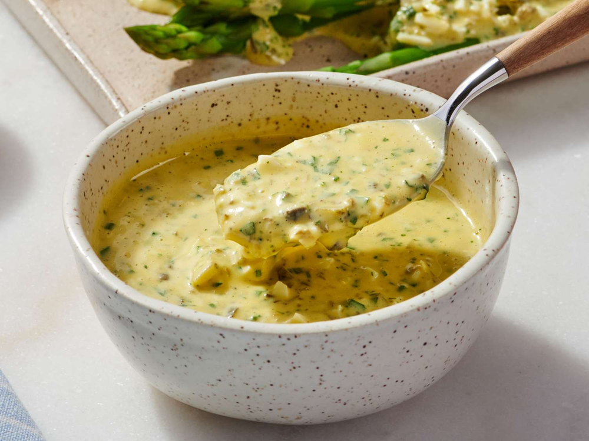

# Gribiche Sauce

*This piquant sauce is especially good served with cold fish, crustaceans, smoked trout and hard boiled eggs.*

**Serves:** 6

**Prep Time:** 15 minutes

**Cook Time:** 0 minutes

## Overview
Sauce Gribiche is the building block for cold fish, shellfish, smoked trout, poached salmon and any cold protein where you'd otherwise reach for mayonnaise or tartare: a French cold sauce built from hard-boiled egg yolks worked into a smooth paste, emulsified with groundnut oil and white wine vinegar exactly like mayonnaise, then loaded with chopped capers, finely diced cornichons, snipped fines herbes and the chopped whites of the hard-boiled eggs for textural contrast. It's the cold cousin of sauce ravigote and tartare, but distinguished by the hard-cooked egg yolks (raw yolks would be a mayonnaise; the cooked yolks give a softer richer flavour with no raw-egg risk) and the visible pieces of egg white, capers and cornichons through the sauce. Hard-boil four eggs, separate the yolks and whites. Push the yolks through a fine sieve into a mortar with the Dijon mustard and a pinch of salt and pepper, then crush with a pestle to a smooth paste. Now build the emulsion: trickle in half of the groundnut oil in a thin steady stream while working with the pestle to amalgamate it; rushing the oil splits the emulsion just like it does with mayonnaise. Add the white wine vinegar (this slackens the mixture and helps the rest of the oil emulsify in), then trickle in the remaining oil while pounding till smooth. Coarsely chop the reserved egg whites and add to the sauce with the drained capers, finely diced cornichons and finely snipped fines herbes (parsley, chives, tarragon, chervil; use fresh, never dried), mixing in with a spoon rather than the pestle so the textural pieces stay intact. Season, cover, chill. Serve cold next to cold salmon, smoked trout, crab or hot eggs.

## Ingredients

### Base
- 4 hard boiled eggs
- 1 teaspoon Dijon mustard
- 250 ml groundnut oil
- 1 tablespoon white wine vinegar

### Vegetables & herbs
- 30 grams capers (drained)
- 30 grams cornichons (finely diced)
- 2 tablespoons [Fines Herbes](../../base-ingredients/herbs/fines-herbes.md) (finely snipped)
- salt
- pepper

## Method

### Stage 1 - Prepare egg base
1. Separate the hard-boiled egg whites and yolks.
1. Put the yolks, mustard and a little salt and pepper into a mortar and crush with the pestle to make a smooth paste.

### Stage 2 - Create emulsion
1. Gradually trickle in half of the groundnut oil, mixing with the pestle as you go to amalgamate it thoroughly.
1. Still mixing, add the wine vinegar, then continue to trickle in the remaining oil as before.

### Stage 3 - Add vegetables & herbs
1. Coarsely chop the hard boiled egg whites.
1. Add to the sauce with the capers, cornichons and herbs and mix them in with a spoon.

### Stage 4 - Season & serve
1. Season the sauce with salt and pepper to taste.
1. Cover and refrigerate until ready to serve.

## Notes
- **Egg yolk emulsion:** Essential for sauce body; don't skip the mortar work as it creates silky base.
- **Oil temperature:** Cold oil emulsifies best; room temperature oil creates separated, greasy sauce.
- **Fresh herbs:** Fines herbes should be freshly snipped; dried loses delicate flavour needed here.

## Serving
- Serve chilled with cold poached fish, smoked trout, shellfish (crab, lobster), and cold eggs. A classic French sauce for charcuterie boards.

## Storage
- Keeps refrigerated for 2 days in an airtight container.
- Does not freeze well; emulsion breaks upon thawing.
- Best eaten fresh; egg yolks oxidize and darken slightly with time.
