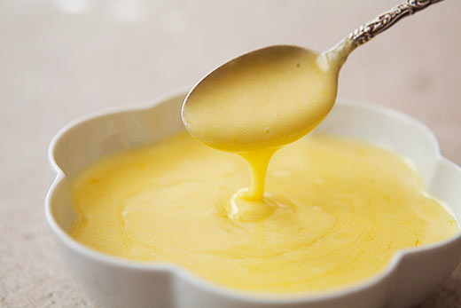

# Hollandaise Sauce

*This light, creamy classic has inspired a host of other sauces.*

**Serves:** 4

**Prep Time:** 10 minutes

**Cook Time:** 15 minutes

## Overview
Hollandaise is one of the five French mother sauces and the building block for an entire family of derived sauces including béarnaise, mousseline, maltaise, mikado and choron. It's also the sauce of Eggs Benedict, Eggs Royale, and the classical accompaniment for poached fish, steamed asparagus and steamed broccoli. The structure is an emulsion of egg yolks and clarified butter held together by an acidic reduction (white wine vinegar with crushed white peppercorns). Two temperatures define success. The egg yolks must be cooked over very low heat to 65 C maximum (any higher and the yolks scramble), and the clarified butter must be tepid not hot when it goes in (hot butter would shock the yolks into scrambling). A heat diffuser or a heavy-bottomed copper pan gives you the precise control you need. Combine the white wine vinegar, cold water and crushed white peppercorns in a thick-bottomed saucepan, reduce by a third over heat, then cool completely; the acidic base flavours the sauce and helps stabilise the emulsion later. Whisk in the egg yolks. Set the pan on a diffuser over very low heat and whisk continuously, keeping the whisk in contact with the bottom of the pan; gradually increase the heat as the sauce emulsifies, the mixture progressively thickening into a smooth creamy ribbon over 8 to 10 minutes. Never above 65 C. Pull off the heat and pour in the tepid clarified butter in a thin steady stream while whisking constantly; the emulsion builds as the butter incorporates. Season with salt, optional lemon juice at the very end, then strain through muslin-lined sieve if you want to remove the peppercorns. Serve immediately or hold in a 50 to 55 C bain-marie for up to 30 minutes.

## Ingredients

### Base & reduction
- 1 tablespoon white wine vinegar
- 4 tablespoons cold water
- 1 teaspoon white peppercorns (crushed)
- 4 egg yolks

### Emulsion
- 250 grams [Clarified Butter (Beurre Clarifié)](../../base-ingredients/baking/clarified-butter.md) (cooled to tepid)
- salt
- ½ lemon (optional, juice)

## Method

### Stage 1 - Prepare reduction
1. In a thick-bottomed stainless steel or copper saucepan, mix the wine vinegar with 4 tablespoons of cold water and the crushed peppercorns.
1. Heat and allow to bubble so it reduces by one third, then leave to cool completely.

### Stage 2 - Create egg base
1. Add the egg yolks to the cold reduction and mix with a whisk.
1. Put the saucepan on a heat diffuser over a very low heat and continue whisking, making sure that the whisk remains in contact with the bottom of the pan.
1. Gradually increase the heat so that the sauce emulsifies progressively, becoming very smooth and creamy after 8-10 minutes. DO NOT allow the temperature of the sauce to rise above 65°C.

### Stage 3 - Emulsify with butter
1. Remove from heat and still whisking, pour in the tepid clarified butter in a steady stream.
1. Season with salt to taste.

### Stage 4 - Finish
1. At the very last moment, stir in the lemon juice (if using).
1. Pass the sauce through a muslin-lined conical strainer to eliminate the crushed pepper if required, then serve immediately.

## Notes
- **Temperature control:** Keep the sabayon at 62-65°C. Egg yolks fully set around 70°C and the sauce splits at that point. Use a heat diffuser and very low heat.
- **Clarified butter:** Must be tepid (lukewarm), not hot, for smooth emulsification.
- **Reduction:** The acidic base is essential for flavour and helps stabilize the emulsion.

## Serving
Serve with poached or steamed fish, asparagus, broccoli, eggs Royale, or other classic preparations. Essential for Eggs Benedict variations.

## Storage
- Best served immediately; does not keep well due to emulsion instability.
- If it must be held, keep warm in a bain-marie (water bath) at 50-55°C for up to 30 minutes.
- Does not freeze; emulsion breaks upon thawing.
