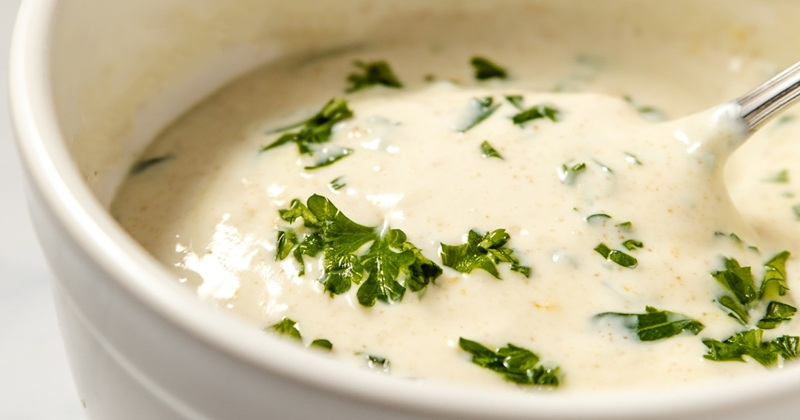

# Lemon Yogurt Sauce

*The Mediterranean-Middle-Eastern catch-all. Greek yogurt, a clove of garlic grated fine, a squeeze of lemon, a slick of olive oil, salt. Rested for 20 minutes so the garlic mellows. Good on grilled meat, roasted vegetables, fritters, kebabs, anything that wants a cool tart counterpoint.*

**Serves:** Makes 1 cup

**Prep Time:** 5 minutes (plus 20 minutes resting)

**Cook Time:** None

## Overview
Lemon yogurt sauce is the building block for the cool tart counterpoint on a mezze platter or beside anything grilled: full-fat thick Greek yogurt with finely grated garlic, fresh lemon juice, olive oil and a pinch of salt, rested 20 minutes so the raw garlic edge mellows into the yogurt. It's the pared-down cousin of tzatziki (no grated cucumber), Middle Eastern labneh sauces and Mediterranean yogurt dips, made with five ingredients in five minutes and improved by the rest. The two technique points are the yogurt and the garlic ratio. Use full-fat Greek-style yogurt (the thick strained kind); regular yogurt is too thin and the sauce won't cling to whatever you spoon it over. If only thin yogurt is available, strain it through muslin or a fine sieve for 30 minutes first to thicken. And on the garlic, a quarter teaspoon (about half a small clove) finely grated on a Microplane is enough. Raw garlic intensifies as the sauce sits, so what tastes mild on day one becomes aggressive by day two if you started with more. Whisk the yogurt briefly in a small bowl to loosen, then add the grated garlic, lemon juice, olive oil, salt and an optional pinch of pepper and whisk till uniform; the consistency should be pourable-cream. The oil floats on top initially, then folds back in with stirring. Cover and rest at room temperature for at least 20 minutes (an hour is ideal); the garlic mellows and the flavours marry. Taste, adjust salt or lemon, loosen with a tablespoon or two of cold water if you want a drizzling consistency. Serve cold with grilled lamb skewers, falafel, kebabs, charred aubergine, fritters or roast vegetables. Keeps three days; flavour peaks on day two.

## Ingredients

- 1 cup full-fat Greek-style yogurt (the thick kind, strained)
- ¼ teaspoon finely grated garlic (about ½ small clove on a Microplane)
- 1 tablespoon lemon juice
- 1 tablespoon extra-virgin olive oil (plus more for drizzling)
- ¼ teaspoon fine sea salt (or kosher salt)
- A pinch of black or white pepper (optional)

## Method

### Stage 1 - Combine
1. In a small bowl, whisk the yogurt to loosen it slightly.
2. Add the grated garlic, lemon juice, olive oil, salt and pepper if using.
3. Whisk until uniformly combined. The sauce should be the consistency of pourable cream.

### Stage 2 - Rest
1. Cover and rest at room temperature for 20 minutes (or up to 1 hour). The garlic mellows; the flavours marry.

### Stage 3 - Adjust and serve
1. Taste. Add a pinch more salt if needed, or another teaspoon of lemon juice for a brighter sauce.
2. For a thinner drizzling consistency, whisk in 1-2 tablespoons of cold water. For a thicker dip, leave as-is.

## Notes
- **Greek-style yogurt only**: regular yogurt is too thin and the sauce won't cling. If only thin yogurt is available, strain through muslin or a fine sieve for 30 minutes first.
- **Garlic restraint**: ¼ teaspoon (half a clove) is enough. The raw-garlic bite intensifies as the sauce sits; more than this and the sauce becomes harsh by day two.
- **Variations**:
  - **Herb version**: stir in 1 tablespoon of chopped fresh dill, mint or coriander after resting.
  - **Tahini-yogurt**: replace 2 tablespoons of yogurt with 2 tablespoons of tahini for a deeper, nuttier sauce.
  - **Lemon-zest version**: add the zest of half a lemon for a more aromatic, brighter sauce.

## Serving
- With grilled lamb skewers, chicken kebabs, falafel, roast vegetables, charred eggplant, fritters of any kind. Stirred into salads. Spooned over a baked potato. As the cooling element on a mezze platter alongside hummus and baba ganoush.

## Storage
- In a sealed jar in the fridge for up to 3 days. The flavour improves on day 2; by day 3 the garlic starts to dominate.
- Whisk briefly before serving, separation is normal.
- Don't freeze, yogurt seizes on thawing.
