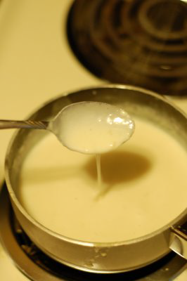

# Mornay Sauce

*You can coat poached eggs, fish, vegetables and white meats with this sauce, then brown under a hot grill. This sauce can also be mixed with macaroni cheese.*

**Serves:** 4

**Prep Time:** 5 minutes

**Cook Time:** 15 minutes

## Overview
Sauce Mornay is the building block for the classic French cheese sauce that crowns fish, poached eggs, blanched vegetables and pasta gratins, then browns to a deep gold under a hot grill: a derived sauce built on a base of béchamel, enriched with an egg yolk and cream liaison, and finished with finely grated Gruyère. It's the cheese sauce of the French repertoire, more refined than a simple cheese-and-roux sauce because of the liaison; the egg yolks and cream give the sauce a silky luxurious body that grills to a flawless golden gratin crust without splitting. Two technique points keep it stable. First, the liaison goes in slowly. Mix the egg yolks and double cream together first in a separate bowl, then pour into the warm béchamel while whisking constantly; this slow tempering brings the yolks up to the béchamel's temperature gradually so they enrich the sauce rather than scrambling into curds. Let the sauce bubble for about a minute while whisking continuously to ensure the yolks are fully cooked. Second, the cheese goes in off the heat. Pull the pan off the burner before adding the grated Gruyère; live heat seizes the cheese into strings and clumps, while residual heat melts it cleanly into the sauce. Use Gruyère for the proper character (other cheeses can substitute but won't taste like Mornay). Add a pinch of grated nutmeg, taste, season with salt and pepper. Use immediately to coat poached eggs, fish or steamed cauliflower, then slide under a hot grill till the surface turns deep gold and bubbles. Eggs Mornay is the most famous application; the sauce also stirs into macaroni for a classier macaroni cheese, and folds into pasta gratins.

## Ingredients

### Base sauce
- 500 ml [Béchamel Sauce](./bechamel-sauce.md)

### Enrichment
- 3 egg yolks
- 50 ml double cream
- 100 grams Gruyere cheese (finely grated)

### Seasoning
- 1 pinch nutmeg
- salt
- pepper

## Method

### Stage 1 - Prepare liaison
1. Mix the egg yolks and cream together in a bowl.

### Stage 2 - Temper egg yolks
1. Pour the egg and cream mixture into the warm béchamel, whisking constantly.
1. Let the sauce bubble for about 1 minute, whisking continuously, to ensure yolks are fully cooked.

### Stage 3 - Add cheese
1. Take the pan off the heat.
1. Shower in the grated cheese and stir until melted.
1. Add nutmeg and taste, adjusting seasoning with salt and pepper as necessary.

### Stage 4 - Serve
1. Use immediately for poached eggs, fish, or vegetables that will be gratined.

## Notes
- **Gruyère cheese:** Essential for authentic flavour; other cheeses lack the necessary depth and melting quality.
- **Egg yolks:** Must be tempered slowly to avoid scrambling; constant whisking is crucial.
- **Nutmeg:** Use sparingly, just a pinch; this sauce already has subtle spice from the béchamel.

## Serving
- Serve with poached eggs (Eggs Mornay), poached fish fillets, blanched vegetables, or white meats. Brown under a hot grill to create a golden crust before serving.

## Storage
- Can be made ahead and refrigerated for 1 day in an airtight container.
- Reheat gently over low heat, stirring frequently, being careful not to scramble the eggs.
- Can be frozen for up to 1 month; thaw in refrigerator before reheating.
