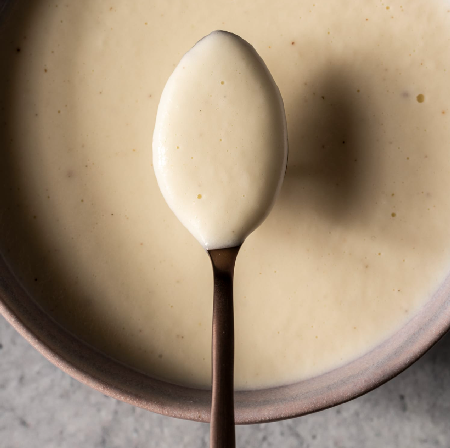

# Soubise Sauce

*A variant of béchamel sauce that has a slightly sweet taste from sweated onions, and goes well with white meat or veal.*

**Serves:** 4

**Prep Time:** 10 minutes

**Cook Time:** 25 minutes

## Overview
Sauce Soubise is the building block for the sweet onion-flavoured derivative of béchamel that pairs with veal escalopes, roast chicken, white meats and blanched vegetables: thinly sliced onions sweated slowly in butter without colour, simmered with béchamel and passed through a fine sieve to extract the onion flavour into the sauce, then enriched with double cream and a pinch of nutmeg. The character is gentle onion sweetness underneath the creamy body, which makes it the right sauce for delicate proteins where a strong sauce would dominate. The "sweat without colour" step is what defines the sauce; the onions need to go soft, sweet and translucent without ever browning, because any caramelisation darkens the sauce and shifts the flavour from sweet-onion to roasted-onion (still good, but a different sauce entirely). Melt butter in a saucepan over low heat, add the thinly sliced onions and sweat for 5 minutes, stirring occasionally so they don't catch but never letting them take on colour; if the heat creeps up and they start to brown, drop the burner. Once the onions are soft and translucent, add the béchamel and bring to the boil over low heat, then bubble gently for 10 minutes, stirring frequently. Pass the sauce through a fine-meshed sieve into a clean saucepan, pressing hard on the onions with the back of a ladle to extract every drop of flavour. The pulpy onion bits don't go through; what comes out is a smooth pale sauce flavoured by the onions rather than chunky with them. Add the cream and cook gently 6 to 8 minutes more, stirring constantly, till the sauce reduces and thickens to a glossy coating consistency. Season with salt, pepper and freshly grated nutmeg. Serve over the chosen protein.

## Ingredients

### Base
- 300 ml [Béchamel Sauce](./bechamel-sauce.md)
- 40 grams butter
- 200 grams onion (thinly sliced)

### Finishing
- 150 ml double cream
- ½ teaspoon nutmeg (freshly ground)
- 1 pinch salt and pepper

## Method

### Stage 1 - Sweat onions
1. Melt the butter in a saucepan over a low heat.
1. Add the onions and sweat for 5 minutes without colouring.

### Stage 2 - Combine with béchamel
1. Add the béchamel sauce and bring to the boil over a low heat.
1. Allow to bubble for 10 minutes, stirring frequently.

### Stage 3 - Pass & strain
1. Pass through a fine-meshed sieve into a clean saucepan.
1. Press the onions with the back of a ladle to extract as much flavour as possible.

### Stage 4 - Finish & season
1. Add the cream and cook gently for 6-8 minutes, stirring continuously, until the sauce has reduced and thickened.
1. Season to taste with salt, pepper and the nutmeg.

## Notes
- **Straining:** Essential to remove onion skins and achieve silky texture; do not skip.
- **Sweating without colour:** Keeps sauce pale and delicate; browning onions darkens the sauce.
- **Reduction:** The cream stage concentrates flavours and creates silky body.

## Serving
Serve with braised or roasted white meats (veal, chicken breast), blanched vegetables, or egg dishes.

## Storage
- Keeps refrigerated for 2 days in an airtight container.
- Freezes well for up to 1 month.
- Reheat gently over low heat, stirring frequently; add splash of milk if thickened.
