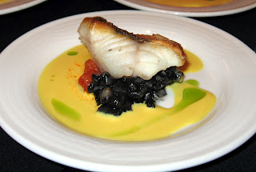

<!-- TODO: hero image undersized, refresh from Pexels or hand-curate -->
# Vermouth Sauce

*A rich creamy, succulent sauce that goes perfectly with braised white fish or shellfish.*

**Serves:** 4

**Prep Time:** 5 minutes

**Cook Time:** 20 minutes

## Overview
Vermouth sauce is the building block for braised white fish and shellfish: a herbal-complex creamy sauce built from finely chopped shallots reduced in dry vermouth with thyme and bay, joined by fish stock and double cream, then mounted with cold butter at the end and finished with a pinch of paprika. The vermouth gives the sauce its distinctive character; the dry vermouth's herbal complexity (the wormwood, gentian, juniper and bittering herbs that go into the wine) carries depth that plain dry white wine can't match, and that herbal layer is what makes vermouth sauce different from a basic shellfish butter sauce. Use proper dry vermouth (Noilly Prat or Dolin); sweet red vermouth would make a cloying sauce. Put the finely chopped shallots, a thyme sprig, half a bay leaf and dry vermouth into a small saucepan and reduce by a third over high heat (the kitchen will smell of pine and herbs as the alcohol burns off). Pour in fish stock and cook over medium heat for 10 minutes, then add the cream. Reduce over high heat till the sauce thickens enough to coat the back of a spoon. Fish out the thyme and bay leaf. Whisk in a pinch of paprika (this both colours the sauce a faint warm orange and adds a subtle gentle smokiness), then drop the heat to its lowest setting and whisk in cold cubed butter a little at a time off the heat to mount the sauce into a glossy emulsion. Crucial; don't let the sauce boil from this point or the emulsion splits. Season with salt and pepper. Optional: blitz briefly in a blender for a foam-light texture. Serve immediately over braised sole, turbot, cod, scallops or lobster. Best made just as the fish comes off the heat.

## Ingredients

### Aromatics & wine reduction
- 40 grams shallots (finely chopped)
- 1 sprig thyme
- ½ bay leaf
- 100 ml vermouth (dry)

### Stock & cream
- 300 ml Fish stock
- 2 tablespoons double cream

### Finishing
- 60 grams butter (well chilled and diced)
- 1 pinch paprika
- salt
- pepper

## Method

### Stage 1 - Reduce vermouth
1. Put the shallots, thyme, bay leaf and vermouth into a saucepan.
1. Let bubble to reduce by one-third over a high heat.

### Stage 2 - Add stock
1. Pour in the fish stock and cook over a medium heat for 10 minutes.
1. Add the cream.

### Stage 3 - Reduce & finish
1. Reduce the sauce over a high heat until it is thick enough to coat the back of a spoon.
1. Remove the thyme and the bay leaf.
1. Whisk in the paprika and turn the heat down to low, making sure that the sauce does not boil.

### Stage 4 - Mount butter & serve
1. Whisk in the butter, a little at a time, off the heat.
1. Season to taste with salt and pepper.
1. (Optional) Transfer to a blender for 30 seconds to make a foam.
1. Serve immediately.

## Notes
- **Vermouth selection:** Dry vermouth is essential; sweet vermouth creates cloying sauce.
- **Shallot reduction:** Concentrates flavour; do not skip this stage.
- **Butter mounting:** Off-heat whisking prevents emulsion breaking; do not allow to boil.
- **Foam technique:** Creates elegant presentation and lightens body for modern service.

## Serving
Serve with braised white fish fillets (sole, turbot, cod) or shellfish (scallops, lobster). The herbal vermouth notes complement delicate seafood beautifully.

## Storage
- Best served immediately; emulsion breaks if held too long.
- Can be held in a warm bain-marie at 55°C for up to 20 minutes.
- Does not freeze; butter breaks and separates upon thawing.
