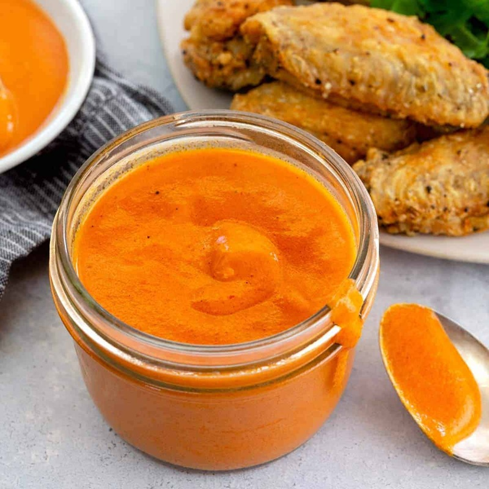

# Buffalo Sauce

*The tangy, butter-rich orange sauce behind American Buffalo wings: hot sauce melted into butter, balanced with a touch of sugar and the savoury depth of Worcestershire. Goes on wings, drumsticks, cauliflower, burgers, fried chicken sandwiches and the leftover roast on a Monday lunchbox.*

**Serves:** 4 (about 200 ml; sauces a kilo of wings)

**Prep Time:** 2 minutes

**Cook Time:** 5 minutes

## Overview
Buffalo sauce is the building block of American Buffalo wings, the tangy orange butter-rich sauce that gets tossed with freshly fried chicken wings so every piece comes out glossy and dripping with sticky tangy heat: a base of Frank's Original RedHot (or any cayenne-vinegar hot sauce) emulsified with melted unsalted butter, balanced with a pinch of sugar to soften the vinegar bite, garlic powder, and a few dashes of Worcestershire to layer in savoury depth. It's a small recipe (five minutes start to finish), but the technique is what makes the difference between a glossy emulsified sauce that clings to wings and a greasy split slick. Heat is the whole control. Use low to medium heat throughout; crank it up and the butter splits, leaving an oily film floating on top of the vinegar-thin liquid beneath, and the sauce won't recover. Place 85 g of unsalted butter in a small saucepan over low-medium heat and let it melt without foaming or browning. Pour in 125 ml of Frank's RedHot (Frank's is the original American hot sauce that defines Buffalo wings; Crystal, Texas Pete or other cayenne-vinegar sauces work but have different salt and vinegar levels, so taste and adjust), stir with a small whisk till the butter and hot sauce emulsify into a single smooth glossy orange sauce rather than two distinct layers. Add the sugar, garlic powder and Worcestershire and stir for another 30 seconds. Taste; the finish should be sharp, savoury, slightly sweet and warm rather than punishingly hot. If it splits while you cook, pull the pan off the heat and whisk vigorously with a teaspoon of cold water to bring it back. Use immediately: toss in a wide bowl with hot crispy wings, drizzle on a fried chicken sandwich, or stir half-and-half into mayonnaise for a Buffalo dip.

## Ingredients
- 125 ml Frank's Original Hot Sauce (or any cayenne-vinegar hot sauce)
- 85 g unsalted butter (about 6 tablespoons)
- 2 teaspoons granulated sugar
- ⅛ teaspoon garlic powder
- 5 dashes Worcestershire sauce

## Method

### Stage 1 - Melt the butter
1. Place the butter in a small saucepan over low-medium heat.
1. Let it melt without browning, the butter should be liquid, not foaming or sizzling.

### Stage 2 - Combine with the hot sauce
1. Pour in the hot sauce.
1. Stir with a small whisk or wooden spoon until the butter and hot sauce emulsify into a smooth, glossy orange sauce.

### Stage 3 - Season
1. Add the sugar, garlic powder and Worcestershire sauce.
1. Stir for another 30 seconds, then taste.
1. The sauce should be sharp, savoury, slightly sweet and not punishingly hot.

### Stage 4 - Serve
1. Use immediately while warm: toss with freshly fried wings in a wide bowl until every piece is glossy and slick, or drizzle over a fried chicken sandwich.

## Notes
- **Low heat throughout:** Crank it up and the butter splits, leaving an oily film on top. If it splits, pull the pan off the heat and whisk vigorously to bring it back; a teaspoon of cold water helps.
- **Heat level:** This is a balanced sauce, not a face-melter. For more heat add another tablespoon of hot sauce; for less, an extra teaspoon of butter.
- **Frank's RedHot is the original:** Other cayenne-vinegar hot sauces work (Crystal, Texas Pete, Tabasco-style) but the salt and vinegar levels vary, taste and adjust.

## Serving
- The classic partner for wings (toss in a wide bowl with a splash of sauce per portion). Also brilliant for: fried chicken sandwiches, drizzled over crisp roasted cauliflower, stirred 1:1 with mayonnaise for a Buffalo dip, or thinned with cream for a pasta sauce.

## Storage
- Keeps refrigerated 1 week in a sealed jar.
- The butter sets solid once chilled; warm gently on the hob or 20 seconds in a microwave before using.
- If it thickens too far, loosen with a splash of warm water.
- Not recommended for freezing, the emulsion breaks on thaw.
