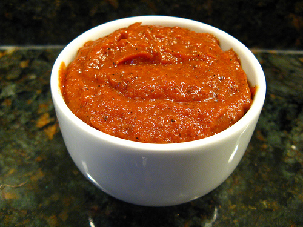

# Chipotle Sauce

*The smoky flavour of this rich sauce makes it ideal for barbecue-cooked food, either as a marinade or as an accompaniment. It is also wonderful stirred into cream cheese as a sandwich filling, or with chicken. Chipotle chillies are smoke-dried Jalapeños.*

**Serves:** 6

**Prep Time:** 20 minutes

**Cook Time:** 75 minutes

## Overview
Chipotle sauce is the building block for the deeply smoky barbecue sauce that paints itself onto grilled ribs, brushes over pulled pork sandwiches, marinates steaks before the grill, gets stirred into cream cheese for sandwich fillings, and serves as a deep dipping sauce for chicken: a sauce built around the chipotle chilli (a smoke-dried jalapeño) so the smokiness comes from the chilli itself rather than added liquid smoke. Charred roasted tomatoes give the body, soaked rehydrated chipotles give the heat and smoke, red wine gives depth, and honey, mustard and dried oregano balance the layers. Two technique points matter. First, the tomatoes go in the oven first, quartered and dry-roasted at 200 C for 45 to 60 minutes till the edges blacken and char in patches; that caramelisation and char is essential to the depth of the sauce, and skipping it gives you a watery thin tomato chilli sauce rather than the deep complex backbone Chipotle sauce needs. Second, soak the dried chipotle chillies in cold water for 20 minutes till they soften, then slit them open and scrape out the seeds (more seeds = more heat; remove most for moderate heat, leave a few in for fiery). Once the tomatoes are roasted and cool enough to handle, slip off the blistered skins, scoop out the seeds and tip the flesh into a food processor with the chopped chipotles, garlic and red wine. Blitz till smooth. Stir in oregano, honey, mustard and black pepper, then bring to the boil in a small pan and immediately drop to low for 10 minutes till the sauce reduces and thickens. Use hot brushed onto grilling meats, or cool down and serve cold as a dipping sauce. Keeps a week refrigerated.

## Ingredients

### Produce
- 500 grams tomatoes
- 5 chipotle chillies
- 3 garlic cloves (chopped)

### Liquid & flavourings
- 150 ml red wine
- 1 teaspoon dried oregano
- 4 tablespoons clear honey
- 1 teaspoon American mustard
- ½ teaspoon freshly ground black pepper

## Method

### Stage 1 - Roast tomatoes
1. Preheat the oven to 200°C.
1. Cut the tomatoes into quarters and place them in a roasting pan.
1. Roast the tomatoes for 45-60 minutes, until they are charred.

### Stage 2 - Prepare chillies
1. Meanwhile, soak the chillies in a bowl of cold water to cover for about 20 minutes or until they are soft.
1. Remove the stalks, slit the chillies and scrape out the seeds with a small sharp knife. Discard the seeds if necessary.
1. Chop the chillies roughly.

### Stage 3 - Purée vegetables
1. Remove the tomatoes from the oven, let them cool slightly and then remove the skins and seeds.
1. Put the tomatoes in a food processor and purée.
1. Add the chillies, garlic and red wine, and process until the mixture is homogeneous.

### Stage 4 - Add seasonings & reduce
1. Add the oregano, honey, mustard and black pepper.
1. Stir to mix, then check for seasoning.
1. Pour the mixture into a small pan and slowly bring to the boil over a medium heat.
1. Immediately reduce the heat to low and simmer for 10 minutes, stirring occasionally until the sauce has reduced and thickened.
1. This sauce can be served hot or cold.

## Notes
- **Charring tomatoes:** Essential for depth; creates caramelized sugars that balance sweetness.
- **Chipotle seeds:** Remove to reduce heat level if preferred; seeds concentrate spiciness.
- **Smoke-dried peppers:** Source of this sauce's distinctive smoky character; no substitute.

## Serving
- Serve as marinade for grilled meats or as an accompaniment to barbecue. Also excellent stirred into cream cheese for sandwich filling or mixed with sour cream for a dip.

## Storage
- Keeps refrigerated for 1 week in an airtight container.
- Freezes well for up to 3 months.
- Flavour improves slightly with time as spices continue to infuse.
