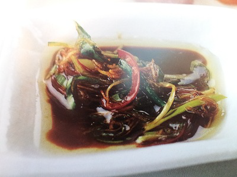

# Ginger and Chilli Sauce for Sashimi

*For sashimi, it is essential to use extremely fresh, good quality salmon and tuna. Cut into diamonds, about 5 mm thick, arrange on a platter and serve with this sauce.*

**Serves:** 8

**Prep Time:** 15 minutes

**Cook Time:** 5 minutes

## Overview
Ginger and chilli sauce for sashimi is the building block for the dipping sauce that goes alongside thinly sliced raw salmon and tuna on a sashimi platter: very finely diced fresh ginger, julienned spring onions and red chilli, combined in a bowl with dark and light soy sauces, unrefined cane sugar and chicken stock, then activated by hot oil poured over the top to bloom the aromatics. The technique is borrowed from Cantonese cooking where the hot-oil pour-over (called "bao you" or splash oil) is a standard finishing move for steamed fish, but adapted here as a standalone sauce for raw fish. The temperature of the oil matters more than any other detail. Heat the sesame oil and groundnut oil together in a small pan to between 80 and 100 C; too cool and the oil doesn't activate the aromatics, too hot (above about 120 C) and the ginger and chilli burn and the spring onions go bitter. A thermometer is the safest way to learn this. Combine the fresh ginger, spring onion, chilli, both soys, sugar and chicken stock in a heatproof bowl. Pour the hot oil over the top all at once, stirring with a fork as it goes; the oil hisses violently and infuses the aromatics into the sauce instantly. Cover with cling film and rest at least 20 minutes for the flavours to meld and the sauce to come to room temperature. Stir before serving. Use only with absolutely fresh sashimi-grade fish (this sauce is engineered to support pristine raw fish and demands quality to match). Arrange thin diamonds of salmon and tuna on a platter and serve with the sauce in a small bowl alongside for diners to dip into.

## Ingredients

### Aromatics
- 1 tablespoon fresh ginger (very finely diced)
- 2 tablespoons spring onions (fine julienne)
- 1 red chilli (fine julienne)

### Soy base
- 2 tablespoons dark soy sauce
- 2 tablespoons light soy sauce
- 1 tablespoon unrefined cane sugar
- 2 tablespoons Chicken Stock

### Oils  
- 1 tablespoon sesame oil
- 2 tablespoons groundnut oil

## Method

### Stage 1 - Prepare base
1. Put all the ingredients, except the oils, into a large bowl.

### Stage 2 - Heat oils
1. In a small pan, heat the oils to between 80 and 100°C.

### Stage 3 - Combine
1. Pour the hot oil over the ingredients in the bowl, stirring with a fork.
1. Mix well.

### Stage 4 - Infuse & serve
1. Cover the bowl with cling film and leave the sauce to stand for at least 20 minutes before serving.
1. Stir before serving.

## Notes  
- **Oil temperature:** Critical for proper infusion; too cool and flavours don't release; too hot and aromatics burn.
- **Rest time:** Allows flavours to fully develop and oil to infuse with aromatics.
- **Fresh sashimi requirement:** This sauce demands top-quality, sushi-grade fish.

## Serving
Serve with thinly sliced sashimi-grade salmon and tuna arranged on a platter. Also excellent with grilled fish or as a marinade for seafood.

## Storage
- Keeps refrigerated for 1 day in an airtight container.
- Do not freeze; aromatics lose potency and oils separate.
- Best served at room temperature for optimal flavour.
