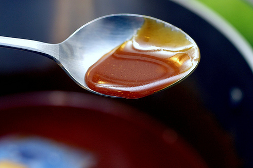

# Caramel Sauce

*Caramel sauce makes a delicious accompaniment to numerous desserts. It should be served very cold. It can also be churned in an ice cream maker to make caramel ice cream.*

**Serves:** Makes 700ml

**Prep Time:** 10 minutes

**Cook Time:** 15 minutes

## Overview
Caramel sauce is the building block for the classic dessert sauce that gets spooned cold over profiteroles, ice cream sundaes, poached pears and apple tarts, or churned into caramel ice cream: a wet caramel of sugar and water cooked to a deep amber, deglazed with double cream and optionally enriched with egg yolks for an almost custard-like silkiness. The wet caramel technique (sugar dissolved in water before heating) is gentler and more forgiving than dry caramel (sugar melted alone), which suits this sauce because you want the caramel to go deep amber without burning. Two technique points keep the sauce smooth. First, brush down the sides of the pan with a wet pastry brush as the syrup heats; sugar crystals that form on the sides can fall back into the syrup and seed a chain reaction that crystallises the whole batch into a grainy mess. Second, watch the colour like a hawk in the final minute. Pour water into a large saucepan and add the sugar, set over low heat till the sugar dissolves completely and the syrup begins to boil, washing down any crystals with a wet brush as you go. Continue cooking till the syrup turns a lovely deep amber colour and the surface just begins to smoke slightly; the moment you see that, kill the heat. Now whisk in the double cream in a steady stream while stirring constantly (the cold cream hisses violently when it hits the hot caramel and the mixture may splutter; protect your hand). Return the pan to high heat and bubble for 2 to 3 minutes whisking continuously, then off the heat. Optional: temper two beaten egg yolks by drizzling a little hot sauce in while whisking, then return to the pan but don't cook further. Strain through a conical sieve into a bowl, cool, stirring occasionally to prevent a skin. Serve very cold.

## Ingredients

### Caramel base
- 80 ml water
- 100 grams sugar

### Enrichment
- 500 ml double cream
- 2 egg yolks (lightly beaten, optional)

## Method

### Stage 1 - Melt sugar
1. Pour the water into a large saucepan and add the sugar.
1. Set over a low heat until the sugar has completely melted and is beginning to boil.
1. Wash down the inside of the pan with a pastry brush dipped in cold water to prevent any crystals from forming.

### Stage 2 - Cook to deep amber
1. Cook the sugar until it turns a lovely deep amber colour and the surface begins to smoke slightly.
1. Take off the heat immediately.

### Stage 3 - Add cream
1. Beat in the cream, stirring constantly with a whisk.
1. Set the pan back over a high heat and stir with the whisk.
1. Let the mixture bubble for 2 or 3 minutes, then remove from the heat.

### Stage 4 - Temper & finish
1. If using egg yolks: still stirring, pour a little of the sauce onto the egg yolks, then return the mixture to the pan but do not cook it.
1. Pass the sauce through a conical strainer into a bowl and keep it in a cool place.
1. Stir the sauce from time to time to prevent a skin from forming.
1. Serve when completely cold.

## Notes
- **Water prevents crystallization:** Essential for smooth caramel; sugar that crystallizes becomes grainy.
- **Deep amber color:** Indicates proper caramelization; pale caramel lacks depth and complexity.
- **Brush washing:** Removes sugar crystals that can cause entire batch to crystallize.
- **Egg yolks are optional:** Add richness but make sauce slightly less stable.

## Serving
- Serve cold with vanilla ice cream, profiteroles, or other desserts. Can be churned into ice cream by adding 75 ml water before churning.

## Storage
- Keeps refrigerated for 2 weeks in an airtight container.
- Can be gently reheated if it becomes too stiff.
- Does not freeze well; texture becomes grainy upon thawing.
