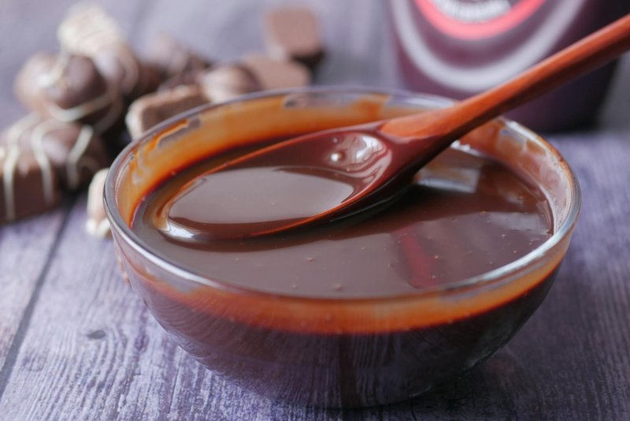

# Chocolate Sauce

*Often used as a topping for various desserts, this sauce can also be used as a base for rich desserts to sit on. Sometimes a pinch of salt, when added to the chocolate can enrich its flavour and enhance the senses.*

**Serves:** 6

**Prep Time:** 5 minutes

**Cook Time:** 10 minutes

## Overview
Chocolate sauce is the building block for the rich silky pour over profiteroles, vanilla ice cream sundaes, poached pears, choux buns, sticky toffee pudding and any chocolate-loving dessert: a base of melted 70% dark chocolate combined with hot milk-cream-sugar mixture, finished with butter swirled in at the end for gloss. The 70% dark chocolate is essential; milk chocolate produces a cloying sweet sauce with no character, while 60% or below lacks the bitter depth that lets the chocolate flavour cut through and dominate. A pinch of salt added with the chocolate enhances the flavour considerably (the way it does in chocolate ganache and brownies). Melt the chopped dark chocolate gently in a bain-marie over barely simmering water; never melt chocolate over direct heat or it seizes into a grainy paste. While the chocolate melts, combine the milk, double cream and sugar in a saucepan and bring to a gentle boil over high heat, stirring with a small whisk till the sugar dissolves completely. Pour the hot milk-cream-sugar mixture onto the melted chocolate in a thin steady stream while stirring constantly with the whisk; this gradual tempering brings the chocolate and the milk together smoothly without seizing. Tip the whole mixture back into the saucepan and let bubble for 15 seconds, no more. Off the heat, whisk in the diced cold butter a piece at a time till the sauce turns completely glossy, homogeneous and silky. Strain through a conical sieve to remove any tiny lumps. Serve immediately warm over the dessert of choice. Keeps five days refrigerated; reheat very gently over low heat or in a microwave with short bursts and frequent stirring (overheating breaks the emulsion).

## Ingredients

### Chocolate base
- 200 grams dark chocolate (70% cocoa)

### Liquid components
- 175 ml milk
- 2 tablespoons double cream
- 30 grams sugar

### Enrichment
- 30 grams butter

## Method

### Stage 1 - Melt chocolate
1. Melt the chocolate in a bain-marie over gentle heat.

### Stage 2 - Heat liquid components
1. Put the milk, cream and sugar in a saucepan and set over a high heat.
1. Stir gently with a whisk until the mixture boils.

### Stage 3 - Combine
1. Pour the hot milk mixture onto the melted chocolate, stirring constantly.
1. Tip the whole mixture into the saucepan and let it bubble for 15 seconds.

### Stage 4 - Finish
1. Take the pan off the heat and beat in the butter, a little at a time, until the sauce is completely homogeneous and glossy.
1. Pass through a conical strainer.
1. Serve immediately.

## Notes
- **Bain-marie:** Ensures gentle, even heating without scorching chocolate.
- **70% chocolate:** Essential for proper balance of bitterness and sweetness; milk chocolate creates cloying sauce.
- **Butter mounting:** Creates gloss and silky mouthfeel; do not omit.

## Serving
Serve warm over vanilla ice cream, profiteroles, pears, or other desserts. Can also be used as base for rich desserts to sit on.

## Storage
- Keeps refrigerated for 5 days in an airtight container.
- Reheat gently over low heat, stirring frequently.
- Can be frozen for up to 1 month; reheat gently to avoid breaking.
