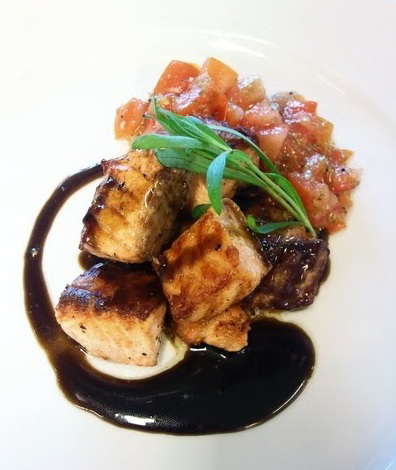

# Liquorice Sauce

*This sauce has an unusual but delicious flavour, which perfectly complements a pear tart or plum clafoutis. Although this is a sweet sauce, this works perfectly well with grilled salmon.*

**Serves:** 4

**Prep Time:** 5 minutes

**Cook Time:** 15 minutes

## Overview
Liquorice sauce is the building block for an unexpected and grown-up sweet sauce that turns up alongside pear tart or plum clafoutis, but works equally well as a savoury sauce next to grilled salmon (a Scandinavian flavour pairing). The structure is a crème-anglaise-style egg-yolk custard infused with liquorice extract, finished cool with a fold of whipped cream stirred through just before serving for body. The liquorice character is the whole reason to make this sauce; that distinctive sweet-bitter-aniseed flavour that liquorice extract brings is impossible to replicate with anise or fennel, and the sauce shines in dishes where a regular vanilla crème anglaise would feel too obvious. Use proper liquorice extract (the kind sold for cooking, often as a soft block or thick syrup); liquorice powder requires extra sieving to remove gritty bits and doesn't dissolve as cleanly. Put the milk in a saucepan with two-thirds of the caster sugar and the liquorice extract, and bring to the boil over medium heat, stirring so the extract dissolves into the milk. Meanwhile, whisk the egg yolks with the remaining sugar in a bowl till pale and ribboned. Pour the hot liquorice milk onto the yolks in a thin steady stream while whisking constantly to temper, then return the mixture to the saucepan. Cook over low heat stirring with a wooden spoon till the sauce thickens enough to lightly coat the back of the spoon and a finger drawn through it leaves a clear trace; don't let it boil or the yolks scramble. Strain through a fine-meshed conical sieve into a bowl set over crushed ice to cool fast and stop the cooking. Just before serving, whip the cream to soft peaks and fold gently into the cold sauce. Serve immediately; the cream deflates if it sits.

## Ingredients

### Base
- 250 ml milk
- 60 grams caster sugar
- 25 grams liquorice extract
- 3 egg yolks

### Finishing
- 50 ml whipping cream

## Method

### Stage 1 - Infuse liquorice
1. Put the milk in a saucepan with two-thirds of the sugar, add the liquorice and bring to the boil over a medium heat.

### Stage 2 - Temper egg yolks
1. Meanwhile, whisk the egg yolks and the remaining sugar together in a bowl until the mixture becomes pale and has a light ribbon consistency.
1. Pour the liquorice milk on to the egg yolk and sugar mixture, whisking constantly.
1. Pour the mixture back into the saucepan.

### Stage 3 - Cook custard
1. Cook over a low heat, stirring with a wooden spatula or spoon; do not let it boil or it will curdle.
1. The sauce is ready when it has thickened enough to lightly coat the back of the spatula.
1. When you run your finger through, it should leave a clear trace.
1. Immediately take the pan off the heat.

### Stage 4 - Cool & finish
1. Pour the sauce through a fine-meshed conical sieve into a bowl set over crushed ice and leave to cool.
1. Stir occasionally to prevent a skin from forming. (At this stage, the sauce can be kept covered in the fridge for up to 48 hours.)
1. Just before serving, whip the cream and fold into the sauce.

## Notes
- **Liquorice extract vs. powder:** Use true extract for smooth, lump-free sauce; powder requires sieving.
- **Crushed ice:** Speeds cooling and prevents overcooking; essential for proper texture.
- **Cream folding:** Add only immediately before serving; sauce becomes loose if mixed too far in advance.

## Serving
Serve chilled with pear tart, plum clafoutis, or poached pears. For surprising elegance, serve alongside grilled salmon as sauce.

## Storage
- Keeps refrigerated for 2 days without the whipped cream in an airtight container (up to 48 hours).
- Add cream only when ready to serve.
- Do not freeze; custard texture becomes granular upon thawing.
