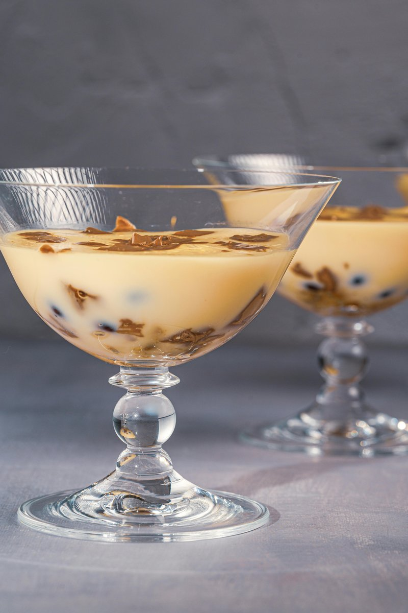

# Sabayon

*Serve the sabayon immediately, either in a glass as it is, or spoon it over a dessert such as a medley of red fruits, or fruit filled crêpes in a gratin dish and place under a hot grill until the sabayon is lightly grilled.*

**Serves:** 4

**Prep Time:** 15 minutes

**Cook Time:** 9 minutes

## Overview
Sabayon is the French version of Italian zabaglione and the building block for an entire family of warm dessert sauces and foams: egg yolks, sugar and sweet wine whisked over gentle heat in a bain-marie till the mixture quadruples in volume into a pale glossy fluffy mousse-light ribbon. Serve it warm in a glass on its own as a dessert in itself, spoon it over summer berries or fruit-filled crêpes and briefly grill or torch the top till lightly golden, or use as a sauce alongside warm puddings. The technique is everything; sabayon lives or dies by temperature control. The water in the bain-marie must stay below a rolling boil (a gentle steady simmer), and the sabayon itself must not climb above about 65 C; hotter and the egg yolks scramble into curds. A thermometer is the simplest way to learn it. Two-thirds fill a saucepan with warm water large enough to hold a heatproof round-bottomed bowl, set over low heat. Pour the Sauternes into the bowl, whisk in the egg yolks one at a time, then whisk in the caster sugar. Set the bowl over the bain-marie (the bottom of the bowl must not touch the water; you want the steam, not direct contact) and whisk continuously without pause. Over 8 to 10 minutes the mixture thickens dramatically and increases in volume. When the temperature reaches about 55 C and the sabayon falls in a light ribbon from the whisk that holds briefly on the surface before sinking, it's cooked. Pull off the heat and continue whisking another minute or two as it cools slightly; this final off-heat whisking builds the thick shiny mousse-like texture that defines a proper sabayon. Spoon into glasses or a sauceboat and serve immediately; the foam holds 15 to 20 minutes maximum before it starts to collapse.

## Ingredients
- 100 ml Sauternes (or other sweet white wine)
- 3 egg yolks
- 40 grams caster sugar

## Method
1. Two-thirds fill a saucepan (large enough to hold a heatproof round-bottomed bowl) with warm water, and heat gently. 
1. Pour the Sauternes into the bowl, then add the egg yolks, whisking as you go. 
1. Carry on whisking as you stir in the sugar.
1. Place the bowl over the saucepan, making sure that the bottom of the bowl is not in direct contact with the water. 
1. Continue whisking the mixture over the heat so that it gradually thickens, making sure that the temperature of the water in the pan increases steadily but moderately.
1. After 8 - 10 minutes, the mixture should have reached a light ribbon consistency. 
1. It is essential to keep whisking all the time. 
1. When the temperature reaches 70-75°C the sabayon is cooked (yolks pasteurise around 70°C; below that the sauce is technically raw).
1. Turn off the heat and continue whisking until the sabayon has a very thick ribbon consistency and a fluffy, rich and shiny texture. 
1. Remove the bowl from the pan.

### Marsala sabayon
For a richer sabayon, replace the Sauternes with Marsala, or Banyuls if you prefer. This is delicious spooned over summer berries and briefly gratinéed, either under the grill or using a cook's blowtorch.

### Eau-de-vie sabayon
Replace the Sauternes with 75 ml eau-de-vie, such as raspberry or pear, or Kirsch, and add 50 ml water and an extra 20 grams sugar.

## Notes
- Keep the water in the bain-marie at a gentle simmer rather than a rolling boil, too much heat will scramble the egg yolks before the mixture has time to thicken properly.
- Whisk constantly and without pause throughout the cooking; stopping even briefly can cause the eggs to curdle or the mixture to lose its emulsification.
- Use a thermometer to confirm the sabayon reaches 55°C, this is the point at which the yolks are safely cooked and the sauce will hold its fluffy ribbon consistency.
- Once the bowl is removed from the heat, keep whisking until the mixture cools slightly; this final stage builds the thick, shiny texture and prevents the sabayon from collapsing.

## Serving
Serve with: summer berries, fruit-filled crêpes, or a medley of red fruits
Temperature: warm, served immediately
Amount: approximately 3-4 tablespoons per person

## Storage
- Sabayon is best served immediately after making and does not keep well.
- If holding briefly, keep the bowl over warm (not hot) water and whisk occasionally for up to 15 minutes.
- Leftover sabayon can be refrigerated for up to 1 day; it will deflate but can be gently re-whisked over a bain-marie to partially restore its texture.
