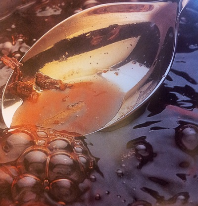

# Sweet Spiced Red Wine Sauce

*This sauce goes perfectly with peaches or pears, or to enhance the flavour of a moulded rice pudding. You can also churn the sauce to make an excellent sorbet, just stir in 75 ml water before churning.*

**Serves:** 8

**Prep Time:** 10 minutes

## Overview
Sweet spiced red wine sauce is the building block for a deeply aromatic mulled-wine-style dessert sauce that drapes over poached peaches, poached pears, moulded rice pudding and vanilla ice cream: red wine reduced by a third with caster sugar, crushed cinnamon stick, clove, split vanilla pods and orange zest and juice, then finished off the heat with a pinch of freshly grated nutmeg and fresh mint leaves. Add 75 ml of water and you can churn it directly into a sorbet, which makes the sauce a double-duty recipe. Use a good-quality Pinot Noir if you can; its lighter body and fruit-forward character reduces into a much more elegant sauce than a heavy tannic red would, where the tannins would concentrate into something astringent and bitter. The aromatic infusion happens in two stages. The cinnamon, clove, vanilla and orange go in at the start and cook with the wine, while the nutmeg and mint go in off the heat at the end. The reason for the split is heat sensitivity; the harder spices need the long cook to release their aromatics into the wine, while mint turns bitter and nutmeg loses its perfume if cooked for long. Pour the red wine into a saucepan with the sugar, crushed cinnamon, clove, vanilla pods, finely pared orange zest and the juice, slowly bring to the boil and let bubble gently till the liquid reduces by one-third. Watch the reduction; going further turns the sauce overly sweet and syrupy. Off the heat, add the nutmeg and torn mint leaves, leave to infuse for a few minutes, then pass through a fine-meshed conical sieve while still warm (cold the sauce thickens and won't strain as cleanly). Cool fully, refrigerate. Serve cold or at room temperature over fruit.

## Ingredients
- 500 ml red wine (preferable Pinot Noir)
- 200 grams caster sugar
- 1 cinnamon stick (crushed)
- 1 clove
- 2 vanilla pods (split length-ways)
- finely pared zest and juice of 1 orange
- small pinch of freshly grated nutmeg
- 1 tablespoon mint leaves

## Method
1. Pour the red wine into a saucepan and add the sugar, spices, vanilla, orange zest and juices. 
1. Slowly bring to the boil and let bubble gently until the liquid has reduced by one-third.
1. Off the heat, add the nutmeg and mint and allow to infuse for a few minutes, then pass the sauce through a fine-meshed conical sieve into a bowl. 
1. Leave to cool completely, then refrigerate until ready to use.

## Notes
- Use a good-quality Pinot Noir if possible, its lighter body and fruit-forward character reduces into a more elegant sauce than heavier tannic reds.
- Watch the reduction carefully: one-third reduction is the target, but going too far will make the sauce overly sweet and syrupy.
- Add the nutmeg and mint off the heat only, as prolonged cooking will turn the mint bitter and dull the fragrance of the nutmeg.
- Pass the sauce through a fine-meshed sieve while it is still warm for the smoothest result; the liquid thickens as it cools and becomes harder to strain.

## Serving
- **Serve with:** poached peaches or pears, moulded rice pudding, or vanilla ice cream
- **Temperature:** cold or at room temperature
- **Amount:** approximately 3-4 tablespoons per person

## Storage
- Store in an airtight container in the refrigerator for up to 5 days.
- The sauce can be frozen for up to 1 month; defrost overnight in the refrigerator before using.
- Stir well before serving as the sauce may settle during storage.
