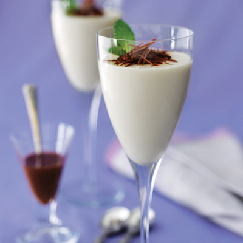

# White Chocolate Sauce with Mint

*Mint adds a touch of freshness to this sauce, which is sublime when poured over dark chocolate ice cream*

**Serves:** 6

**Prep Time:** 15 minutes

## Overview
White chocolate sauce with mint is the building block for a luxurious pour over dark chocolate ice cream, poached pears or steamed puddings: melted best-quality white chocolate combined with milk and double cream infused with fresh mint leaves and caraway seeds, briefly boiled at the end for a glossy finish. The contrast of warm sweet white chocolate against cold dark ice cream is the dessert this sauce is engineered for, and the mint-caraway infusion is what saves the sauce from cloying sweetness; without the herbal lift, melted white chocolate and cream alone would be too sweet to eat in any quantity. Two technique points keep the sauce smooth. First, white chocolate is far more heat-sensitive than dark chocolate; it scorches and seizes the moment it overheats, so melt it gently in a bain-marie over barely simmering water with the bowl held clear of the water itself (just steam should touch the bottom of the bowl). Stir occasionally with a wooden spoon till smooth. Second, the mint and caraway go into the cream off the heat. Bring the milk and double cream to the boil in a saucepan, then the moment it bubbles, toss in the mint leaves and caraway seeds, kill the heat and cover the pan; off-heat infusion for 10 minutes extracts the delicate aromatics without cooking them off or letting the mint turn bitter from prolonged heat. Strain the infused cream through a fine-meshed sieve onto the melted chocolate while still warm, whisking constantly to amalgamate fully into a single smooth glossy sauce. Tip into a clean saucepan, set over medium heat and let it bubble for just a few seconds while whisking continuously; this final flash boil tightens the texture and gives the sauce its glossy pourable finish. Serve immediately or hold briefly in a bain-marie.

## Ingredients
- 250 grams best-quality white chocolate
- 100 ml milk
- 250 ml double cream
- 7 grams fresh mint leaves
- ¾ teaspoon caraway seeds

## Method
1. Chop the white chocolate and place it in a heatproof bowl. 
1. Set over a pan of barely simmering water (making sure the bottom of the bowl is not in contact with the water) and melt it gently over a low heat, stirring with a wooden spoon occasionally until smooth.
1. Meanwhile, bring the milk and cream to the boil in a saucepan. 
1. When it begins to bubble, toss in the mint leaves and caraway seeds, turn off the heat and cover the saucepan. 
1. Leave to infuse for 10 minutes.
1. As soon as the chocolate has melted, remove the bowl from the heat. 
1. Pass the infused cream mixture through a fine-meshed sieve onto the melted chocolate, mixing with a whisk until it has fully amalgamated.
1. Transfer the chocolate sauce to a clean saucepan set over a medium heat and let bubble for a few seconds, whisking continuously.
1. Serve the sauce immediately, you can keep it warm in a bain-marie for a short while if necessary.

## Notes
- Melt the white chocolate over very low heat and never let the bowl touch the water, white chocolate scorches easily and will seize if it overheats.
- Steep the mint and caraway in the hot cream off the heat with the lid on to maximise the infusion without cooking off the delicate aromatics.
- Whisk the strained cream into the melted chocolate gradually and steadily to ensure the sauce emulsifies fully without splitting.
- The brief final boil in the saucepan is important for texture; it tightens the sauce slightly and gives it a glossy, pourable consistency.

## Serving
- **Serve with:** dark chocolate ice cream, poached pears, or plain steamed puddings
- **Temperature:** warm, served immediately or kept in a bain-marie
- **Amount:** approximately 3-4 tablespoons per person

## Storage
- Store any leftover sauce in an airtight container in the refrigerator for up to 3 days.
- Reheat gently in a bain-marie over low heat, stirring frequently, do not microwave or boil, as this can cause the chocolate to split.
- The sauce will thicken considerably when cold; add a splash of warm cream and whisk to loosen it when reheating.
