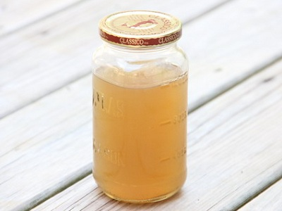

# Balti Chicken Stock

*This vibrant and spiced Indian-style stock is made from the carcass of a dressed roasting chicken, transforming the remains into a rich, flavorful base perfect for Balti curries and spiced Indian preparations.*

**Prep Time:** 25 minutes

**Cook Time:** 60 minutes

**Yield:** Approximately 900 millilitres

## Overview

Balti chicken stock is the building block that turns a finished roast chicken's carcass into the base for your next Balti curry: amber, aromatic, already singing with Balti masala, garlic and bay so the curry on top has somewhere to land. Unlike a classical French stock that lives or dies on the slow bare simmer of clean bones in cold water, this one is openly assertive, the spice paste cooks in with the bones and the whole thing is done in an hour. Strip the meat from a 1.8 kg bird for other use, pull the skin off the carcass entirely (any skin left on makes the stock greasy and dull), then smash the bones lightly so they fit the pot. Cover with a litre of cold water, add quartered unpeeled garlic, sliced onion, chopped celery and carrot, four bay leaves, a tablespoon each of Balti masala paste, sugar and salt, then bring to a boil and immediately drop to the gentlest simmer. Skim heavily every 5 to 10 minutes for the first 30 minutes (this is where the cloud comes from), then once or twice over the next 30 minutes; never stir, just skim, or you'll fold the impurities back in. Top up with water if it reduces past about 25 percent. After an hour, lift the carcass and vegetables out with a slotted spoon, then strain the liquid through muslin in a chinois (let it drain by gravity, don't press), cool and skim any solid fat, then portion into 200 ml pots for the freezer; that's exactly enough for one curry. Keeps three months frozen.

## Ingredients

### Protein Base & Vegetable Aromatics
- 1 oven-ready chicken (approximately 1.8 kilograms dressed weight)
- 1 litre cold water (total)

### Aromatics & Vegetables (After Butchering the Chicken)
- 6 garlic cloves (quartered, approximately 30 grams)
- 100 grams onion (coarsely sliced, approximately ½ medium onion)
- 2 celery sticks (chopped into 3-4 centimeter pieces)
- 1 carrot (large, approximately 200 grams, chopped into chunks)
- 4 bay leaves (whole, dried preferred)

### Spice & Seasonings
- 1 tablespoon [Balti Masala Paste](../base-ingredients/curry-paste/balti-masala-paste.md) (approximately 20 grams, genuine paste, not powdered spice blend)
- 1 tablespoon granulated sugar (approximately 12 grams)
- 1 teaspoon fine sea salt (approximately 6 grams)

## Method

### Stage 1 - Butcher the Chicken Carcass
1. Take 1 oven-ready chicken (approximately 1.8 kilograms dressed weight, raw or cooked).
1. Using a sharp knife, cut away the skin from the carcass and discard entirely (skin creates greasy, unappetizing stock, removal is non-negotiable).
1. Using a cleaver or heavy knife, remove the two legs and two thighs at their joints, separating them from the carcass.
1. Set the removed legs, thighs, and breasts aside (these are reserved for other preparations, cooking, freezing, or disposal according to preference).
1. The remaining carcass (ribcage, spine, breastbone framework, and any clinging connective tissue) is the stock base.

### Stage 2 - Prepare Vegetables & Spices
1. Quarter 6 garlic cloves (leave unpeeled, with skin intact for deeper flavor).
1. Coarsely slice 100 grams onion.
1. Chop 2 celery sticks into 3-4 centimeter pieces.
1. Chop 1 large carrot into uneven chunks (approximately 3-4 centimeter pieces; uniform size is not critical for stock).
1. Have ready 4 bay leaves, 1 tablespoon Balti masala paste, 1 tablespoon sugar, and 1 teaspoon salt.

### Stage 3 - Combine & Initial Cooking
1. Place the chicken carcass (skin removed) into a large pot.
1. Add all prepared vegetables: quartered garlic, sliced onion, chopped celery, chopped carrot.
1. Add 4 bay leaves.
1. Add 1 tablespoon Balti masala paste.
1. Add 1 tablespoon sugar.
1. Add 1 teaspoon salt.
1. Add 1 litre cold water (enough to cover the carcass and vegetables).
1. Place the pot over high heat and bring to a boil (approximately 5-10 minutes).
1. As soon as the liquid reaches a rolling boil, immediately reduce the heat to very low.

### Stage 4 - First 30-Minute Simmer & Skimming
1. Maintain a very slow rolling simmer for exactly 30 minutes (surface should bubble gently but not vigorously).
1. Do not cover the pot.
1. Using a large, flat spoon or skimmer, skim the surface repeatedly throughout these 30 minutes.
1. Remove all foam, impurities, and fat that rise to the surface.
1. Skim every 5-10 minutes during this initial 30-minute period (more frequently than meat stocks).
1. Do NOT stir the stock, stirring incorporates impurities. Only skim the surface.
1. Check water level, if more than ¼ of the liquid has evaporated, add more water (the Balti spice  can become overly concentrated if liquid reduces too much).

### Stage 5 - Second 30-Minute Simmer & Final Skimming
1. After the first 30 minutes, continue simmering for another 30 minutes.
1. Reduce the heat slightly if the simmer becomes too vigorous (aim for a gentle, rolling simmer, not a hard boil).
1. Continue to skim the surface as necessary (less frequently than the first 30 minutes, but still 3-4 times).
1. Total cooking time should be 60 minutes exactly.
1. By the end of cooking, the liquid will have reduced to approximately 900 millilitres.
1. The carcass will have released its marrow and gelatin, and the vegetables will be soft and translucent.

### Stage 6 - Remove Solids
1. Allow the stock to cool very slightly (approximately 2-3 minutes) until safe to handle.
1. Using a slotted spoon, carefully remove the carcass framework from the stock, lifting it out like a piece of corrugated cardboard.
1. Place on a plate and allow to cool; later inspect for any usable meat (discard, or reserve for reuse).
1. Continue removing vegetables and bay  leaves with the slotted spoon until the pot contains only clear liquid.
1. Be gentle during this removal process; do not crush vegetables into the liquid.

### Stage 7 - Final Straining
1. Place a damp muslin-lined chinois (cone-shaped fine-meshed sieve) or fine-meshed conical sieve over a clean pot or large bowl.
1. Carefully pour or ladle the stock through the muslin-lined sieve.
1. Allow the liquid to drain naturally by gravity; do not force or press on any remaining solids.
1. The muslin catches any final impurities, resulting in crystal-clear stock.
1. Discard all solids and muslin.

### Stage 8 - Cool
1. Allow the strained stock to cool to room temperature (approximately 1-1 ½ hours).
1. Once cooled, use a shallow spoon to skim any fat that has solidified on the surface.
1. Discard the fat layer (or reserve for cooking if desired).

### Stage 9 - Portion & Freeze
1. Pour the cooled, clarified stock into individual 200-millilitre yoghurt pots (or similar small containers).
1. The 200-millilitre portion size is ideal for single Balti curry preparations.
1. Cover tightly and place in the freezer.
1. Stock will keep frozen for up to 3 months.
1. Thaw in the refrigerator overnight when needed.

## Notes
- **Skin Removal Critical:** Skin must be completely removed from the carcass. Leaving skin creates greasy, unappetizing stock with off-putting mouthfeel.
- **Balti Masala Paste Essential:** Genuine Balti masala paste (a prepared mixture) is essential; do not substitute with powdered spice blends or garam masala. The paste provides the correct Balti character.
- **Split Cooking Methodology:** The two 30-minute stages allow for control over cooking intensity and flavor development. Total 60 minutes is critical.
- **Skimming Not Optional:** Initial and secondary skimming removes impurities and ensures clarity. More frequent skimming than meat stocks is necessary due to higher impurity content in raw chicken.
- **No Stirring Rule:** Stirring incorporates impurities. Only gentle surface skimming is allowed.
- **Water Check:** Monitor water level; if reduction exceeds 25% during first 30 minutes, add more water to prevent spice over-concentration.
- **200ml Portion Size:** Freezing in 200-millilitre portions makes this stock maximally practical for single Balti curry preparations.
- **Yield Expectation:** Approximately 900 millilitres from 1 litre initial water, yielding 4-5 portions of 200 millilitres each.
- **Stock Clarity:** Clear, amber, Balti-spice-aromatic stock indicates proper technique. Cloudiness suggests insufficient skimming or stirring during cooking.

## Variations
- **With Extra Garlic:** Use 8-10 garlic cloves instead of 6 for robust garlic character.
- **Spicier Version:** Add ½ teaspoon chilli powder (or 1 dried red chilli) to the pot during cooking.
- **With Ginger:** Add 2-3 slices fresh ginger (or ½ teaspoon ground ginger) for warming spice complexity.
- **Extra Aromatics:** Add 1-2 star anise for subtle licorice undertone.
- **Sweeter Version:** Increase sugar to 1 ½-2 tablespoons for deeper sweetness in the spice blend.

## Serving
- **Primary Use:** Base for Balti curries, spiced gravies, Indian-style preparations
- **Application:** 200-millilitre portions provide base for single-serving Balti curry preparations
- **Temperature:** Thaw in refrigerator overnight, then reheat gently to steaming (90°C) before use
- **Spice Character:** Distinctly aromatic with Balti masala spice complexity, perfect for dishes expecting these flavors
- **Pairing:** Balti curries, spiced meat preparations, Indian-influenced cooking

## Storage
- **Refrigeration:** 3 days in covered container at 4°C (shorter shelf-life than classical stocks due to spice paste content)
- **Freezing:** Up to 3 months in frozen state
- **Portion Control:** 200-millilitre yoghurt pot freezing is recommended for convenient single-portion usage
- **Thawing:** Thaw in refrigerator overnight (approximately 8-12 hours) before use
- **Reheating:** Reheat gently to steaming (90°C); do not boil (boiling can dull spice character)
- **Visual Indicator:** Clear, amber-spiced-stock color indicates proper preparation
- **Separation on Thaw:** If separation occurs on thawing, whisk gently to recombine before using
