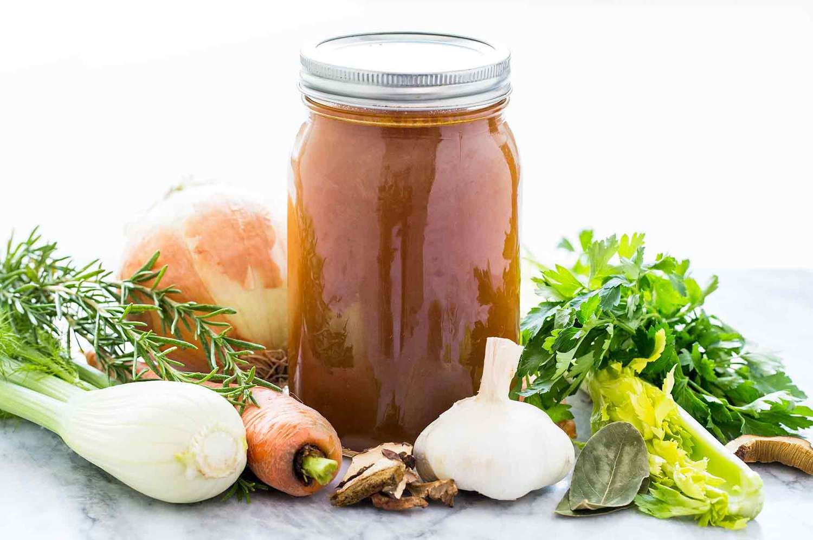

# Vegetable Stock

*Clean and versatile, vegetable stock provides a foundation for vegetarian preparations, light sauces, and elegant vegetable dishes, delivering subtle flavor without overpowering delicate ingredients.*

**Prep Time:** 20 minutes

**Cook Time:** 45 minutes

**Yield:** Approximately 1 ½ litres

## Overview

Vegetable stock (fond de légumes) is the building block for vegetarian cooking, risottos, light sauces and any delicate dish where a meat stock would be too loud, a pale golden broth with sweetness from carrot and onion, a soft anise lift from fennel, and a faintly herbal background from leek and bouquet garni. Two rules keep it on the right side. First, never boil it: a rolling boil churns the vegetable starches into a permanent cloud and turns the flavour bitter, so the moment it hits the boil drop straight to a bare simmer where the surface barely trembles. Second, watch the clock. Unlike meat stocks, where longer almost always means deeper, vegetable stock peaks at 45 minutes and goes downhill from there as the vegetables overcook into bitterness. Slice carrots, leek whites, celery, fennel, shallots and onion into uniform half-centimetre pieces so they cook evenly, crush two garlic cloves with their skins on, drop everything into a wide pot with a bouquet garni, then add 250 ml of dry white wine (the acidity is what keeps it from tasting flat) and two litres of cold water. Bring to a boil, drop straight to that bare simmer, skim any foam off in the first few minutes for clarity, then leave it alone, no stirring, just an occasional skim. At the 35-minute mark drop in the muslin-wrapped peppercorns so they perfume without making the stock harsh. At 45 minutes ladle through a fine sieve into a bowl, plunge into an ice bath to halt the cooking, then decant. It won't gel like a meat stock and the colour stays pale gold, both correct.

## Ingredients

### Primary Aromatics & Vegetables
- 300 grams carrots (cut into thin rounds, approximately ½ centimeter thick)
- 2 leeks (white parts only, rinsed thoroughly, halved lengthwise and sliced to approximately 1 centimeter)
- 100 grams celery stalks (thinly sliced, approximately ½ centimeter)
- 50 grams fennel bulb (very thinly sliced, approximately 0.3 centimeter)
- 150 grams shallots (thinly sliced, approximately ½ centimeter)
- 100 grams onion (thinly sliced, approximately ½ centimeter)
- 2 cloves garlic (unpeeled, lightly crushed)

### Aromatics & Liquid
- 1 [Bouquet Garni](../base-ingredients/herbs/bouquet-garni.md)
- 250 millilitres dry white wine
- 2 litres cold water

### Seasoning
- 10 white peppercorns (crushed and tied in muslin)

## Method

### Stage 1 - Prepare Vegetables
1. Prepare all vegetables: wash carrots and celery, peel onions and shallots, wash leeks thoroughly, trim fennel.
1. All vegetables should be sliced uniformly to approximately ½-1 centimeter thickness.
1. Leave garlic cloves unpeeled; crush slightly.
1. Place all prepared vegetables, garlic, and bouquet garni in a large saucepan.

### Stage 2 - Add Liquid & White Wine
1. Add 2 litres cold water to the saucepan.
1. Add 250 millilitres dry white wine.
1. Place over high heat and bring to a rolling boil (approximately 10-15 minutes).

### Stage 3 - Initial Skimming
1. As soon as the liquid reaches a full boil, immediately lower the heat to very low.
1. The surface should show a bare simmer.
1. Using a large, flat spoon, skim any foam or impurities.
1. This initial skimming prevents cloudiness.

### Stage 4 - Simmer & Monitor
1. Maintain a bare simmer (surface barely trembling).
1. Simmer gently, uncovered, for exactly 45 minutes.
1. Do not stir the stock.
1. Skim occasionally if necessary (every 10-15 minutes).

### Stage 5 - Add Peppercorns
1. After 35 minutes of simmering, add the muslin-wrapped 10 white peppercorns.
1. Stir gently to distribute.
1. Continue simmering until exactly 45 minutes total cooking time.

### Stage 6 - Strain
1. Place a fine-meshed sieve over a clean bowl.
1. Carefully ladle the stock through the strainer.
1. Allow the liquid to drain naturally by gravity.
1. Discard all vegetable solids.

### Stage 7 - Cool Over Ice
1. Allow strained stock to cool to room temperature (approximately 15-20 minutes).
1. Prepare a large bowl of ice water.
1. Place the bowl with warm stock into the ice bath.
1. Cool completely (approximately 20 minutes).

### Stage 8 - Final Storage Preparation
1. The cooled stock should be clear and pale golden.
1. Unlike meat stocks, vegetable stock will not gel when cold (no gelatin from vegetables).
1. Decant into storage containers.

## Notes
- **Vegetable Selection Balanced:** Equal emphasis on root vegetables, leaf bases, and aromatics.
- **Fennel Sweetness:** Provides subtle anise character and natural sweetness. Do not omit.
- **Cooking Duration Critical:** 45 minutes is exact. Longer cooking produces bitter flavors.
- **Never Boil:** Rolling boil causes impurities to incorporate, creating cloudiness.
- **Leek Washing Essential:** Sand hides between leek layers; wash thoroughly.
- **White Wine Acidity:** Provides balance and prevents herbaceous/bland flavors.
- **Stock Clarity:** Clear, pale golden stock indicates proper technique.

## Variations
- **With Fresh Herbs:** Add 2-3 sprigs fresh tarragon or thyme.
- **Asian Variation:** Add 2-3 slices fresh ginger and 2 star anise.
- **Richer Variation:** Double the shallot and onion quantities.
- **Mushroom Addition:** Add 100 grams sliced mushrooms for umami depth.

## Serving
- **Primary Use:** Base for vegetarian sauces
- **Secondary Use:** Braising liquid for vegetables, soup base
- **Temperature:** Reheat gently to steaming (90°C); do not boil
- **Pairing:** Delicate vegetables, vegetarian preparations, elegant soups

## Storage
- **Refrigeration:** 4-5 days in covered container
- **Freezing:** Up to 3 months
- **No Fat Layer:** Vegetable stock will not develop a solidified fat layer
- **No Gelatin:** Stock will not gel when cold. This is normal.
- **Reheating:** Thaw in refrigerator, then reheat gently
