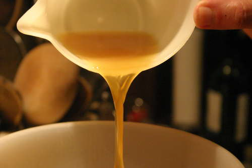

# White Chicken Stock

*The workhorse of modern kitchens, white chicken stock is clean and delicate, forming the base for light sauces, cream-based preparations, and refined vegetable dishes.*

**Prep Time:** 20 minutes

**Cook Time:** 1 ½ hours

**Yield:** Approximately 1 ½ litres

## Overview

White chicken stock (fond blanc de volaille) is the building block for classical light sauces, the velouté and the suprême and everything that flows from them, and the everyday workhorse of any French-leaning kitchen. The defining move is the blanch: you cover 1.5 kg of chicken wings (wings give the right ratio of meat to bone to skin to gelatin, better than carcass alone) in cold water, bring to a rolling boil, then drain immediately and rinse the wings and the pot clean of every scrap of grey foam. That blanching step strips the surface impurities before they get a chance to dissolve into the stock, and it's why the finished broth comes out pale ivory and crystal clear instead of cloudy. Return the rinsed wings to the clean pot, cover with 2.5 litres of cold water, bring to a boil, then drop straight to a bare simmer where the surface barely trembles. Skim hard for the first five minutes (eight to ten passes), then add the aromatics in one go: carrot chunks, leek whites, celery, an onion studded with two whole cloves (more cloves and the spice takes over), sliced button mushrooms for a quiet umami back note, and a bouquet garni. Don't stir from this point. Hold the simmer for 90 minutes total, skimming gently every 20 to 30 minutes, and you'll lose about a third of the liquid to evaporation. Ladle through fine mesh into a clean bowl (no pressing the solids), drop into an ice bath to cool, and lift the solidified fat layer once it sets. The stock will gel slightly cold; that's the gelatin from the wings, the signature of body that gives a sauce its silky finish.

## Ingredients

### Protein Base
- 1 ½ kilograms chicken wings (blanched, see Method)

### Aromatics & Vegetables
- 200 grams carrots (cut into chunks, approximately 3-4 centimeters)
- 2 leeks (white parts only, rinsed and cut into 5-centimeter pieces)
- 1 stalk celery (approximately 10 centimeters, coarsely chopped)
- 1 onion (medium, studded with 2 whole cloves)
- 150 grams button mushrooms (thinly sliced)
- 1 [Bouquet Garni](../base-ingredients/herbs/bouquet-garni.md) (thyme, bay leaf, parsley stems)

### Liquid Base
- 2 ½ litres cold water

## Method

### Stage 1 - Blanch Chicken Wings
1. Place 1 ½ kilograms chicken wings into a large pot.
1. Cover completely with cold water (approximately 2 ½ litres).
1. Place over high heat and bring just to a rolling boil.
1. As soon as the water reaches a full boil, immediately drain the chicken wings.
1. Rinse thoroughly under cold running water, removing all foam and impurities.
1. Rinse the pot thoroughly.
1. Return blanched, rinsed wings to the clean pot.

### Stage 2 - Initial Water & Boil
1. Add 2 ½ litres cold water to the pot with blanched wings.
1. Place over high heat and bring to a full rolling boil (approximately 10-15 minutes).

### Stage 3 - Initial Skimming (Critical)
1. As soon as the liquid reaches a rolling boil, immediately reduce the heat to low.
1. The surface should maintain a bare simmer.
1. Using a large, flat spoon, remove all foam and impurities that rise to the surface.
1. Skim thoroughly (8-10 passes) until the surface is relatively clear.
1. Allow exactly 5 minutes of gentle simmering before proceeding.

### Stage 4 - Add Aromatics
1. Add all vegetables and bouquet garni: carrots, leeks, celery, onion studded with cloves, mushrooms, and bouquet garni.
1. Stir gently to distribute.
1. Reduce heat to maintain bare simmer.
1. Do not stir again.

### Stage 5 - Gentle Simmer
1. Simmer gently, uncovered, for 1 ½ hours (90 minutes).
1. Skim the surface whenever necessary (every 20-30 minutes), being gentle.
1. Do not cover the pot.
1. Approximately ⅓ of the liquid will reduce.

### Stage 6 - Strain
1. Place a fine-meshed sieve over a clean bowl.
1. Carefully ladle the stock through the strainer.
1. Let the liquid flow through without forcing or squeezing vegetables.
1. Discard all solids.

### Stage 7 - Cool Over Ice
1. Allow strained stock to cool slightly to room temperature (approximately 5 minutes).
1. Prepare a large bowl of ice water.
1. Place the stock into the ice-water bath.
1. Cool completely (approximately 30 minutes).

### Stage 8 - Remove Fat & Storage
1. Once cooled, a thin layer of fat will have solidified on the surface.
1. Skim off and discard this fat.
1. The stock should be clear, pale ivory.
1. Decant into storage containers.

## Notes
- **Blanching Step Essential:** Removes initial impurities and creates clearer stock.
- **Clove-Studded Onion:** Infuses subtle spice; do not increase quantity.
- **Gentle Simmer Only:** Rolling boil incorporates impurities.
- **Mushroom Inclusion:** Adds subtle umami without overwhelming delicate flavor.
- **Initial Skimming Critical:** Essential for clarity.

## Variations
- **Richer Stock:** Use 1 whole chicken (1.8 kilograms) for deeper flavor (increase cooking to 2 hours).
- **Herb-Forward:** Add 1-2 additional sprigs fresh thyme.
- **With Ginger:** Add 2-3 slices fresh ginger for subtle character.
- **Lighter Stock:** Reduce cooking time to 1 hour.
- **Asian Variation:** Add 2 star anise for subtle character.

## Serving
- **Primary Use:** Base for light cream sauces
- **Secondary Use:** Braising liquid for chicken and delicate fish
- **Temperature:** Reheat gently to steaming (90°C); do not boil
- **Pairing:** Light meats, cream-based vegetables, elegant soups

## Storage
- **Refrigeration:** 3-4 days in covered container
- **Freezing:** Up to 3 months
- **Gelatin Behavior:** Stock will gel when cold; will liquify when reheated
- **Fat Layer:** Thin layer is protective
- **Reheating:** Thaw in refrigerator, then reheat gently
