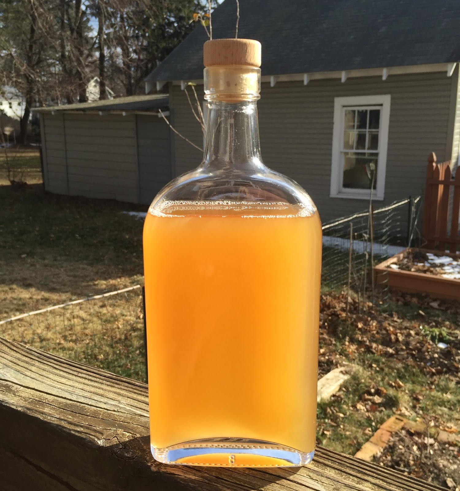

# Applejack

*The American apple brandy. Two paths: freeze-concentrate hard cider in winter ("jacking"), or distil cider in a pot still and age in oak. The pre-Prohibition folk drink and the modern licensed version, side by side.*

**Read first:** [Safety](safety.md) (especially the methanol section - fruit washes are higher-risk)

## Overview

Applejack is the apple-orchard counterpart to whisky. Made from fermented apple cider, it appears across the American colonial record from the 1600s onward, particularly in the orchard-dense Northeast (New Jersey's Laird's distillery, founded 1698, is the oldest continuous spirit producer in the United States). Two distinct techniques:

1. **Freeze concentration ("jacking")** - leave hard cider outdoors in winter, scoop the ice off the top, repeat until what remains is concentrated alcohol-and-apple essence. No still needed.
2. **Pot-still distillation** - distil fermented hard cider into apple brandy, age in oak. The licensed-distiller approach.

Both produce something legitimately called applejack. The freeze-concentration version is harsher and stronger-tasting (concentrating not just alcohol but also higher alcohols, esters and methanol - see safety below). The distilled version is cleaner.

A note on the law: freeze concentration sits in a legal gray area. The technique itself isn't distillation, but TTB regulations on "fortified" or "concentrated" alcoholic beverages may apply. With a federal DSP, you're cleared either way; without one, distillation is illegal and freeze concentration is gray.

**Methanol warning specifically for applejack:**

Fruit washes (cider, especially) produce 5-10x more methanol than grain washes due to the high pectin content of apples. The cuts must be MORE aggressive than for grain whisky:

- **For pot-still applejack:** discard 100 ml per gallon of wash as foreshots (double the grain rule). For a 5-gallon cider wash, throw away the first 500 ml.
- **For freeze concentration:** the technique concentrates methanol along with ethanol. The folk method has historically caused "apple palsy" - a methanol-poisoning syndrome among hard-drinking 18th-century farmers. To reduce risk: freeze-concentrate only to 25% ABV maximum; do not concentrate to higher proofs without a distillation step to separate methanol.

## Path A: Distilled applejack (the licensed-distiller route)

This is the modern, clean approach. Treat it as a fruit-brandy distillation.

### Hard cider wash (5 gallons)

Start with hard cider - either bought (5 gallons of a still, dry, unfiltered hard cider; Strongbow, Angry Orchard's unflavoured line, or a local cidery's straight cider) or made from fresh apple juice fermented with cider yeast.

If making from scratch:
1. 5 gallons fresh-pressed apple juice (a mix of sweet, sharp and bittersharp apples gives the best result - see notes)
2. 25 g cider yeast (Lalvin 71B or White Labs WLP775)
3. 2 g yeast nutrient
4. Ferment 2-4 weeks at 18-20 °C (lower than whisky; ciders ferment cooler)
5. Wash ABV: 6-8%

### Distillation

The cider distillation is otherwise identical to [whisky](whisky.md), with two important differences:

1. **More aggressive foreshots cut.** 100 ml per gallon of wash. For a 5-gallon batch: discard the first 500 ml.
2. **The hearts come off at lower ABV.** Apple brandy hearts are typically 60-70% ABV (vs 70-85% for grain whisky). The lower starting wash ABV gives lower distillate proofs.

Distil exactly once. Some traditions double-distil for cleaner brandy; the American applejack tradition is single-distillation, which retains more apple character.

### Cuts in detail (because methanol)

| Cut | Amount per 5-gallon wash | Action |
|---|---|---|
| Foreshots | 500 ml | DISCARD without exception |
| Heads | 250-500 ml | Discard or save for redistilling |
| Hearts | 1-1.5 litres | KEEP - your applejack |
| Tails | When parrot reads below 50% ABV | Discard or save |

The smell test is even more important for apple brandy than grain whisky. Foreshots and heads of a cider distillation smell distinctly of solvent and acetone. Hearts smell of apple, soft and sweetly fragrant.

### Cut and age

1. Cut to barrel strength (typically 50-60% ABV for brandy; lower than bourbon's 62.5% maximum).
2. Age in a charred American oak barrel - same kind as bourbon. 6-12 months in a 5-gallon barrel.
3. Or skip the barrel and bottle clear ("white applejack" or "apple eau-de-vie"); this is also a legitimate style.

### Bottle

Cut to 40-50% ABV. Bottle. Apple brandy improves slowly in glass; a year on the shelf softens it further.

## Path B: Freeze-concentrated applejack (the folk method, with caveats)

The 18th-century New Jersey method. Cheaper, no still, but produces a less clean spirit.

### How freeze concentration works

Water freezes at 0 °C. Ethanol freezes at -114 °C. When hard cider is cooled below 0 °C, the water freezes out as ice while the alcohol remains liquid. Scoop out the ice and the remaining liquid is more concentrated alcohol.

The technique works in a winter freeze (the original colonial method, with a barrel of cider in the barn) or in a household freezer (modern, easier, more reliable).

### Method

1. **Start with 5 gallons of hard cider** at ~7% ABV.
2. **Place in a wide, shallow open container** - a clean food-grade plastic tub. Or in the original barrel.
3. **Freeze at -5 to -10 °C** (a household chest freezer works; a winter night below freezing works).
4. **Wait 24-48 hours.** Ice will form on the surface - a thick crust of clear ice. The liquid beneath is now slightly more alcoholic.
5. **Scoop or strain the ice out.** Discard the ice.
6. **Repeat 3-5 cycles** until the remaining liquid is at 20-25% ABV. Each cycle removes roughly 20-30% of the water by volume.

### What the result tastes like

Freeze-concentrated applejack at 20-25% ABV is intensely apple-flavoured, slightly tart, full-bodied. The apple character is more present than in a distilled apple brandy because no flavour compounds are vapourised away - only water is removed. It tastes like a triple-strength cider.

**It also concentrates methanol and other off-compounds** at the same rate as ethanol. This is the methanol-poisoning risk of the technique. To reduce risk:

- **Stop at 25% ABV maximum.** Concentrating further pushes methanol concentration up disproportionately.
- **Use cider from low-methanol apples** if possible - sweeter, fully-ripe culinary apples produce less methanol than bittersharp cider apples. (Counter to the better-cider rule; the trade-off matters here.)
- **Do not heat-distil from a freeze-concentrated wash** - you would be vapourising an already-concentrated methanol pool. If you want distilled applejack, distil from a regular hard cider wash, not a freeze-concentrated one.

### A historical aside

"Apple palsy" or "applejack palsy" was a recognised 18th-and-19th-century syndrome - chronic methanol exposure from heavy applejack drinking, manifesting as tremors, vision loss and eventually blindness. The disappearance of the syndrome paralleled the move from freeze concentration to proper distillation. The technique is part of the American canon; the toxicology is also part of the American canon.

## Notes

- **Apple varieties matter.** A good cider apple blend follows the British classification:
  - **Sweet apples** (Sweet Coppin, Yarlington Mill, Northern Spy): provide sugar
  - **Sharp apples** (Bramley, Granny Smith): provide acidity
  - **Bittersweet apples** (Dabinett, Kingston Black): provide tannin
  - **Bittersharp apples** (Foxwhelp, Stoke Red): provide both tannin and acidity
  
  A blended cider with roughly 60% sweet, 30% sharp, 10% bitter gives the most balanced applejack. A single-variety cider works but is less complex.
  
- **The Laird's family** has been making applejack continuously since 1698 (with a pause during Prohibition). Their commercial product is a blend of apple brandy and neutral grain spirit, by federal definition. A pure 100% apple brandy from Laird's is sold separately as "Laird's Straight Applejack" or as "Laird's Bonded Apple Brandy". For an authentic family operation, follow the pure-apple-brandy path.

- **Calvados** is the French equivalent of applejack - a regulated cider brandy from Normandy, double-distilled and barrel-aged. The technique is similar; the regulations are tighter.

## See also
- [Whisky (the umbrella)](whisky.md) - the same distillation process applied to a different wash
- [Grain alcohol](grain-alcohol.md) - for a comparison with another concentration technique
- [Flavoured moonshine](flavoured-moonshine.md) - Apple Pie moonshine is the simpler, lower-proof apple-spirit cousin
