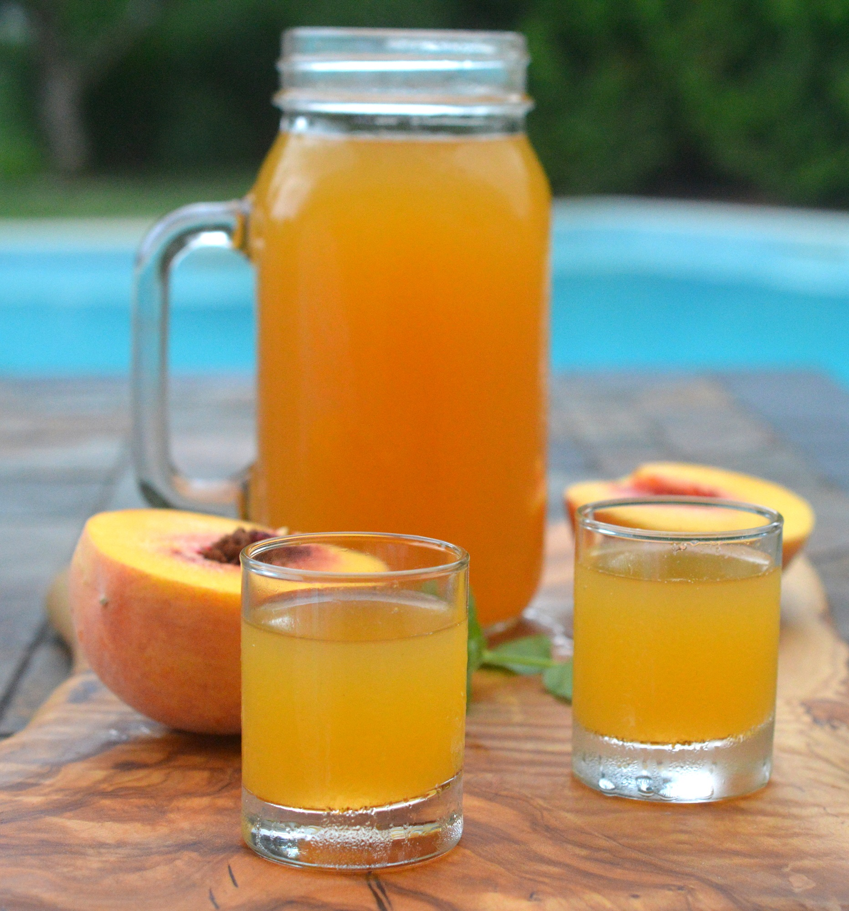

# Flavoured Moonshine

*The Ole Smoky line decoded: Apple Pie, Peach, Blackberry, Strawberry, Cherry, White Lightnin', Hunch Punch, Mountain Java. Each is an infusion of un-aged corn whiskey, sweetened, jarred, and chilled. Family-fun chapter of the course.*

**Read first:** [Ole Smoky moonshine](ole-smoky-moonshine.md)

## Overview

Ole Smoky and Sugarlands built modern Tennessee moonshine into a successful commercial category by introducing flavoured varieties. The flavoured moonshines are not a different spirit; they are the same un-aged corn whiskey ([Ole Smoky-style moonshine](ole-smoky-moonshine.md)) infused with fruit, spice or syrup. Cut typically to 40 proof (20% ABV) for sippability, packaged in clear mason jars, drunk over ice or in cocktails.

The infusion principle is the same as for vodka: pour the spirit over a flavour ingredient, wait, strain. The differences from a typical vodka infusion:

- **Base proof:** moonshine starts at 50% ABV. The infusion concentrates flavours faster than the same procedure with vodka (40% ABV).
- **Sweetness:** flavoured moonshines are sweet. A sugar syrup is added; the resulting cordial is closer to a liqueur than a flavoured spirit.
- **Final proof:** typically 35-50 proof (17.5-25% ABV) - much lower than the base moonshine. Drinkable straight.

This page covers the Ole Smoky canon by name, with family-scale recipes for each.

## Apple Pie

The single most popular flavoured moonshine in the United States. Spiced apple cider sweetened and spiked with moonshine. Tastes like warm apple pie filling, served cold from a mason jar.

### Ingredients (makes about 2 litres)
- 1 litre Ole Smoky-style moonshine (50% ABV)
- 1 litre fresh apple cider (the non-alcoholic, unfiltered kind - what Brits call "cloudy apple juice")
- 250 ml apple juice (clear, for layered apple character)
- 200 g brown sugar
- 4 cinnamon sticks
- 6 whole cloves
- 1 whole nutmeg (crushed)
- Zest of 1 lemon
- 1 tsp vanilla extract

### Method
1. Combine the apple cider, apple juice, brown sugar, cinnamon sticks, cloves, nutmeg and lemon zest in a heavy saucepan.
2. Bring to a gentle simmer over medium heat. Simmer 20 minutes, until the sugar has dissolved and the kitchen smells of apple pie.
3. Cool to room temperature.
4. Strain through a fine mesh sieve to remove spices and lemon zest.
5. Stir in the moonshine and vanilla extract.
6. Bottle in mason jars. Refrigerate 2-3 days before drinking - the flavours integrate.

Final ABV: about 25%.

### Serving
Straight from a chilled mason jar, with a piece of cinnamon stick. Or warm in a mug with a slice of apple as a winter drink.

## Peach

Summer in a jar. Made from fresh peaches infused into moonshine, sweetened and aged briefly to round the edges.

### Ingredients (makes about 1.5 litres)
- 1 litre moonshine
- 750 g fresh ripe peaches (about 6 medium; stones removed, chopped)
- 250 ml peach juice or nectar
- 200 g granulated sugar
- 1 vanilla pod (split lengthways)

### Method
1. Combine the chopped peaches and sugar in a clean jar. Stir; let macerate 1 hour. The peaches will release their juice.
2. Add the moonshine and the split vanilla pod. Seal the jar.
3. Steep 1-2 weeks in a cool dark place. Shake daily.
4. Strain through cheesecloth. Squeeze the peach pulp to extract everything.
5. Stir in the peach juice/nectar.
6. Bottle. Rest a week.

Final ABV: about 35%.

## Blackberry

The Appalachian summer pick. Wild blackberries are abundant across the Tennessee hills in late summer; the moonshine made from them is dark purple, tart-sweet, and intensely fragrant.

### Ingredients (makes about 1.5 litres)
- 1 litre moonshine
- 500 g fresh blackberries (or frozen, thawed; wild are best)
- 200 g granulated sugar
- 2 tbsp fresh lemon juice
- ½ cinnamon stick

### Method
1. Lightly crush the blackberries with the back of a wooden spoon - not to a paste, just to release juice.
2. Combine crushed blackberries, sugar, lemon juice and cinnamon stick in a clean jar.
3. Add the moonshine. Seal.
4. Steep 2-3 weeks in a cool dark place. Shake every few days.
5. Strain through fine cheesecloth, then through a coffee filter for clarity.
6. Bottle.

Final ABV: about 40%.

## Strawberry

Spring's first fresh-fruit flavoured moonshine. Sweeter than blackberry; brighter pink than red.

### Ingredients (makes about 1.5 litres)
- 1 litre moonshine
- 750 g fresh ripe strawberries (hulled, halved)
- 150 g granulated sugar (less than the others; strawberries are already sweet)
- 2 tbsp fresh lemon juice
- ½ vanilla pod

### Method
1. Combine all ingredients in a clean jar. Seal.
2. Steep 1-2 weeks. Shake every few days.
3. Strain through cheesecloth.
4. Bottle.

Final ABV: about 38%.

## Cherry

The darkest and richest of the flavoured moonshines. Use sour cherries (Montmorency) if you can find them; sweet Bing cherries also work but produce a less complex result.

### Ingredients (makes about 1.5 litres)
- 1 litre moonshine
- 600 g fresh sour cherries (pitted, halved) OR 800 g sweet cherries
- 200 g granulated sugar
- 1 cinnamon stick
- 4 whole cloves
- 1 vanilla pod (split)

### Method
1. Combine all ingredients in a clean jar.
2. Steep 3-4 weeks (longer than the other fruits - cherry is slower to give its flavour).
3. Strain through cheesecloth, then coffee filter.
4. Bottle.

Final ABV: about 38%.

## White Lightnin' (the un-flavoured version)

This is just the base moonshine, packaged for sale. The "flavour" is the corn itself, the cuts, the proof. See [Ole Smoky moonshine](ole-smoky-moonshine.md) - that recipe IS White Lightnin'.

Tradition: cut to 50% ABV (100 proof) for the proper Tennessee strength.

## Hunch Punch

A pre-mixed cocktail-in-a-jar. Multiple fruit juices, two spirits, sweet but not cloying, dangerously drinkable. Named for the "let's hunch over and drink this" attitude.

### Ingredients (makes about 2 litres)
- 750 ml moonshine
- 500 ml fruit punch (the bottled kind - Hawaiian Punch is the cultural standard)
- 250 ml pineapple juice
- 250 ml orange juice
- 100 g granulated sugar
- Juice of 2 lemons
- Optional: 100 ml triple sec or orange liqueur

### Method
1. Dissolve the sugar in the lemon juice and 100 ml warm water in a small saucepan; let cool.
2. Combine all ingredients in a large jar. Stir.
3. Refrigerate at least 24 hours before serving. Stir before pouring.
4. Serve from a mason jar over ice with fresh fruit.

Final ABV: about 25%.

## Mountain Java

Coffee-flavoured moonshine. The Tennessee answer to Kahlúa, except with corn whiskey instead of rum and at lower proof.

### Ingredients (makes about 1 litre)
- 750 ml moonshine
- 250 ml strong cold-brew coffee (or espresso, cooled)
- 200 g brown sugar
- 1 tbsp vanilla extract
- 1 cinnamon stick (optional)

### Method
1. Dissolve the brown sugar in the coffee in a saucepan over low heat. Cool.
2. Stir in the moonshine, vanilla and cinnamon stick.
3. Bottle. Steep 3-5 days before drinking.

Final ABV: about 37%.

Serving: over ice with a splash of cream, or in coffee cocktails (a White Russian with Mountain Java instead of Kahlúa is excellent).

## General notes on flavoured moonshine

- **Use clean moonshine.** A poorly-cut base spirit cannot be salvaged by fruit and sugar. Foreshots cut tightly, hearts only.
- **Sugar last.** Add sugar after the spirit is in contact with the fruit, not before. Sugar slows the alcohol's extraction of fruit flavours.
- **Refrigerate finished jars.** Flavoured moonshines hold longer in the fridge - 3-6 months. At room temperature, the fruit notes fade in 2-3 months.
- **Don't strain too aggressively.** Some pulp suspended in the bottle is a sign of authenticity, like real lemonade with bits of lemon flesh.
- **Mason jars matter.** The presentation is part of the product. A Ball or Kerr mason jar in clear glass, with a metal screw lid, is the proper container.

## Cocktails with flavoured moonshines

- **Apple Pie on the rocks** - straight, with a piece of cinnamon stick.
- **Peach Bellini-style** - 50 ml peach moonshine, 100 ml prosecco, fresh peach slice.
- **Blackberry smash** - 50 ml blackberry moonshine, 25 ml lemon juice, mint leaves muddled, soda water.
- **Strawberry Lemonade** - 50 ml strawberry moonshine, 75 ml fresh lemonade, lemon wedge.
- **Cherry Old Fashioned** - 50 ml cherry moonshine, 1 sugar cube, 2 dashes Angostura, orange peel.
- **Mountain Java White Russian** - 50 ml Mountain Java, 50 ml vodka, 30 ml cream over ice.
- **Hunch Punch by the pitcher** - already a cocktail; serve as it is.

## See also
- [Ole Smoky moonshine](ole-smoky-moonshine.md) - the base spirit for everything on this page
- [Vodka](vodka.md) - the cleaner cousin used in some flavoured spirits
- [Applejack](applejack.md) - the proper-distilled apple version, drier and stronger than Apple Pie moonshine
