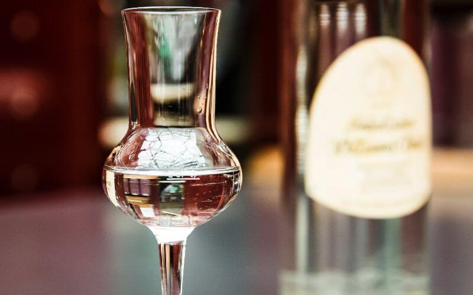

# Grain Alcohol

*The strongest commercial spirit: 190-proof (95% ABV) neutral grain alcohol. The base for tinctures, extracts, infusions and high-strength cocktail bases. Not a drink in itself.*

**Read first:** [Vodka](vodka.md), [Safety](safety.md)

## Overview

Grain alcohol (also called "neutral grain spirit" or NGS) is essentially vodka taken to its mathematical limit. The US federal definition simply describes it as "distilled spirits distilled at or above 190 proof." Commercial brands like Everclear, Spirytus and Devil's Springs reach 190 proof (95% ABV) in bottles; some go to 191 proof, the practical maximum achievable by distillation (you cannot get higher than 95.6% ABV via simple distillation due to the ethanol-water azeotrope; molecular sieves or membrane separation are needed for the final 4-5%).

For a family-scale pot still, reaching 95% ABV requires multiple distillation passes - typically 4-6, sometimes more, depending on technique. A reflux column makes it easier but adds equipment.

Grain alcohol is **NOT a drinking spirit.** At 95% ABV, even a small sip causes severe throat burn and is dangerous. Its purpose is:

1. **Tincture base** - herbal extracts (vanilla, lemon balm, propolis, peppermint) for the kitchen or the medicine cabinet
2. **Infusion base for cordials and liqueurs** - limoncello, nocino, ratafia
3. **Cocktail component (heavily diluted)** - long island iced tea bases, "punch" punches
4. **Cleaning and lab uses** - solvent, sterilising rub

Several US states ban the retail sale of 190-proof grain alcohol (California, New York, Florida, Washington, Massachusetts, others). Tennessee permits it. Your family operation, with a federal DSP, can produce it; check your state license terms for what you can sell.

## Recipe (5-gallon wash, base sugar wash for cleanest yield)

For grain alcohol you want maximum yield and minimum flavour - the multi-distillation strips out flavour anyway, so a high-sugar, low-flavour wash is ideal.

### Ingredients
- 7 kg cane sugar
- 18 litres water
- 25 g distiller's yeast (high-alcohol tolerant; SafSpirit C-70 or Turbo 24)
- 5 g yeast nutrient (DAP)
- 2 g Epsom salt (magnesium sulphate, supports yeast)

### Method

**Make the wash:**
1. Dissolve the sugar in 5 litres of hot water (60 °C). Stir until completely dissolved.
2. Top up to 18 litres with cool water. The mixture should be at about 26 °C.
3. Add the yeast, nutrient and Epsom salt. Stir gently.
4. Cover with an airlock. Ferment 5-7 days at 25-30 °C.
5. Expected wash ABV: 14-16%. A turbo yeast can push higher, but the off-flavours increase.

**Strip run (first distillation):**
1. Charge the still with the whole wash. Heat aggressively.
2. The strip run does not need careful cuts; the goal is to capture all the alcohol fast.
3. Collect everything above 30% ABV. Discard the foreshots (50 ml/gallon). Don't try to separate heads/hearts/tails on this run.
4. Result: ~3-4 litres of "low wines" at ~45-55% ABV.

**Second distillation (spirit run):**
1. Dilute the low wines with clean distilled water back to 25-30% ABV.
2. Heat slowly. Run carefully.
3. Discard 100 ml of foreshots (more aggressive than usual; you want zero methanol in the final spirit).
4. Discard the first 250 ml of heads.
5. Collect hearts only - the middle of the run, ideally 80-90% ABV at the parrot.
6. Cut when parrot reads below 80%.
7. Result: ~2 litres of clean spirit at ~85-90% ABV.

**Third distillation (concentration run):**
1. Dilute the clean spirit back to ~30% ABV with distilled water.
2. Distil even more carefully. Tight cuts.
3. Hearts will now reach 90-93% ABV at the parrot.
4. Collect only the tightest middle of the run.

**Fourth and fifth distillations (if needed):**
1. Repeat the dilution-to-30%-then-distil cycle.
2. By the 4th or 5th run, hearts should reach 94-95% ABV.
3. The yield drops with each run (some spirit is left as heads/tails); expect to end with ~1 litre of finished spirit from the original 5-gallon wash.

**Charcoal filtering (optional but recommended):**
1. Filter the final high-proof spirit through activated coconut charcoal. Removes any last off-notes.

**Bottle:**
1. At 95% ABV the spirit can be bottled directly. Label clearly with PROOF (190 proof / 95% ABV) and a hazard warning. This is not a drinking-strength bottle.

## Uses

### Tinctures (the most useful family application)

Tinctures are alcoholic herbal extracts. They keep almost indefinitely and concentrate plant flavours and active compounds.

**Method:**
1. Pack a clean jar 1/3 full with the dried herb of choice (vanilla beans, mint leaves, propolis chunks, ginger root, etc.).
2. Cover with grain alcohol. Seal.
3. Steep 4-8 weeks, shaking daily.
4. Strain through coffee filter, store in amber-glass dropper bottles.

### Vanilla extract

The most common kitchen tincture:
- 10 split vanilla beans + 250 ml grain alcohol
- Steep 8-12 weeks, shaking weekly
- Strain (or leave the beans in indefinitely)

This is real vanilla extract - far superior to the imitation supermarket version.

### Limoncello

A cordial built on grain alcohol:
- Zest of 12 lemons + 750 ml grain alcohol; steep 1 week
- Add 750 ml of 1:1 sugar syrup (cooled); rest 1-2 weeks
- Strain, bottle. Stronger and more flavourful than vodka-based limoncello.

### Diluting for drinking

If grain alcohol is to be consumed (in cocktails or for a vodka substitute), cut it heavily:
- 95% → 40% ABV: add 1.375 parts water by volume (137.5 ml water per 100 ml grain alcohol)
- 95% → 50% ABV: add 0.9 parts water by volume

NEVER drink grain alcohol straight. The Reddit-style "shot of Everclear" prank has put people in hospital with chemical burns.

## Common mistakes

- **Underestimating the distillation count.** Reaching 95% ABV on a pot still without a reflux column takes 4-6 runs minimum. Two or three runs gives only 85-90% - not "grain alcohol" by the federal definition.
- **Drinking it neat.** Causes throat/oesophageal chemical burns. Always cut.
- **Mixing with other flammable liquids without ventilation.** 95% ethanol is flammable and the vapour is heavier than air; spilled grain alcohol pools.
- **Storing in plastic.** Grain alcohol can dissolve some plastics over time. Glass only.

## Notes
- **Azeotrope:** 95.6% ABV is the practical maximum for simple distillation. To exceed this, you need molecular sieves, anhydrous CaCl2 absorption, or membrane separation. Not family-scale.
- **The legal limit on grain alcohol** is set by the federal definition (190 proof minimum) and your state's retail rules.
- **Tincture vs liqueur** - a tincture is alcohol + herb; a liqueur is tincture + sugar. The line is exactly where you add sweetener.

## See also
- [Vodka](vodka.md) - the slightly-lower-proof cousin, more drinkable
- [Flavoured moonshine](flavoured-moonshine.md) - the lower-proof, flavour-forward route to similar drinks
- [Applejack](applejack.md) - a related fruit-based concentration technique
