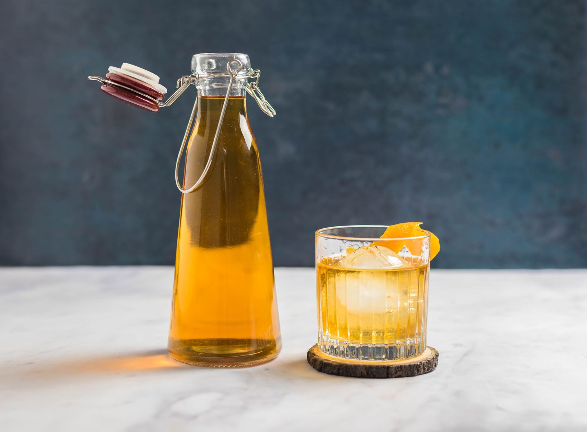

# Rye Whiskey

*The spicier American whiskey: at least 51% rye in the mash bill, otherwise built like bourbon. Pre-Prohibition rye was the dominant American whiskey; the post-Prohibition revival is still underway.*

**Read first:** [Whisky (the umbrella)](whisky.md), [Bourbon](bourbon.md)

## Overview

Rye whiskey is bourbon's older, drier cousin. The federal definition mirrors bourbon's:

1. **At least 51% rye** in the mash bill (the rest typically corn and malted barley)
2. **Distilled to no more than 80% ABV**
3. **Stored at no more than 62.5% ABV**
4. **Aged in new charred American oak**
5. **No additives**

Before Prohibition, rye whiskey was America's dominant spirit, particularly in Pennsylvania and Maryland. Pennsylvania-style ryes were lighter and more elegant; Maryland-style ryes were richer and more aggressive. Prohibition (1920-1933) wiped out the regional distilling tradition; bourbon, with Kentucky's geographic advantages (limestone water, agricultural climate), came back faster. Rye spent most of the 20th century as a cocktail ingredient - the rye in your grandfather's Manhattan or Old Fashioned. The 21st-century craft revival has brought rye back to centre stage.

Rye's signature flavours: black pepper, baking spice, dried herb, dry-grass freshness, a faint mint. It cuts through cocktails in a way bourbon doesn't; it stands up to bitter, sour and sweet modifiers cleanly.

## The mash bill

Three rye styles, each producing a recognisably different whiskey:

| Style | Mash bill | Character |
|---|---|---|
| **Pennsylvania (Monongahela)** | 65-80% rye / 15-25% malted barley / 5-10% corn | Bigger, peppery, herbal, full-bodied |
| **Maryland** | 51-60% rye / 25-35% corn / 15% malted barley | Softer, sweeter, more bourbon-like |
| **Modern craft** | 95-100% rye / 0-5% malted barley | Aggressive, drying, pure-rye character |

The 100% rye mash (used by MGP Indiana for many craft brand-houses) is a modern phenomenon - it requires special handling because rye has very little starch and lots of beta-glucan (which makes the mash sticky and hard to manage). For a first family batch, the Pennsylvania-style 80/15/5 or Maryland-style 60/25/15 is more forgiving.

## Recipe (5-gallon wash, Pennsylvania-style 80/15/5)

### Ingredients
- 5.6 kg cracked rye (distiller's grade)
- 1 kg crushed malted barley
- 350 g cracked corn
- 18 litres water
- 25 g distiller's yeast

### Method

The mashing process for rye is slightly trickier than corn because rye is sticky. The mash will be thicker; stir more frequently.

**Mash:**
1. Heat 12 litres of water to 75 °C.
2. **Add the rye gradually.** Whisk in slowly. Rye will form clumps if dumped in all at once. Stir constantly for 5 minutes.
3. Hold at 75 °C for 20 minutes. The mash will be very thick and gluey. Keep stirring intermittently or it will scorch.
4. Cool to 67 °C with 4 litres of cool water.
5. Add the corn and malted barley. Stir.
6. **Add 1 tsp of rice hulls or oat hulls** to the mash if you have them. This is the rye-distiller's trick; the hulls keep the mash from compacting and allow the malt enzymes to work properly.
7. Hold at 65 °C for 90 minutes. Stir every 10 minutes.
8. Iodine test for conversion; should turn brown/orange (not blue/black).
9. Cool to 26 °C.

**Ferment:**
1. Add yeast.
2. Ferment 5-8 days at 25-30 °C. Rye washes ferment slightly longer than all-corn washes.
3. Expected wash ABV: 8-10%.

**Distil:** As in [whisky](whisky.md). The cuts are identical.

The rye spirit off the still has a distinctly different aroma from bourbon spirit - more grassy, more peppery, less sweet. This is correct.

**Cut to barrel strength:** 62.5% ABV maximum, like bourbon.

**Age:** New charred American oak. Rye whiskey takes oak BETTER than bourbon - the dry peppery character integrates beautifully with vanilla. A 5-gallon barrel will produce a recognisable rye in 8-12 months.

**Bottle:** Cut to 45-50% ABV (rye is traditionally bottled stronger than bourbon to preserve the pepper).

## Notes

- **Rye is harder to work with than corn.** It's stickier, slower to ferment, and the high beta-glucan content can give cloudy washes. Patience with the mash step prevents most problems.
- **Don't skip the rice/oat hulls if you can find them.** They are sold at any homebrew shop. A handful per batch makes the mash workable.
- **Pennsylvania-style is more authentic to colonial-era American whiskey** than bourbon. Bourbon is a Kentucky-corn adaptation of an older rye tradition. Rye is what George Washington made at his Mount Vernon distillery.
- **A 100% rye is possible but ambitious.** It requires either a longer mash time (with stepped temperatures to use rye's own limited enzymes) or addition of exogenous enzymes. Not a starter recipe.

## Common rye flavours

A taste vocabulary for what to look for as the whiskey ages:

- **Black pepper** - front-of-tongue heat; from the rye grain itself
- **Baking spice** - cinnamon, allspice, clove; from the barrel char interacting with rye flavour compounds
- **Mint and eucalyptus** - a cool, herbal note in the finish; characteristic of high-rye
- **Dried hay or fresh-cut grass** - green, vegetal; from young rye spirit
- **Pumpernickel** - a darker bread note in well-aged rye; the rye-grain flavour married with oak

A whiskey that lacks pepper and herb is not yet a good rye. Re-taste at the next 2-month interval; the oak does its work slowly.

## Cocktails (rye's natural habitat)

Rye is at its best in classic American cocktails:

- **Manhattan:** 60 ml rye, 30 ml sweet vermouth, 2 dashes Angostura, stirred, strained, cherry. The rye stands up to the vermouth in a way bourbon cannot.
- **Old Fashioned (rye version):** 60 ml rye, 1 sugar cube, 2 dashes Angostura, orange peel. Spicier than the bourbon Old Fashioned.
- **Sazerac:** see [Sazerac](../../drinks/regional/louisiana/sazerac.md). Rye is the spirit.
- **Vieux Carré:** see [Vieux Carré](../../drinks/regional/new-orleans/vieux-carre.md). Rye is half the spirit base.
- **Whiskey Sour (rye):** 60 ml rye, 25 ml lemon juice, 20 ml simple syrup, optional egg white. Drier than the bourbon version.

## See also
- [Whisky (the umbrella)](whisky.md)
- [Bourbon](bourbon.md)
- [Tennessee whiskey](tennessee-whiskey.md)
